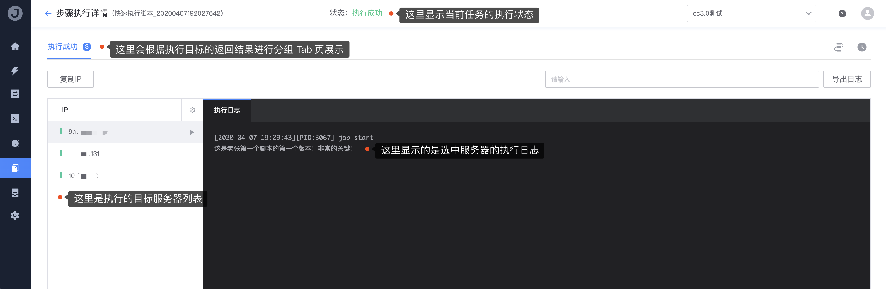

# 3. Execute the script

This article will explain how to execute scripts managed by the job platform or manually entered.

## Preconditions

```text
1. There is an executable server under the business (Agent status is normal)
2. Prepare the system execution account (required)
3. Prepare a "live" script (required)
```

## Steps

1. Select the script we created just now for demonstration execution, and click the "**Execute**" button

    

2. Fill in the required execution parameters and content on the page

    

3. Click "**Execute**" to start executing the script on the target machine

    