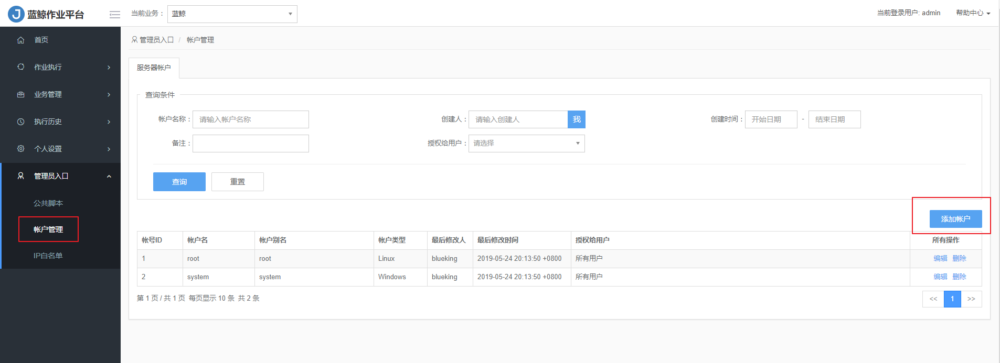

# 帐户管理

首先，每个用户对于哪些应用和该应用下的哪些对象有操作权限，可以通过蓝鲸配置平台统一定义。而配置平台与作业平台是原生集成的，两者的权限共享。对于没有权限的应用或者应用下的对象，用户没有权限操作。

其次，通过在服务器上或者数据库上为不同的蓝鲸平台用户创建不同权限的帐号，并把此帐号登记到作业平台，然后将此帐号分配给蓝鲸平台的用户。此后，蓝鲸平台用户执行任务的时候，只能执行分配的帐号具有的权限的相应任务。此功能目前只有企业版支持。

- 添加服务器本地帐号，并把它授权给蓝鲸平台帐号。

