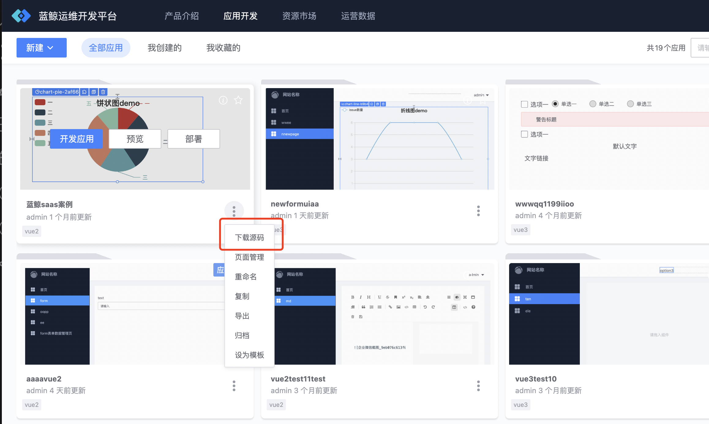

## Application secondary development guidelines

## Method 1: Download the entire application source code package for secondary development
Download the application source code, and the platform will integrate all page source codes and page routing configurations of the application into [BlueKing front-end development framework (BKUI-CLI)]([BKUI-CLI](../../../PaaS/DevelopTools/SaaSGuide/DevAdvanced/bkui/bkui.md)), download it as the entire source code package of the application.



After downloading, you can perform secondary development and deployment through the following steps:

1. Create a new code repository (New Project) on Git, unzip the downloaded source code package, and submit the source code to the newly created code repository. The directory structure is as follows

```bash
├── README.md
├── lib/ # Source code directory
│ ├── client/ # Front-end source code directory
│ │ ├── build/ # Front-end build script directory
│ │ │ ......
│ │ ├── index-dev.html # html used for local development
│ │ ├── index.html # html used in production environment
│ │ ├── src/ # Front-end source code directory
│ │ │ ├── App.vue # App component
│ │ │ ├── main.js # Main entrance
│ │ │ ├── api/ # Front-end ajax directory
│ │ │ │ ......
│ │ │ ├── common/ # Common front-end module directory
│ │ │ │ ......
│ │ │ ├── components/ # Front-end component directory
│ │ │ │ ......
│ │ │ ├── css/ # Front-end css directory
│ │ │ │ ......
│ │ │ ├── images/ # Image storage directory used by the front-end
│ │ │ │ .....
│ │ │ ├── mixins/ # Mixins used in the front end
│ │ │ │ ......
│ │ │ ├── router/ # Front-end router directory
│ │ │ │ ......
│ │ │ ├── store/ # Front-end store directory
│ │ │ │ ......
│ │ │ ├── views/ # Front-end page directory
│ │ │ │ ......
│ │ └── static/ # Front-end static resource directory
│ │ ......
│ └── server/ # Backend source code directory
│ ├── app.browser.js # Server startup file
│ ├── logger.js # Backend log component
│ ├── util.js # Backend tool method
│ ├── conf/ # Backend configuration file directory
│ │ ......
│ ├── controller/ # Backend controller directory
│ │ ......
│ ├── middleware/ # Backend middleware directory
│ │ ......
│ ├── model/ # Backend entity directory
│ │ ......
│ ├── router/ # Backend routing directory
│ │ ......
│ ├── service/ # Backend service directory
│ │ ......
├── nodemon.json # nodemon configuration file
├── package.json # Application description file
```

2. Create application modules in the BlueKing PaaS platform.

     Notice:
     - For application module source code management, select "Code Library" and bind the code repository created in the first step.
     - Select "Nodejs -> BlueKing Application Front-end Development Framework" for the development language and initial template.

         

3. For secondary development, submit the code to the warehouse, enter the BlueKing PaaS platform application module deployment page, and deploy.

## Method 2: Download the source code of a single page of the application for secondary development
If the development scenario is to add a new functional page to an existing application, you can drag and drop to lay out a separate page, then directly download the source code of the independent page and integrate it into the existing application project.

