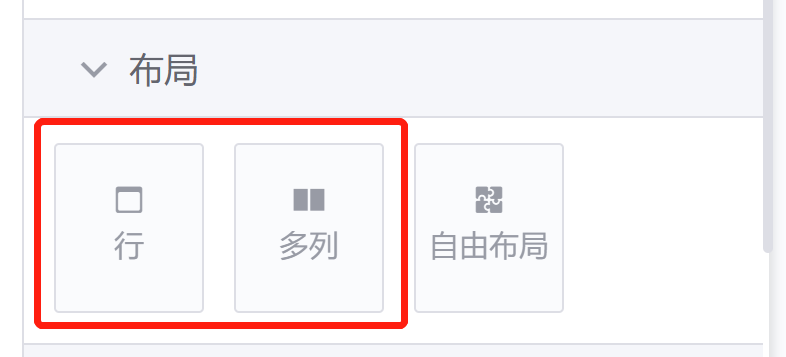
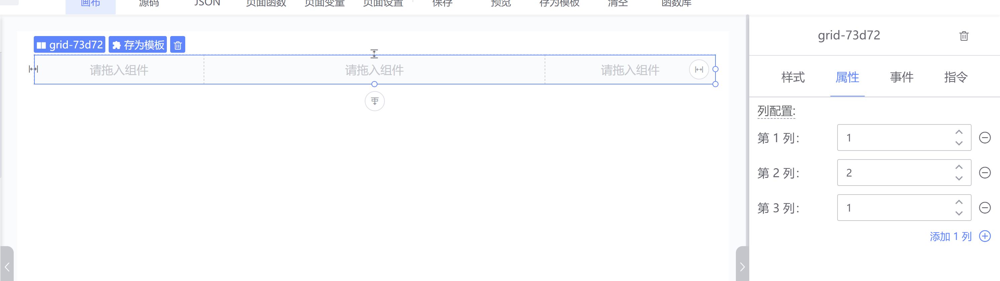

## 布局 - 栅格布局

:::info
可视化开发布局支持栅格布局和自由布局，这里介绍栅格布局
:::

### 栅格布局有行和多列可快速拖动生成页面布局

### 多列组件都可以增加列数，默认为2列，最多 12 列， 可以通过属性面板设置列数和每一列的宽度。我们建议在拖拽布局时采用 12 等分或 24 等分的原则进行规划

### 你也可以通过修改尺寸、外边距等样式来实现更加灵活的布局

