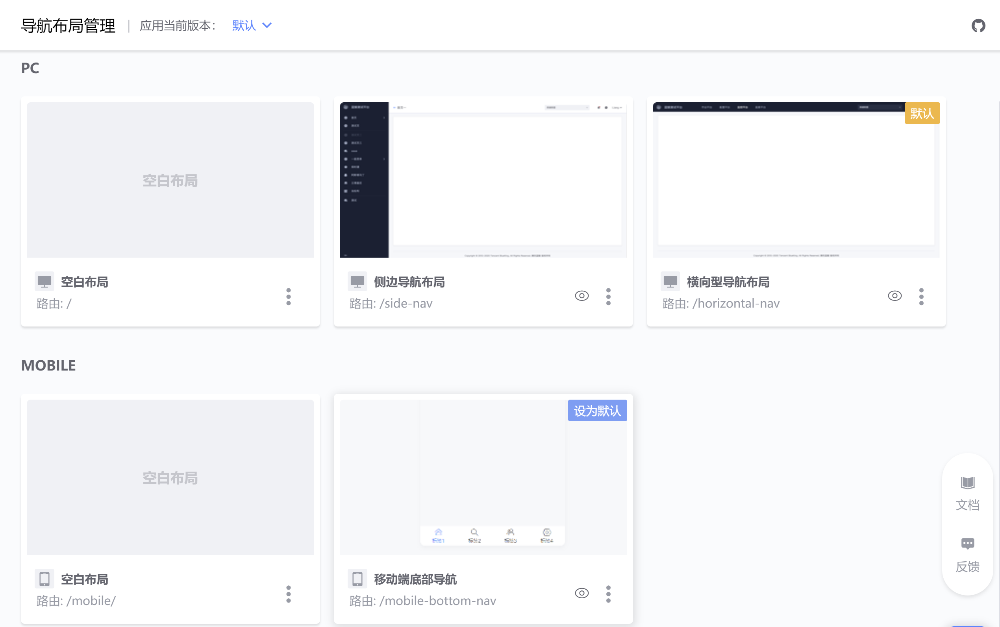

## Navigation Layout Usage Guidelines

### 1. Concept

Navigation layout is a way to group pages with the same layout (navigation) together, so that the same layout can be reused between pages, and the route of the layout will also become the common parent route of the page.

### 2. Add navigation layout

:::info There are 2 ways to add a layout to the application
The system currently provides a total of 5 layouts, namely "blank layout", "side navigation layout", "horizontal navigation layout", "composite navigation layout", and "mobile bottom navigation layout".
:::

#### 2.1 Add when creating a new application

- Among them, "Blank Layout" is the system default layout, which is automatically checked and cannot be canceled.
- If no other navigation layout is selected when adding, you can add it in the "Navigation Layout Management" function page after creating the application.

#### 2.2 Add in navigation layout management

- Enter the "Navigation Layout Management" page and create a new navigation layout
:::tip
Routing: The final page access route of the layout is "layout routing/page routing"
:::

- After the creation is successful, you can see all the navigation layouts in the application.

### 3. Apply navigation layout

:::info After adding the navigation layout, you can apply the added navigation layout to the page when adding the page.
Using the same layout on multiple pages can achieve the effect of reusing the layout. The layout configuration takes effect across all pages, and the pages have a common parent route, which is the route of the layout.
:::

- Select the navigation layout when creating a new page. The selectable templates are all templates added in the application.

### 4. Configure navigation layout

After applying the template to the :::info page, enter the page editing page. You can see the template content in the canvas and set the provided configuration items.
If you use a blank layout, no template content is visible, and what is visible in the canvas is the page content. Currently available configurations include: site name, logo and navigation.
:::

- The example image uses "Side Navigation Layout", and the layout navigation is being entered into settings. Among them, the middle area is the page content editing area.

### 5. More

#### 5.1 Modify page navigation layout

- Enter the page editing page and make modifications in "Page Configuration"

#### 5.2 Modify navigation layout instance name and ID

- Enter the "Navigation Layout Management" page to find the template that needs to be modified.

