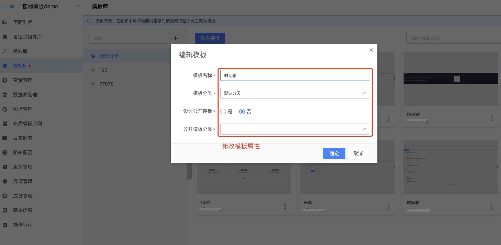

## Guidelines for using page templates
lesscode provides two different granularity templates, application-level templates and page templates. Page templates are lower-granularity templates than application-level templates and can be flexibly applied to various pages.

### How to use page templates?

### The first type: add it to the application through the template market
1. Enter the template market, select the appropriate template, and then add it to the application
 
 
{width="80%"}

 
2. After the addition is completed, it can be used in the canvas template library
 
 

  {width="80%"}

### The second type: add through the canvas template market

You can also quickly add page templates in the canvas template market. The black shaded parts represent page templates that have not been added to the application. Click "Apply" to quickly use them in the application.
 
 

{width="80%"}

### Store template

  During the page layout process, the page content can also be saved as a page template to achieve rapid reuse of partial content.
 
   
  1. Select the corresponding module and click "Save as Template"
 
 

  {width="80%"}

 
2. Fill in the template category to be saved
 
 

{width="80%"}

 
3. You can also directly save the content of a page as a page template in the canvas (excluding navigation content), which can be embedded into any page layout.
 
 

{width="80%"}

### How to manage templates?

For templates added from the market and customized templates, we provide special template management functions. Users can customize category management, edit, delete, export and other management of templates.

 
1. Enter the application template library management, you can import new templates (supports JSON format), modify category names, template attributes, etc.
 
 

{width="80%"}
{width="80%"}

 
2. The modified effects will be synchronized to the template in the canvas
 
 

{width="80%"}