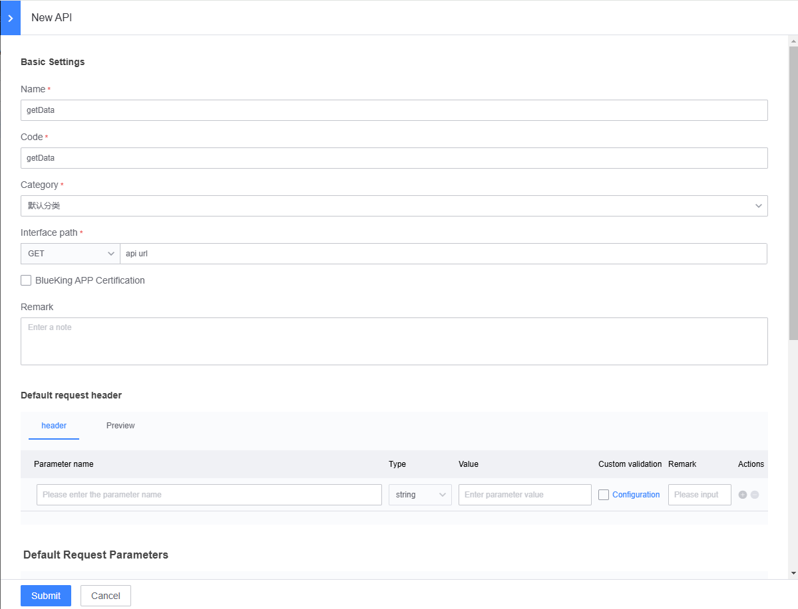
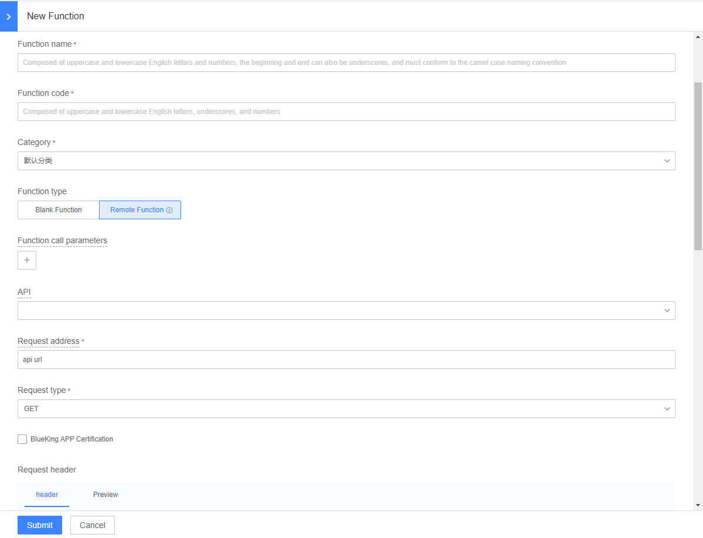
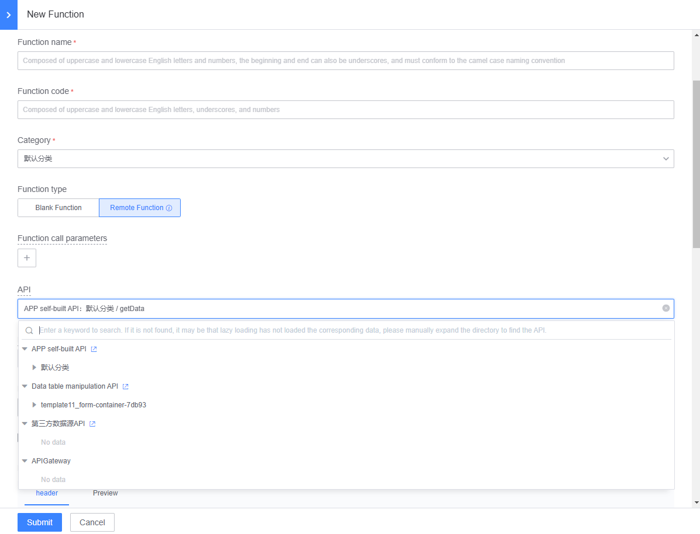

# API Management

In the Blueking LessCode (LessCode), users can create APIs, and these APIs are integrated with the Blueking API Gateway service, facilitating interface management. APIs can be selected within functions for quick usage.

## Creating an API

Navigate to the APP Development -> Resource Management -> API Management page, and click on "Create New." Fill in the corresponding parameters. Once completed, click "Submit" to add a new API. Note:

- Selecting Blueking APP authentication will include the authentication information required by the API gateway in the request. This authentication information is generated based on the user sending the request and the bound APP.
- On the right side of the default request response, there is a `Get Request Response` button. Clicking it allows you to retrieve the API response for testing purposes.

## Using the API

### Generating a Function on the API Management Page

Navigate to the APP Development -> Resource Management -> API Management page. In the action column of the existing API list, click on "Generate Function." The API information will be automatically included, and users can continue filling in the relevant parameters to generate a function.

### Selecting an API in a New Function

In APP Development -> JS Function Development, or Page Editing -> Function Management, click on "Create New Function." Select "Remote Function" as the function type, and you can choose the API we created from the API dropdown options.

