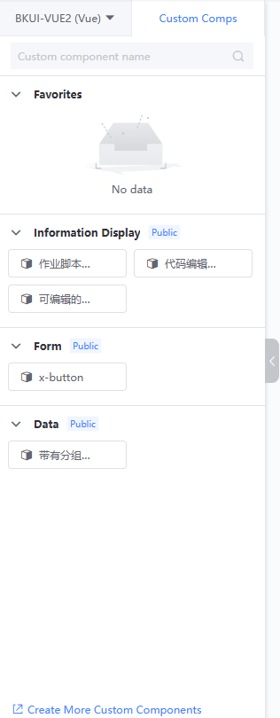
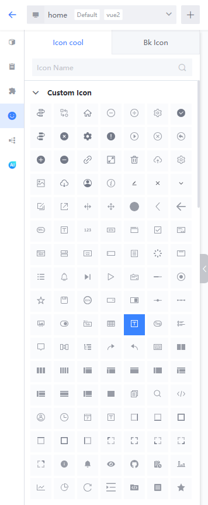
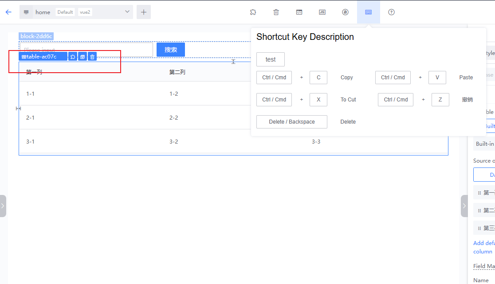
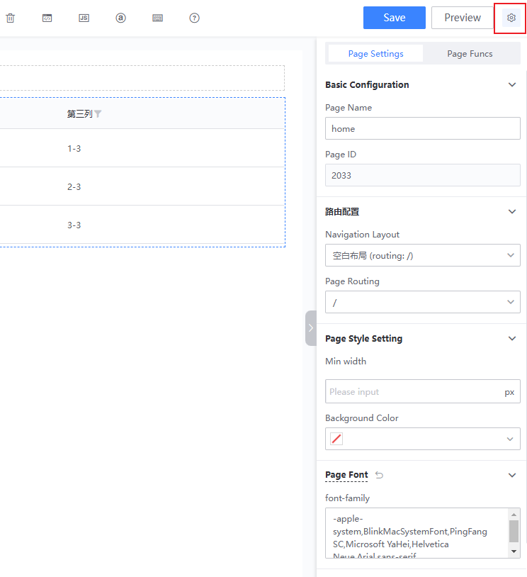
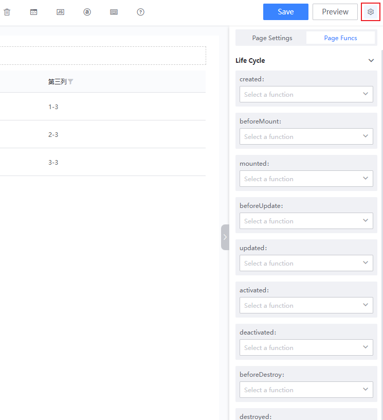

# Canvas Editing

The canvas editing page is roughly divided into four areas: the material area, the drag area, the toolbar, and the properties/styles/events configuration panel.

## Material Area

Available materials include layouts, basic components, custom components, templates, and icon symbols.

### Layouts

The BlueKing LessCode (LessCode) offers three types of layouts: row layout, multi-column layout, and free layout.

### Basic Components

According to different APP types and page types, the BlueKing LessCode (LessCode) provides different basic components:

- Vue2 PC: BlueKing MagicBox component library, Element component library
- Vue3 PC: BlueKing MagicBox component library
- Vue2 Mobile Pages: Vant UI component library
- Vue3 Mobile Pages: Vant UI component library

### Custom Components

Sources include:

- Official built-in custom components
- Custom components from other publicly available APPs
- Custom components uploaded by the current APP

### Icon Symbols

You can drag and drop icons from the built-in BlueKing icon library into the page for use (the cloud version can bind and use icons from the icon-cool project).

## Canvas Drag Area

- Based on design drafts or prototypes, drag materials from the material area to the canvas drag area for arrangement.
- After selecting a component, you can use the blue icons above the component or shortcuts to copy, paste, delete, save as a template, and perform other quick operations.

## Properties/Styles/Events Configuration Panel

After selecting a component, you can configure the properties/styles/events/instructions of the current component.

During the configuration process, if you need to use variables or functions, you can configure the necessary variables or functions through the toolbar entry first. For specific usage, please refer to the guide on using functions and variables on the canvas.

## Toolbar

Includes entry points for saving pages as templates, clearing pages, viewing page source code/JSON, setting functions, setting variables, using shortcut key guides, canvas guides, saving, previewing the canvas, and more.

## In addition, when no component is selected on the page (or click the settings icon next to the preview button), the right area will display the overall configuration of the page.

You can modify the basic configuration of the page, route configuration, style configuration.

  

You can also set lifecycle functions for the page.  

