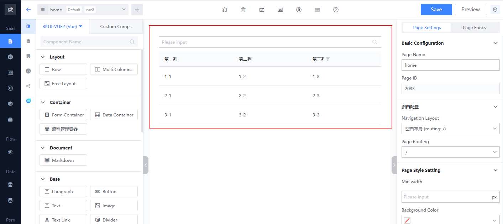
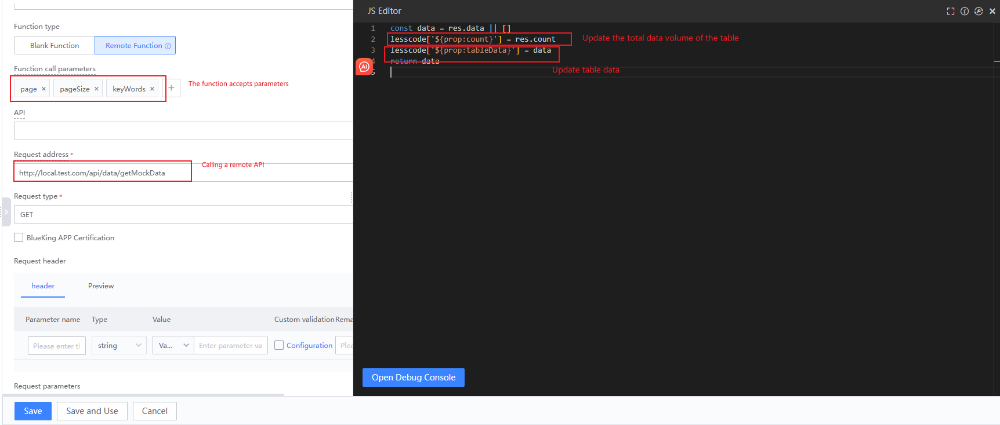
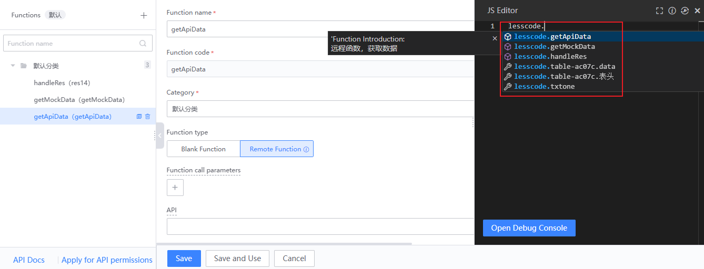
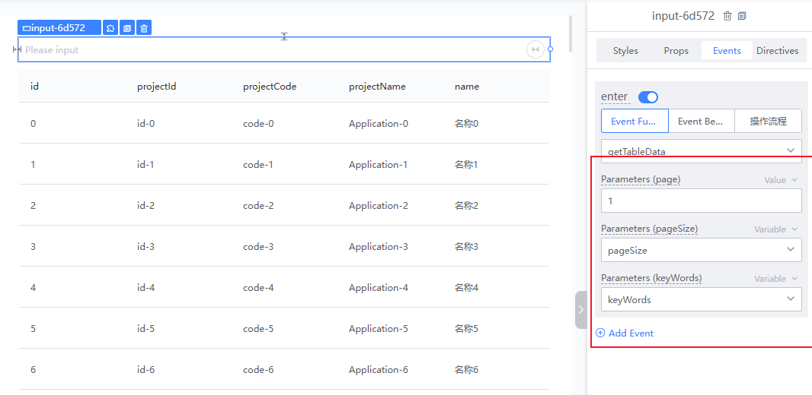
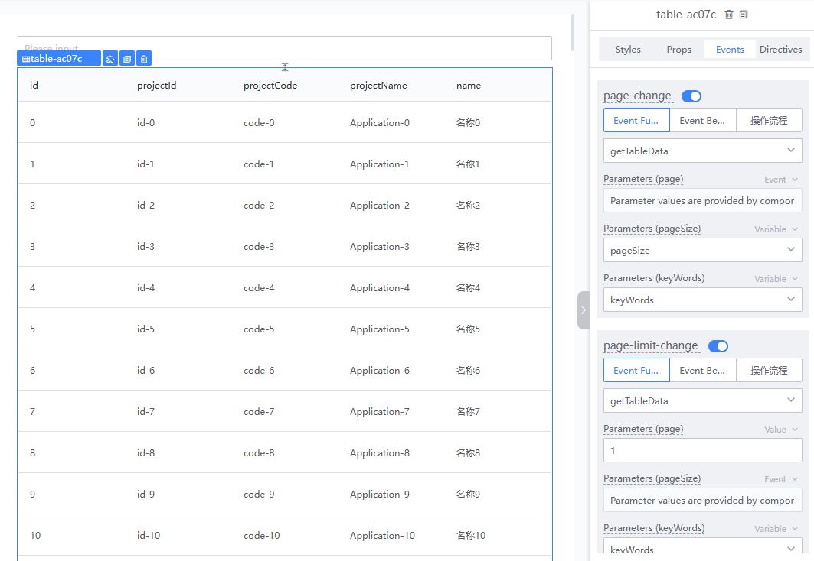
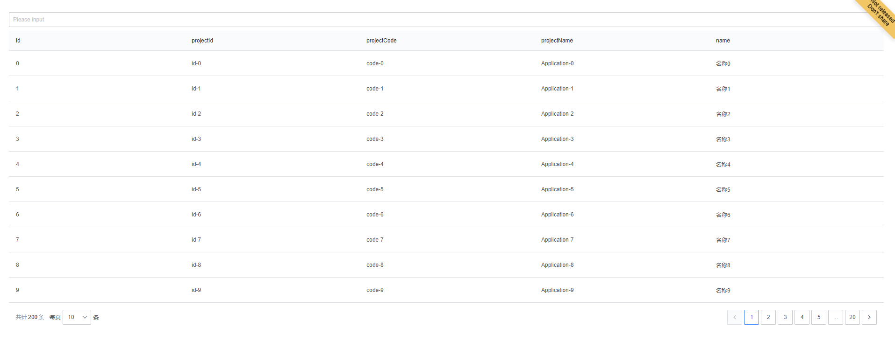

# How to Develop a Table Query Page

### Step 1: Drag and Drop the "Input Box" and "Table" Components onto the Canvas

### Step 2: Configure Component Properties and Directives

- **Set the Table Data Source**: Create a new variable "tableData", configure the "Table" component property "data", and bind it to the custom variable "tableData".
- **Retrieve the Keyword from the Input Box**: Create a new variable "keyWords" and bind the input box component property directive "v-model" to the variable "keyWords".
- **Configure Table Pagination**: Select "remote pagination" for the pagination property.
  - Create a new variable "count" and bind the pagination "count" property to the variable "count".
  - Create a new variable "pageSize" and bind the pagination "limit" property to the variable "pageSize".

### Step 3: Create the Function "getTableData" to Query and Retrieve Table Data

**Note:**

When editing the function:

1. You can use `lesscode.directiveValue`, ensuring you select the corresponding attribute directive value using the editor's auto-completion feature to get or modify component property values configured with directives on the current page.
2. You can use `lesscode.functionName`, ensuring you select the function you need to call using the editor's auto-completion feature.

### Step 4: Configure the "Table" Component "data" Property and Events

1. Set the initial data source of the table "data" property to a function and bind it to the function "getTableData".
2. Click "Refresh Header".

### Step 5: Bind the Input Box "enter" Event to the Table Query Function "getTableData"

### Step 6: Bind Table Pagination Events to Event Functions

Bind the "page-change" and "page-limit-change" events to the table query function "getTableData", and configure the corresponding function call parameters.

### Step 7: Preview the Effect

