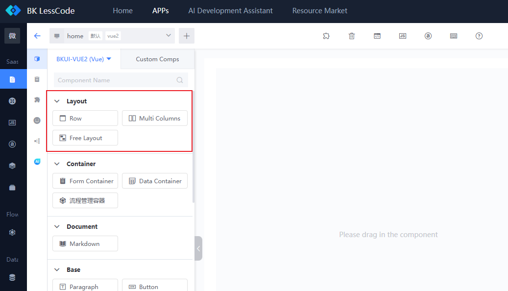
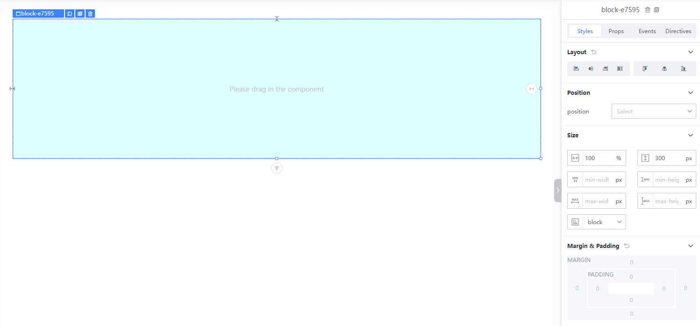
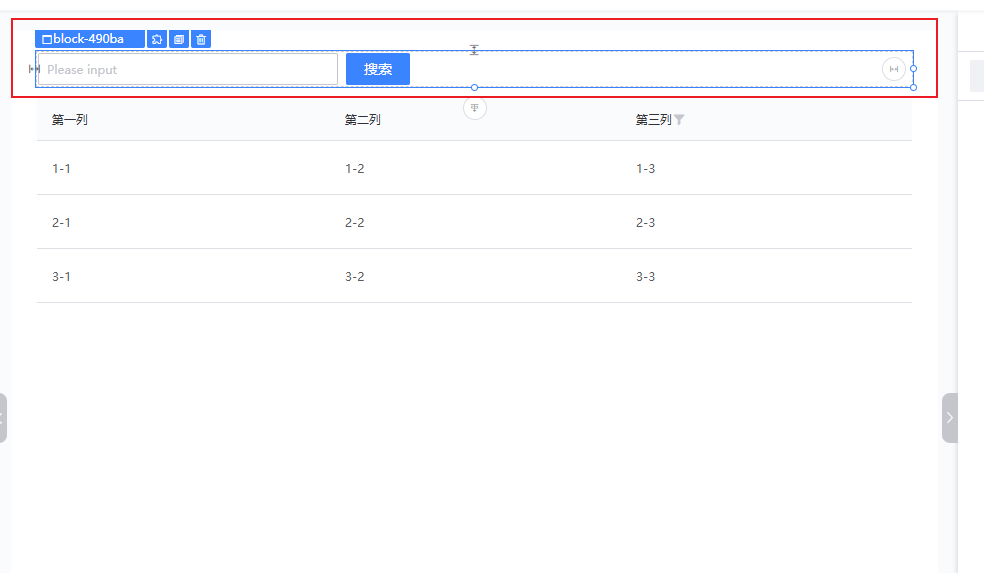
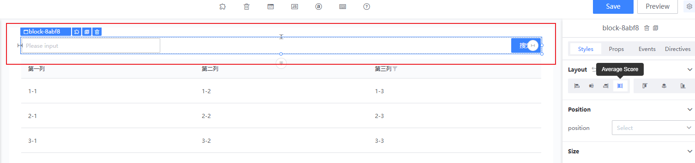
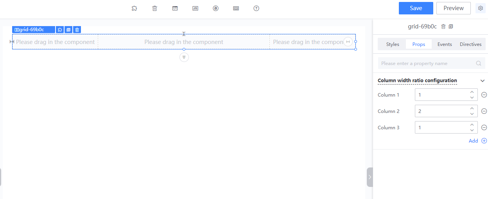
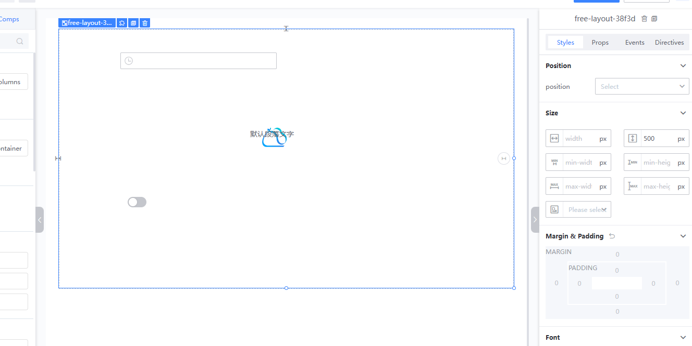

# Canvas Layout Containers

The BlueKing LessCode (LessCode) provides three types of layout containers: row layout, multi-column layout, and free layout, allowing users to easily design the pages they need.

## General Style Settings

Each type of layout has general style settings, such as width, height, background color, etc. These can be configured in the style properties panel on the right after selecting a layout container. (For example, in row layout, the container is set to a height of 300px, width of 100%, and a light blue background color.)

## Row Layout

A row layout can be understood as a regular div. A common use case is placing a search box and a search button within a row layout container.

In addition to general style settings, row layout allows for setting the alignment of components within the layout:

- Left Align
- Right Align
- Center Align
- Justified
- Top Align
- Middle Align
- Bottom Align

## Multi-Column Layout

The multi-column layout divides the container into n columns. The settings panel allows you to define how many columns the container should have and the width ratio of each column. For example, dividing the container into three columns with a 1:2:1 ratio.

Note: When selecting a specific column in a multi-column layout, you can also set the alignment of components within that column.

## Free Layout

The free layout is an area with a default height of 500px and a transparent background. Within a free layout, each component's position can be freely moved, and components can be layered on top of each other.

## Relationship Between Layout and Components (Row Layout and Multi-Column Layout Are Collectively Referred to as Grid Layout)

- Only regular components can be placed in a free layout; grid layouts and other free layouts cannot be placed within it.
- Regular components within a free layout cannot be dragged into a grid layout or another free layout.
- Grid layouts can contain other grid layouts, free layouts, and regular components.
- Regular components within a grid layout can be dragged into another free layout or grid layout.
