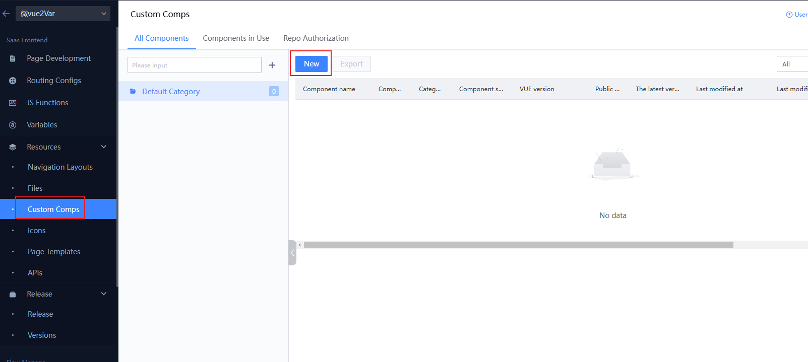
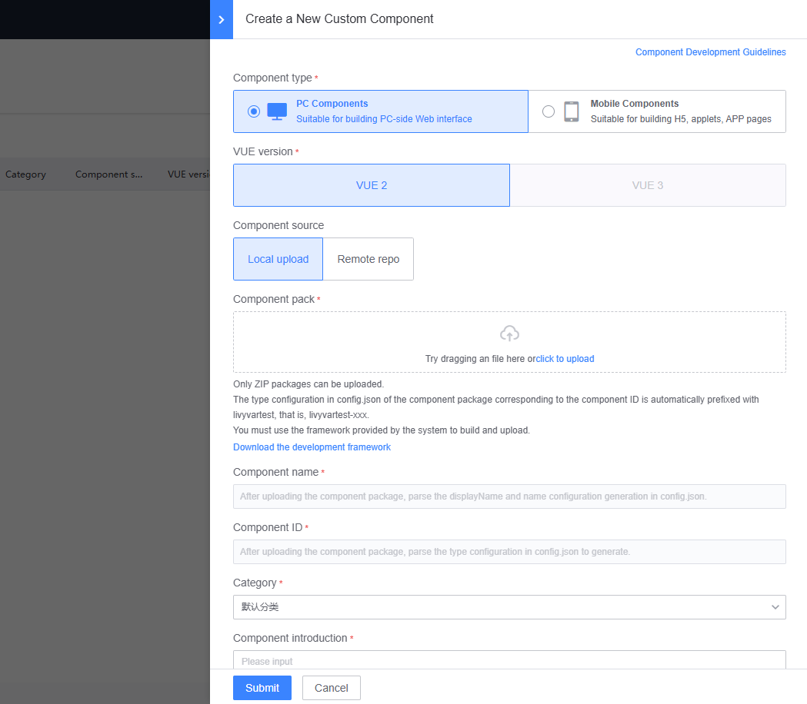
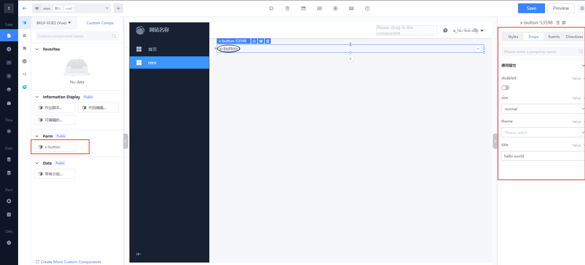

# Custom Component Management

In addition to the basic components provided by the platform, the LessCode platform also allows users to develop and upload custom components that better suit their business scenarios.

## Local Component Development

```bash
1. You must download and use the development framework provided by the platform.

2. Copy the original component code to the `src/` directory of the development framework.

3. Add a `framework` field in the `config.json` file to specify the framework used by the custom component, which can be either vue2 or vue3.

4. Follow the development documentation for component development and building.
```

### Custom Component Project File Structure [Repository Link](https://github.com/TencentBlueKing/lesscode-custom-components)

Download Development Framework: [Vue2](./static/bk-lesscode-component-vue2.zip) [Vue3](./static/bk-lesscode-component-vue3.zip)

```bash
|-- ROOT                    # Root directory of the custom component
    |-- src/                # Directory for writing custom components
        |-- config.json     # Required. Configuration for component capabilities, describing the capabilities exposed to LessCode.
        |-- index.vue       # Required. Source code for component implementation.
        |-- components/     # Recommended. Directory for referenced sub-components.
        |   ......          # Implementation of ajax mock.
        |-- doc/            # Documentation project for the BlueKing front-end development scaffold. Details here are unrelated to the actual project, feel free to explore if interested (content in the doc will not affect the actual project).
        |   ......
        |-- statics/        # Recommended. Directory for static resources.
        |   ......
```

### config.json (Configuration of Capabilities Exposed to LessCode)

<table class="table">
    <tr>
        <th>Field Name</th>
        <th>Type</th>
        <th>Description</th>
    </tr>
    <tr>
        <td>type</td>
        <td>String</td>
        <td>Tag name displayed in the source code (only supports lowercase English letters).</td>
    </tr>
    <tr>
        <td>name</td>
        <td>String</td>
        <td>English name displayed on the page.</td>
    </tr>
    <tr>
        <td>framework</td>
        <td>String</td>
        <td>Framework used by the component.</td>
    </tr>
    <tr>
        <td>displayName</td>
        <td>String</td>
        <td>Chinese name displayed on the page.</td>
    </tr>
    <tr>
        <td>events</td>
        <td>Array</td>
        <td>Custom events supported by the component.</td>
    </tr>
    <tr>
        <td>styles</td>
        <td>
            Array, optional values include:
            <p>display: Type of the generated box.</p>
            <p>size: CSS box model (width, height).</p>
            <p>padding: CSS box model inner padding.</p>
            <p>margin: CSS box model outer margin.</p>
            <p>font: Font.</p>
            <p>border: Border.</p>
        </td>
        <td>Supported CSS style settings.</td>
    </tr>
    <tr>
        <td>props</td>
        <td>Object</td>
        <td>Supported property configurations for the component.</td>
    </tr>
    <tr>
        <td>directives</td>
        <td>Array</td>
        <td>Supported directive configurations.</td>
    </tr>
</table>

#### events — Custom events supported within the component (e.g., `this.$emit('click')`), specifying which events should be exposed to LessCode

```js
// events
{
    ...
    events: [
        {
            name: 'click', // Component supports click event
            displayName: 'Click Event', // Event name displayed in Chinese
            tips: 'Respond to the component's click event' // Description of the event function
        },
        {
            name: 'focus', // Component supports focus event
            displayName: 'Focus Event', // Event name displayed in Chinese
            tips: 'Respond to the component's focus event' // Description of the event function
        }
    ]
}
```

#### props — Supported configuration for component props (consistent with how Vue custom components are used)

```js
// props
{
    ...
    // Component supports configuration of value
    value: {
        type: 'string', // Type (string, number, array, object, boolean)
        val: 'hello world !!!', // Default value
        options: [], // List of selectable values
        displayName: 'Value', // Property name displayed in Chinese
        tips: 'Blank prompt', // Description of data usage
    }
}
```

#### directives — Supported directive configurations

```js
// directives
{
    [
        ...
        {
            type: 'v-bind', // Directive type
            prop: 'disabled', // Property bound by the directive
            val: '', // Variable name bound by the directive
            modifiers: ['sync'], // Directive modifiers, this field is optional
            defaultVal: false // Default value of the variable bound by the directive
        }
    ]
}
```

### Local Debugging

```bash
1. Install dependencies
npm i 

2. Local development
npm run dev

3. Write component logic and conduct tests
```

### Build

```bash
1. Execute build command
npm run build

2. After building, the custom component will be constructed in the /zip directory
```

## Upload Custom Components

#### 1. Select an APP and Enter the APP Management

> In the APP list, select the APP to edit or create a new APP (the newly created APP will automatically enter the APP management page).


#### 2. Create a New Custom Component

> Select the custom component management tab on the left to enter the custom component management page.
>
> Click the "New" button to upload a custom component. If custom components have been uploaded, they will be displayed here for management operations.
>
> The "In Use" tab will show records of custom components being used.



#### 3. Upload Custom Component (component-project.zip)

> Clicking the "New" button will display a dialog for creating a custom component.
>
> The first item in the operation form is selecting the custom component package to upload (component-project.zip, located in the /zip folder after building).
>
> Upon successful upload, the config.json in the custom component package will be parsed automatically, returning the provided type, name, and displayName, and automatically populating them into the corresponding form fields.



## Using Custom Components on Pages

#### Specify the Page to Use the Component

> Select the page to edit from the APP page list, or create a new page for editing.

#### Drag and Drop the Component

> The uploaded component will be automatically registered on the page editing page.
>
> Enter the page editing page and select the custom component tab.
>
> Find the component you want to use and drag it to the editing area.

#### Edit Component Functions

> Select the component to operate on in the editing area.
>
> In the configuration panel on the right, select the operation tab to complete the page function configuration.


