# Data Table Management

In the LessCode platform, users can create data tables and view data from different environments: `Preview`, `Staging`, and `Production`. Users can also modify table data across these environments. Each table has corresponding CRUD APIs, which can be selected when creating functions to allow table data operations on pages. LessCode also supports third-party databases, allowing users to connect to existing databases. When accessing third-party data, the platform automatically retrieves the table structure, enabling users to perform CRUD operations on it.

## Built-in Database

### Create a New Table

Navigate to the "APP Development" -> "Data Table Management" page and click the "New Table" button to enter the new table page.

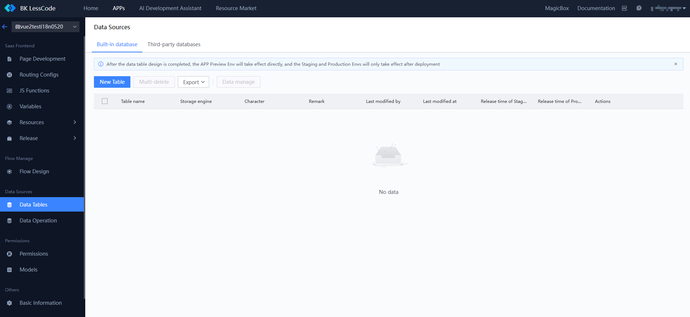

On the new table page, users can fill out the table-related fields based on the guidance provided.

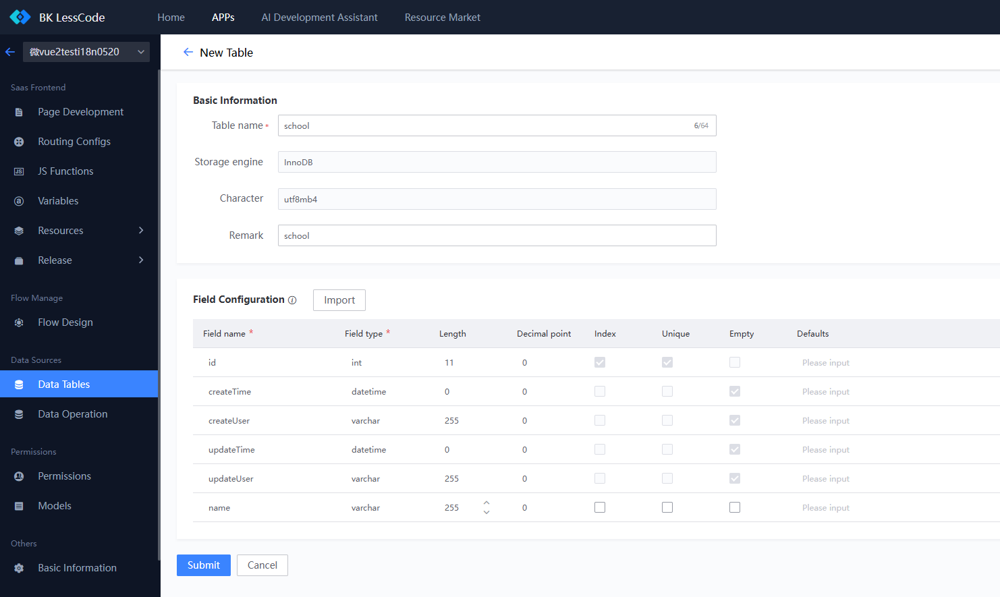

After completing the form, click the submit button to display the SQL content to be executed. Once submitted, the SQL will take effect upon the next deployment and cannot be modified, so it's crucial to carefully check the SQL content and confirm its impact.

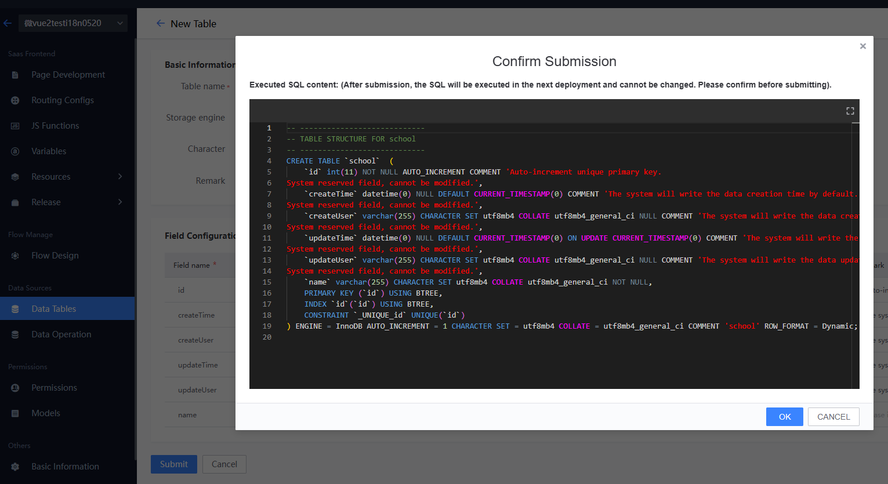

### Modify Table Structure, View Change Logs, Export Table Structure

In the list page, use the `Table Structure Design` action to access the table information page, where you can view the specific structure of the table. Click the `Edit` button to modify the table structure, `Change Logs` to view changes, and `Export` to export the table structure.

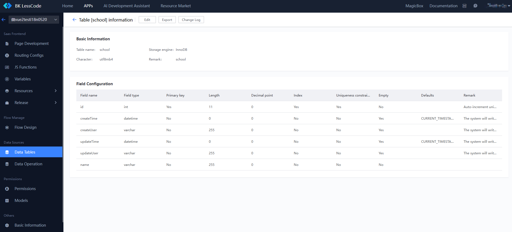

### Data Management

Access the data management page via the `Data Management` button or the `Data Management` action in the operations list.

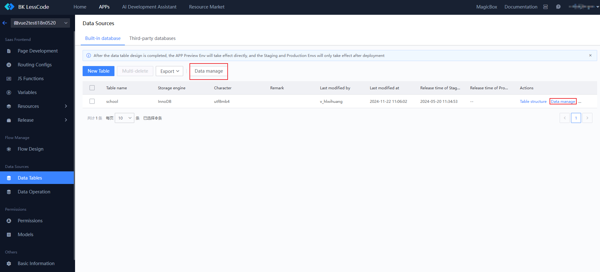

#### The data management page allows switching between `Preview`, `Staging`, and `Production` environments. Note that `Staging` and `Production` environments will have data only after APP deployment. After selecting a table from the list, the right side of the page displays three tabs: `Data`, `Table Structure`, and `API`, showing table data, structure, and APIs, respectively.

Under the Data tab, you can perform operations such as `Import`, `Export`, `Add`, and `Edit`.

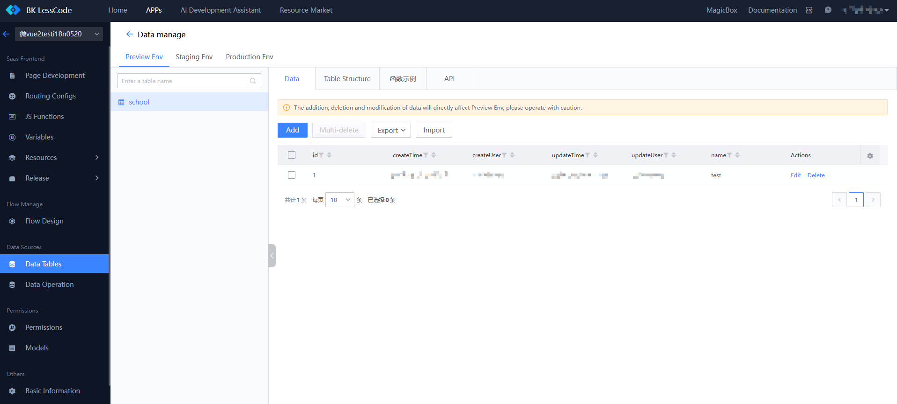

Under the Table Structure tab, you can view detailed online table information, and click the design table structure to jump to the edit page for modifications.

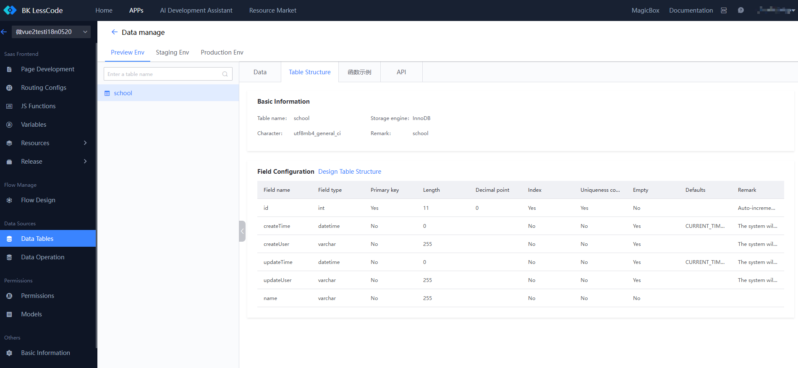

Under the API tab, you can view the interfaces for operating the table.

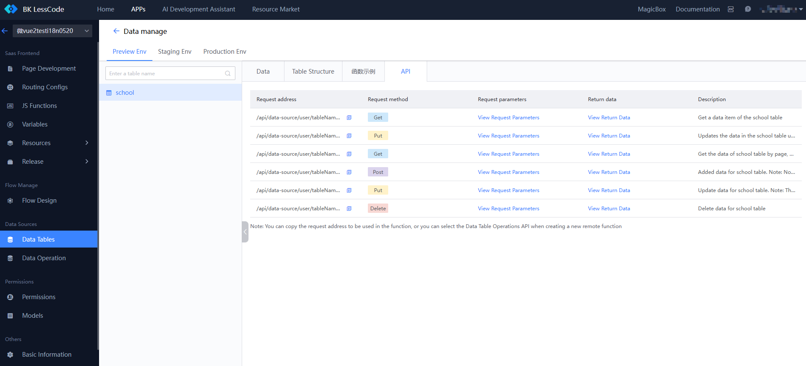

When creating a new function, switch the function type to a remote function. You can select `Data Table Operation API` and choose the desired table and API to operate.

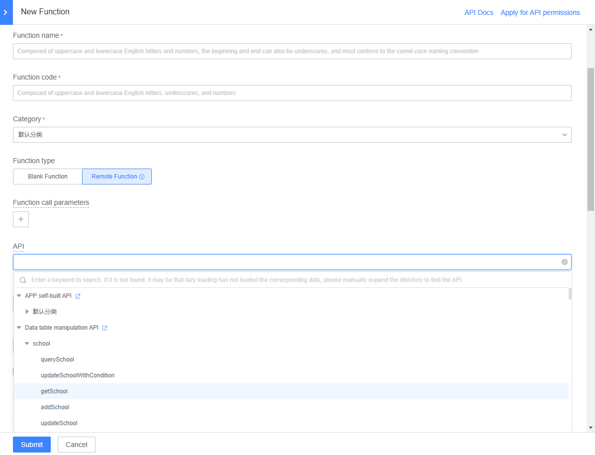

## Third-party Database

Switch to the `Third-party Database` tab, click `Add`, and fill out the form in the side panel to add a third-party database. Each time you select a third-party database, the system automatically retrieves the table structure. Note: Tables must have a unique auto-increment `id` field; otherwise, the system will add this field to the table.

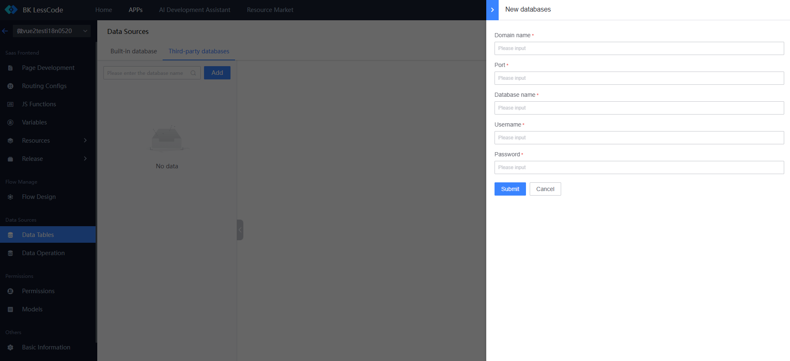

### Add, Modify Third-party Database Table Structure and Data

After selecting a third-party database, you can view existing table structures on the right. You can use the `New Table` button to create a new table, `Table Structure Design` to modify the structure, and `Data Management` to manage data. The operations are consistent with the built-in database, except that data management is available in only one environment.

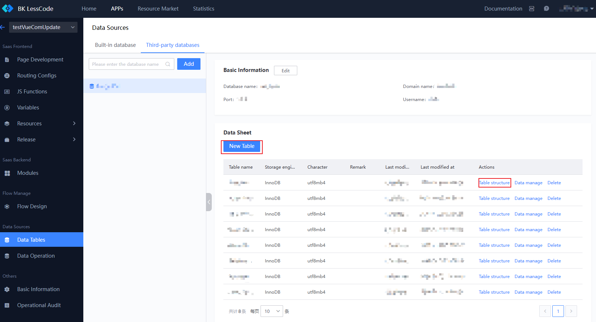
