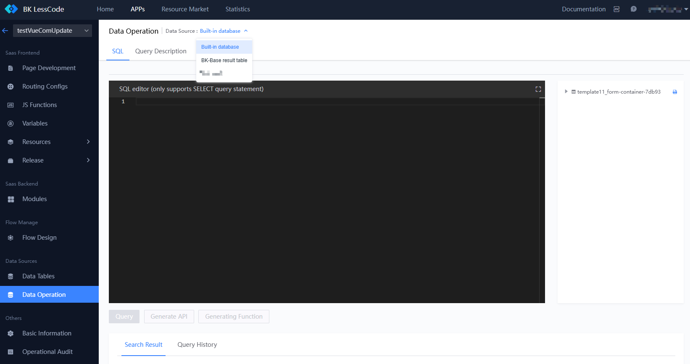
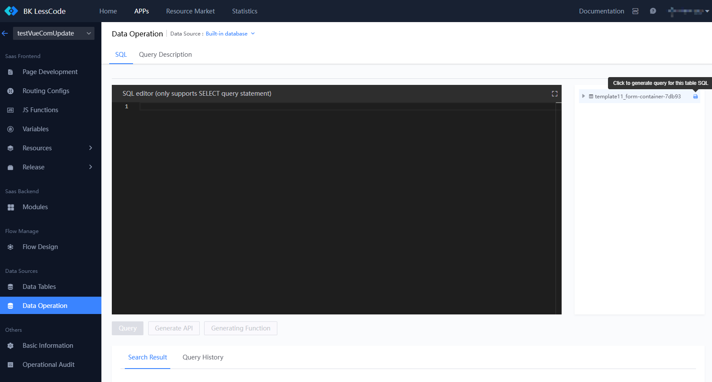
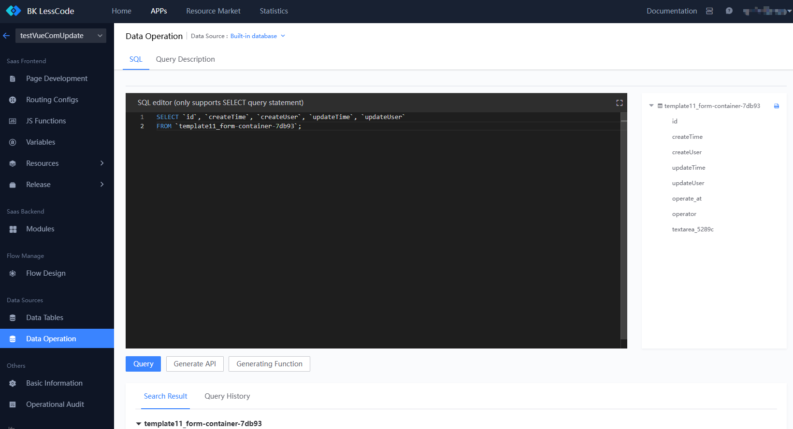
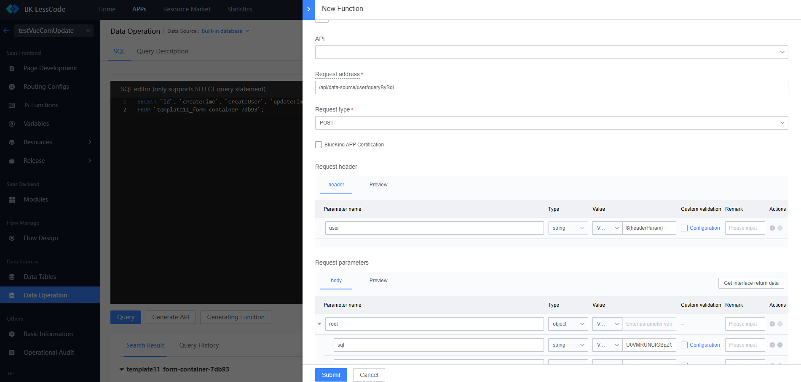
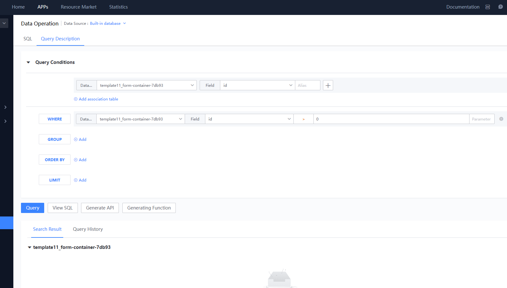
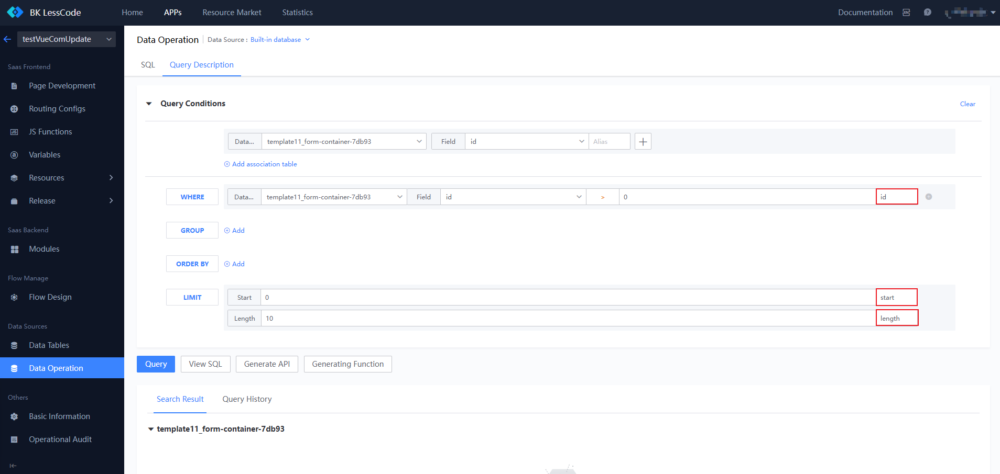
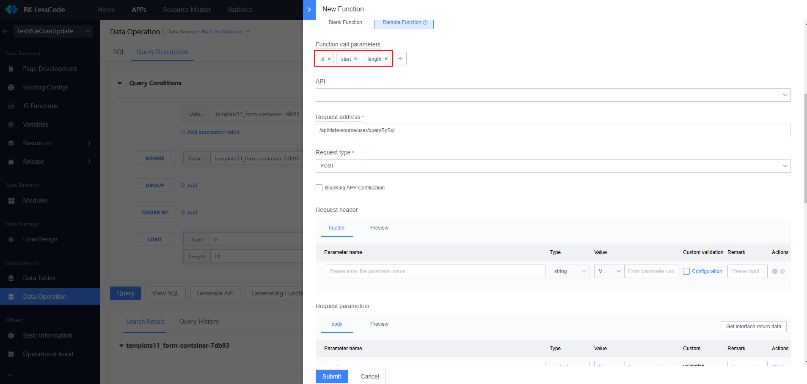

# Data Operations

The LessCode provides a data operations page to facilitate complex data queries. Users can write SQL directly or use query descriptions to perform data queries.

## Switch Between `Built-in Database`, `BkBase Result Table`, and `Third-party Database`

On the "APP Development" -> "Data Operations" page, users can switch databases at the top of the page. Subsequent data queries will be performed in the selected database.

## Write SQL to Query Data

Switch to the SQL tab to directly write SQL statements. The tree structure on the right displays all table structures in the current database, and users can click the button on the right side of the tree to quickly generate SQL. Note: Only query SQL is supported.

After writing the SQL, click the query button to view the results in the `Query Results` tab below. The `Query History` tab allows users to view query history, and by hovering over a row, they can click the `Reload` button to restore the query scenario at that time.

Once the query is successful, users can click `Generate API` to create an API or `Generate Function` to create a function. When generating a function and API, SQL parameters will be encrypted. After generation, do not change the SQL field in the parameters.

## Query Description

Switch to the Query Description tab to generate query statements through configuration. The query conditions include `SELECT`, `WHERE`, `GROUP`, `ORDER BY`, and `LIMIT`, allowing users to configure which tables and fields to query, filter conditions, grouping, sorting, and data limits. Refer to MySQL syntax for specific meanings. After completing the configuration, users can execute the query, and upon success, they can `View SQL`, `Generate API`, or `Generate Function`.

`WHERE` and `LIMIT` can be parameterized, and parameters will be automatically generated when creating an API or function. Simply pass the corresponding parameters when calling the function. Note: If parameters are configured, the values are used for queries in the query description. Parameters are only effective in functions.

If parameters are configured, function parameters will be automatically generated when creating a function. Note: Do not delete the automatically generated parameters or modify the encrypted SQL.

