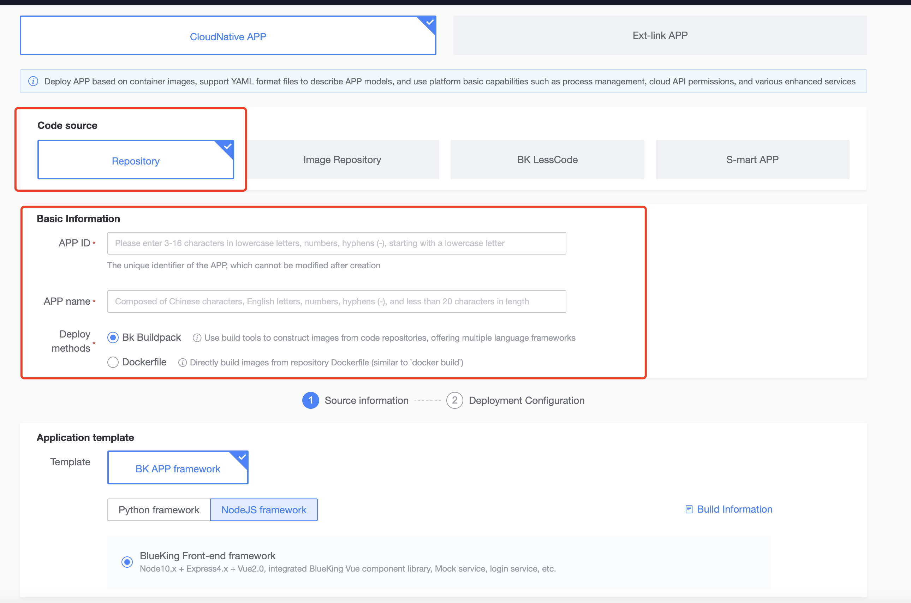

# APP Secondary Development Guide

## Method 1: Download the Entire APP Source Code Package for Secondary Development

Download the APP source code, and the platform will integrate all page source code and page routing configurations into the [Blueking Frontend Development Framework (BKUI-CLI)](https://bk.tencent.com/docs/document/5.1/19/583). This will be available as a complete source code package for download.


After downloading, you can proceed with secondary development and deployment through the following steps:

1. Create a new code repository on Git (New Project), extract the downloaded source code package, and commit the source code to the newly created repository. The directory structure is as follows:

```bash
├── README.md
├── lib/                    # Source code directory
│   ├── client/             # Frontend source code directory
│   │   ├── build/          # Frontend build script directory
│   │   │   ......
│   │   ├── index-dev.html  # HTML for local development
│   │   ├── index.html      # HTML for production environment
│   │   ├── src/            # Frontend source code directory
│   │   │   ├── App.vue     # APP component
│   │   │   ├── main.js     # Main entry point
│   │   │   ├── api/        # Frontend AJAX directory
│   │   │   │   ......
│   │   │   ├── common/     # Common frontend modules directory
│   │   │   │   ......
│   │   │   ├── components/ # Frontend components directory
│   │   │   │   ......
│   │   │   ├── css/        # Frontend CSS directory
│   │   │   │   ......
│   │   │   ├── images/     # Directory for frontend images
│   │   │   │   .....
│   │   │   ├── mixins/     # Frontend mixins
│   │   │   │   ......
│   │   │   ├── router/     # Frontend router directory
│   │   │   │   ......
│   │   │   ├── store/      # Frontend store directory
│   │   │   │   ......
│   │   │   ├── views/      # Frontend views directory
│   │   │   │   ......
│   │   └── static/         # Frontend static resources directory
│   │       ......
│   └── server/             # Backend source code directory
│       ├── app.browser.js  # Server start file
│       ├── logger.js       # Backend logging component
│       ├── util.js         # Backend utility methods
│       ├── conf/           # Backend configuration files directory
│       │   ......
│       ├── controller/     # Backend controller directory
│       │   ......
│       ├── middleware/     # Backend middleware directory
│       │   ......
│       ├── model/          # Backend model directory
│       │   ......
│       ├── router/         # Backend routing directory
│       │   ......
│       ├── service/        # Backend services directory
│       │   ......
├── nodemon.json            # Nodemon configuration file
├── package.json            # APP description file
```

2. Create an APP module in the Blueking Developer Center.

   Note:

   - For APP module source code management, select "Code Repository" and bind it to the code repository created in step 1.
   - For development language and initial template, select "Nodejs -> Blueking APP Frontend Development Framework".

     
3. Submit the secondary development code to the repository, access the deployment page of the APP module in the Blueking PaaS Platform, and deploy.

## Method 2: Download Source Code of a Single APP Page for Secondary Development

If you are adding a new functional page to an existing APP, you can use drag-and-drop layout for a single page and directly download the independent page source code to integrate it into the existing APP project.


