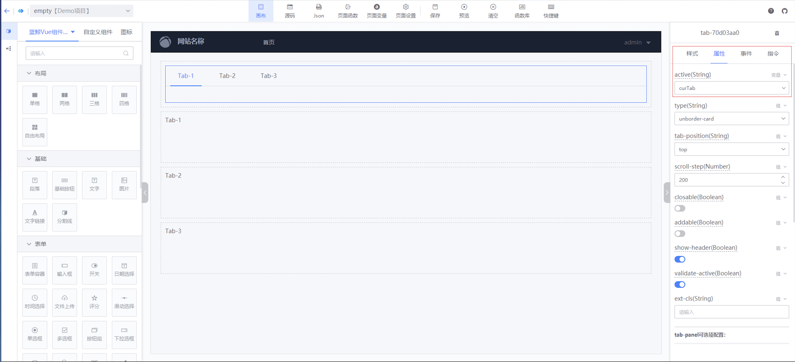

## Instructions for use
---
In the BlueKing LessCode: more business development can be completed through [VUE instructions](https://cn.vuejs.org/api/built-in-directives.html). The following functions can be completed through instructions:
* By configuring attribute-related instructions, the value of the component can be dynamically modified, and the value of the attribute can also be obtained in the function for subsequent business development.
* By configuring commands in the command panel, you can render multiple elements, control whether elements are displayed, and create two-way bindings on form controls or components.

### Instructions related to configuration properties
---
#### Configuration method:
:::info
* Open the canvas editing page
* In the canvas editing area, use the mouse to select a component
* In the configuration area on the right, switch the Tab to the properties panel
* Find an attribute you want to configure, click on the upper right corner of the attribute to switch, you can switch to a variable or expression
* Select variables or fill in expressions
:::

#### Instructions for use:
* After the attribute is switched to a variable and the variable is selected, the value of the attribute will be bound to the variable. The value of this attribute can be modified in the function, or the value of the attribute can be obtained in the function. Note: `lesscode.` can be used in the function to invoke variable selection, and you can select variables bound to a certain attribute.
* After the attribute is switched to a directive and an expression is filled in, the value of the attribute will be calculated from the expression. You can fill in an object value expression like `lesscodeVar.inputValue`, or an expression like `'perfix' + inputSearchVar`. Note: The variables of the page and the global properties provided by JS can be used in the expression, and the remaining variables will be treated as `undefined`

### Configure command panel commands
---
#### Supported commands:
Currently supported are `v-if` `v-show` `v-for` `v-model` `v-html`
#### Configuration method:
:::info
* Open the canvas editing page
* In the canvas editing area, use the mouse to select a component
* In the configuration area on the right, switch Tab to the command panel
* Find a command you want to configure, click on the upper right corner of the attribute to switch, you can switch to a value, variable or expression
* Select variables or fill in expressions
:::

#### v-if, v-show usage instructions
> v-if and v-show both control whether the element is displayed. The difference is that `v-if` will control whether the Dom element is rendered to control whether the element is displayed, and `v-show` will control the `display` attribute of the element to control the element. Whether to display. The following example demonstrates how to use `v-if`:
:::info
* Drag `Tab` and 3 `Grid` components into the canvas
* Select the `Tab` component, switch to the properties panel, and bind a variable `curTab` to the `active` property (as shown in Figure 1 below)
* In order to distinguish the three `Grid` components, drag in the `Paragraph` component respectively and write a text to distinguish it.
* Select the `Grid` component, switch to the command panel, switch `v-if` to an expression, and fill in `curTab === 'Tab-1'`. The other two `Grid` components are configured similarly (as shown below) 2). Note: `Tab-1` is the value of the three tabs configured in the `Tab` component
* That is, when switching tabs is completed, the requirements of different grids are displayed (as shown in Figure 3 below)
:::

#### v-for usage instructions
> The `v-for` directive can render a set of data into a set of elements. The following example demonstrates how to use `v-for`:
:::info
* Drag the `Card` component into the canvas, and drag a `Paragraph` component into the `Card` component and the `Image` component inside the `Card` component
* Select the `Card` component, switch to the command panel, and bind a variable `cardList` to the `v-for` command (as shown in Figure 1 below). Note: The variable `cardList` needs to exist in the application. It is an array with 4 sub-elements. Each sub-element has `img` and `name` attributes.
* The `card06fb0729Item` displayed above the `v-for` instruction can assign values to the instructions of the current component and sub-components, except v-if and v-show of the current component.
* Select the `Image` component and fill in the expression `card06fb0729Item.img` into the `src` attribute of the component (as shown in Figure 2 below). Note: The sub-item `card06fb0729Item` of the variable `cardList` needs to have the `img` attribute
* Select the `Paragraph` component and fill in the expression `card06fb0729Item.name` for the `Text Configuration` attribute of the component (as shown in Figure 3 below). Note: The sub-item `card06fb0729Item` of the variable `cardList` needs to have the `img` attribute
* That is to complete rendering a set of data into a set of elements (as shown in Figure 4 below)
:::

#### v-model, v-html usage instructions
> Not all components support v-model and v-html. The following describes how to use them.
:::info
* v-model: Create two-way binding on form controls or components. This property is currently supported on form control type components. You can create two-way data binding on form elements using the v-model directive. It will automatically select the correct method to update elements based on the control type. For details, see [Form Input Binding Document](https://cn.vuejs.org/api/built-in-directives.html#v-model).
* v-html: used to update the innerHTML of the element. This property is currently supported on the `Paragraph` component.
:::