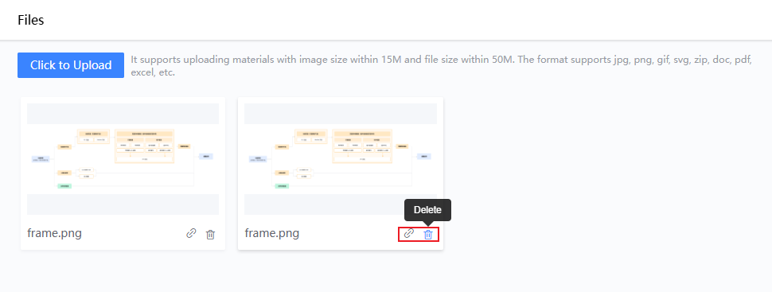
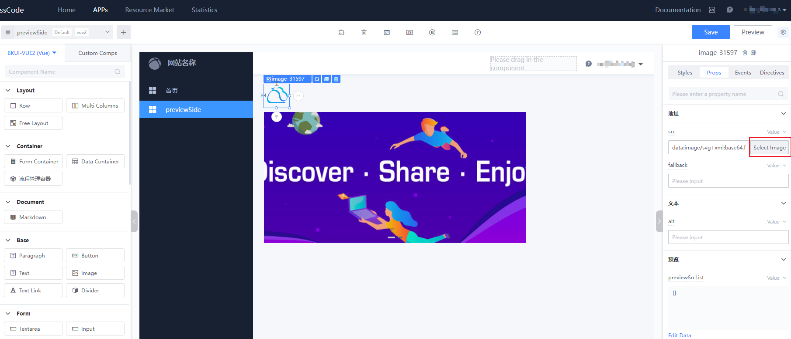
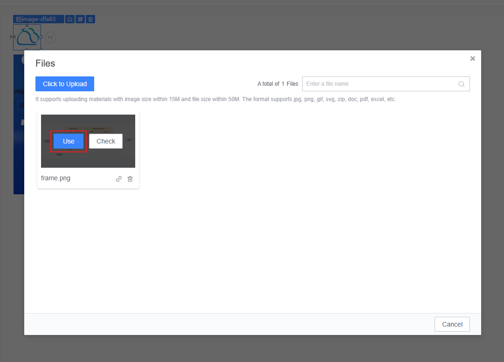

# File Management Usage Guide

File management is used to upload file resources needed in the APP, such as images and documents. Once uploaded, you will receive an access link that can be used for displaying or downloading on the page.

## File Upload

Navigate to the "Resource Management - File Management" page and click the "Upload" button to select the file you want to upload.

> Supported formats include common image and document types: jpg, png, gif, svg, zip, doc, pdf, excel

After a successful upload, you can "Copy Link" or "Delete" the file.

## Using Files on the Page

In the page editor, common components like images or carousels can easily utilize images. Drag the component onto the canvas and use the right-side properties panel to click "Select Image," which opens the file management dialog.

Click the "Use" button to select an image. You can also upload new files immediately by clicking the "Upload" button and use them right away.

Alternatively, you can reference a file link to open or download a file.

Moreover, components that can reference resources, like style background images, can select files. If you wish to enter it manually, you can obtain the file address by using "Copy Link."
