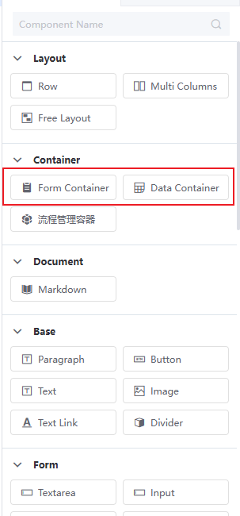
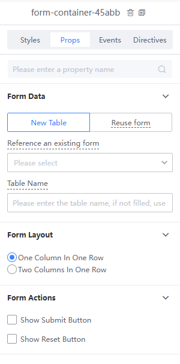
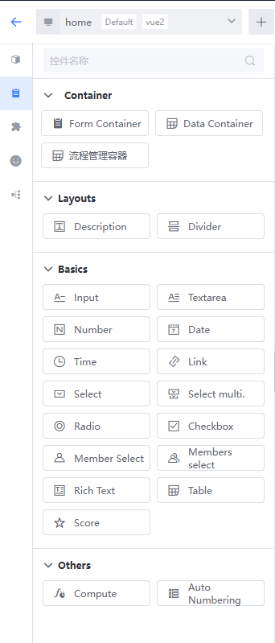
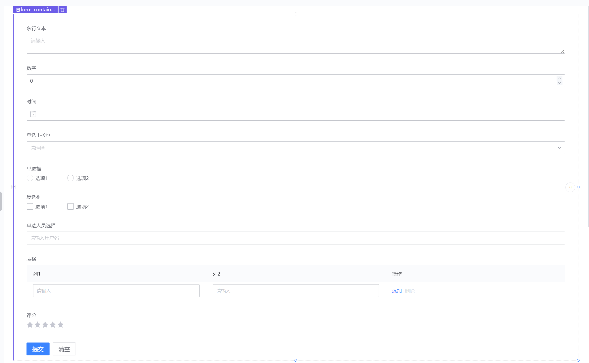
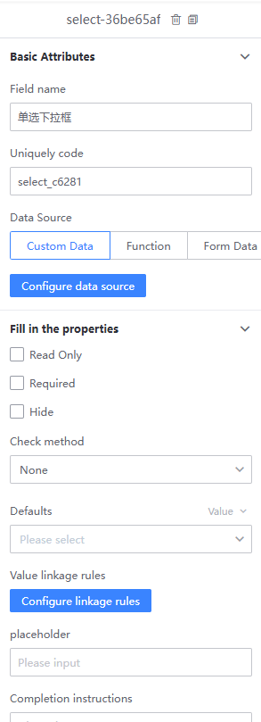
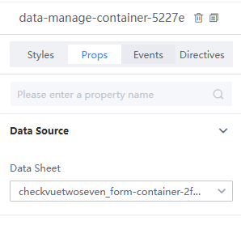
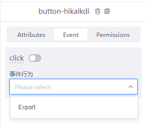
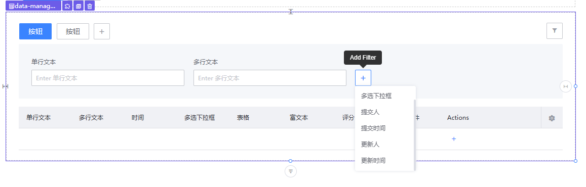
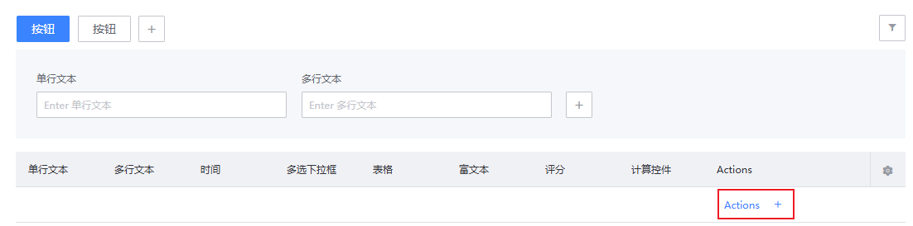
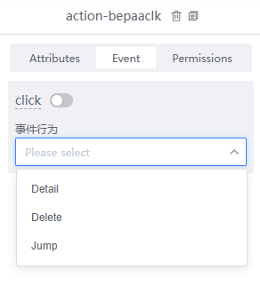

# Form Container and Data Management Container

Some APPs often require using forms to collect and manage data. For these scenarios, the platform includes two types of form editor containers: Form Container and Data Management Container. These containers simplify the complexity of form control configuration while enhancing functionality, such as default value linkage between form controls, dynamic setting of read-only, required, and hidden attributes, and data export.

You can find the Form Container and Data Management Container controls in the left menu bar of the canvas editing page. Simply drag the control elements onto the canvas to create the corresponding container:

## Form Container

### Configure Form Properties

Once a Form Container is created and saved, by default, the APP automatically creates a database table that binds to the container. Each form item in the Form Container corresponds to a field in this data table. Additionally, Form Containers support referencing and reusing tables created by other form containers within the APPs. When referencing, you can clone form fields from other tables into the current container, creating a new data table upon saving. Reusing binds the data table to the current container, allowing multiple form containers to correspond to a single table.

The Form Container offers two layout options: one-column-per-row and two-columns-per-row. Built-in "Submit" and "Reset" buttons are available but unchecked by default. If users need to submit data to the bound data table, this configuration can be enabled.

### Built-in Form Controls

Based on usage scenarios, supported form elements in the Form Container are divided into three categories of controls, which can be added to the canvas as needed.

- Layout Controls: Include descriptive text and divider line controls, primarily for adding form fill instructions or segmenting multiple forms.
- Basic Controls: Include common form element controls such as input boxes, text areas, date pickers, personnel selectors, tables, etc. Different types of forms may have different property configurations.
- Advanced Controls: Calculation controls derive values based on form items or some built-in time attributes using specified calculation rules, such as summing multiple form item values. Currently, numerical and date calculations are supported. The calculated values from these controls are not written to the DB data table. Adding an auto-numbering control to the container will add a corresponding field to the DB data table. When form data is submitted, the field's value is automatically generated based on the set numbering rule and written to the data table.

An example using a variety of form element controls:

### Configure Form Field Properties

Like other controls on the canvas, selecting a form element control displays its property configuration panel on the right side of the canvas. Different types of form element controls may have different property configurations.

## Data Management Container

The Data Management Container is a special-purpose container used for managing the data of the data table corresponding to a bound Form Container. It includes built-in functions for data export, filtering, deletion, etc., simplifying the steps developers need to implement these features.

### Bind Data Source

After adding a Data Management Container to the canvas, you need to bind a form data source to the container. The bound data source serves as the origin of the data displayed in the table.

### Data Operations

You can add buttons to the header of the Data Management Container. Like regular button controls, these can have properties, events, and permissions configured. Currently, the only built-in event is the export operation, but more operation types will be added based on usage scenarios.

### Data Filtering

Table data supports field filtering configuration, allowing data to be filtered by defining filter fields.

### Table Data Operations

Tables support configuring action columns, with three built-in action types: details, delete, and redirect. Action buttons can also have permission rules bound as needed. Once added, each row of data in the table will have corresponding action options.

