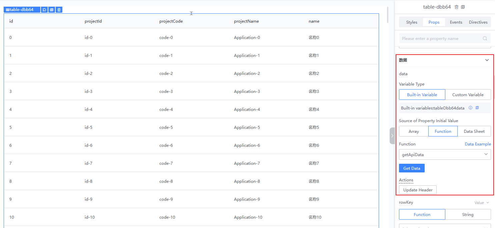
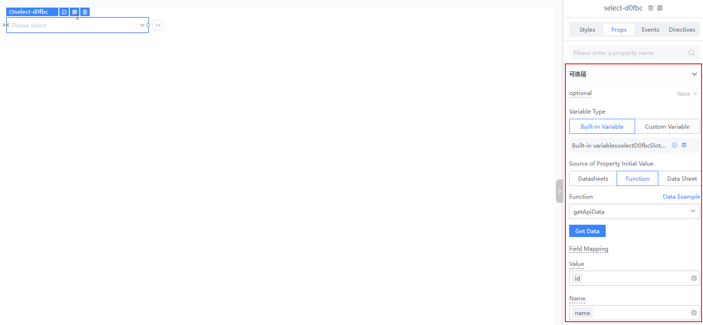
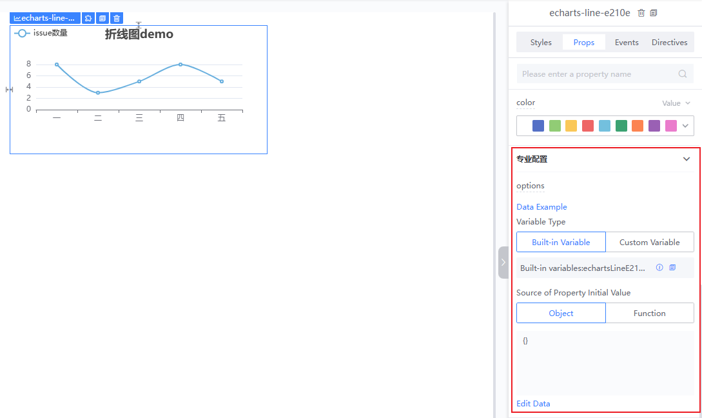
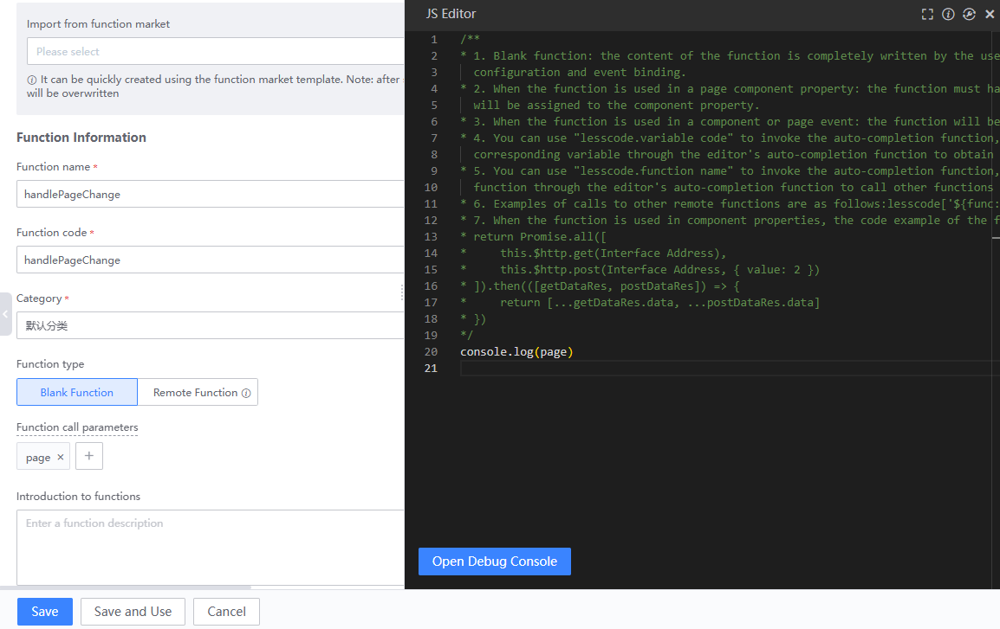
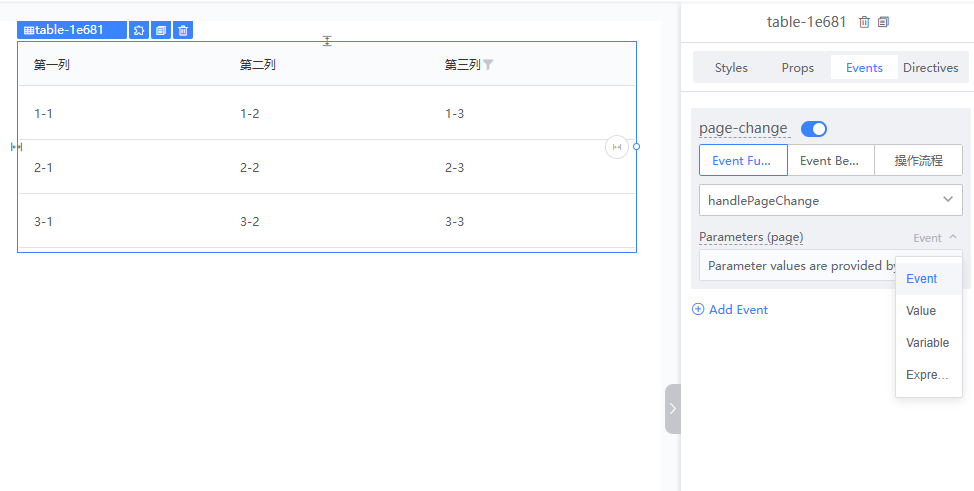
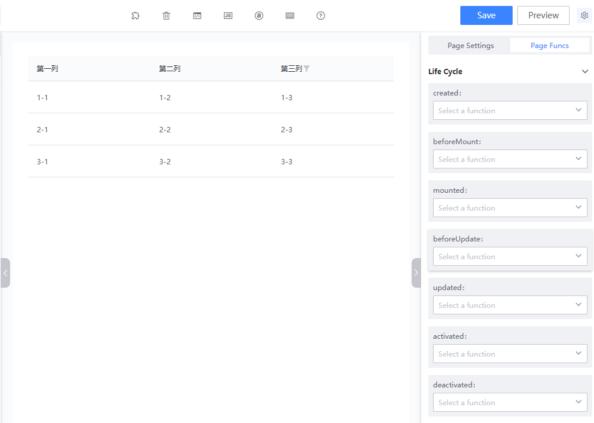

# Function Usage on Canvas

In front-end pages, functions are typically used for components to fetch data and handle page interactions. On the Blueking LessCode (LessCode), we provide functions to achieve these two capabilities based on different scenarios.

## For Component Data Fetching

### Table Component

The Table component can use functions to fetch the data that needs to be displayed and utilize the 'Update Header' operation to display all fields returned by the function.

### Dropdown Component

The Dropdown component can utilize functions to fetch data for the dropdown list and use field mapping to set the 'Value' and 'Name'.

### Chart Component

Chart components can use functions to dynamically obtain chart configurations.

## For Handling Page Interactions

### Using Functions with Component Events

Components will emit events at specific times, allowing developers to execute functions in these events to complete page interactions. Below is an introduction to using functions within events, using the Table component as an example:

Create a new function `handlePageChange`, set the `page` parameter, and the function content is to print the `page` parameter.

Select the Table component and switch to the event panel. Choose the `page-value-change` (page switch) event, and select our function `handlePageChange`. As a result, when the page number of the Table component changes, it will print the current page number value.

There are four parameter options here:

1. Event: Some components will pass a value when they emit an event. We can use this option to pass the event parameter directly to the function.
2. Value: Developers can freely input any value.
3. Variable: Choose a variable to use as the event parameter.
4. Expression: Write a JavaScript expression combined with variables.

### Using Functions in Page Lifecycle

Select the blank area of the page and switch to the page function panel to configure lifecycle functions. Developers can handle page interactions within the page lifecycle functions.

