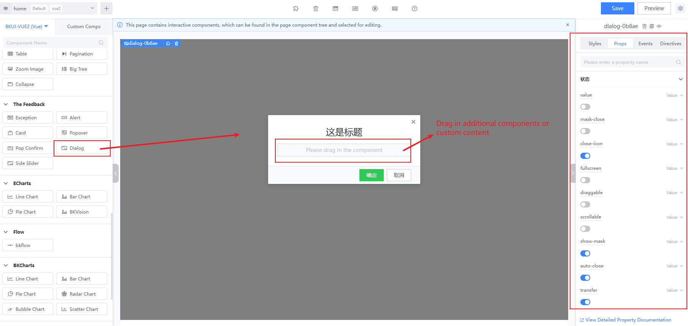
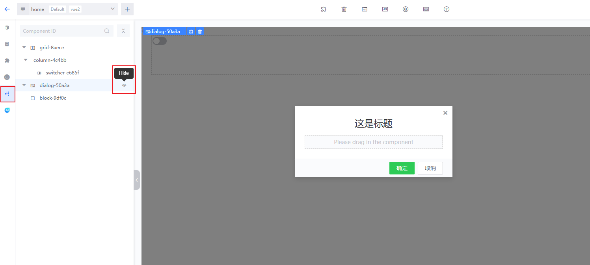
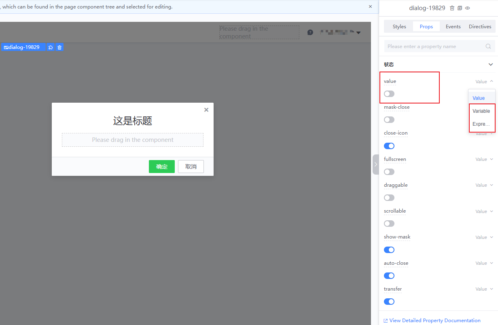
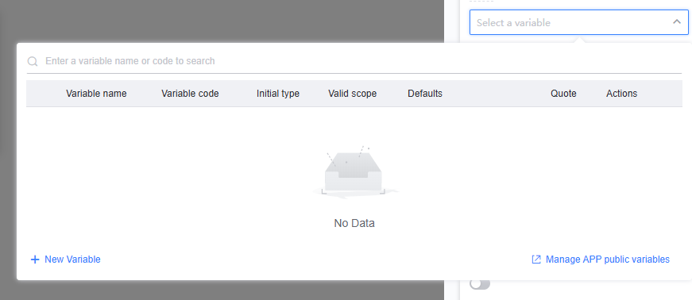
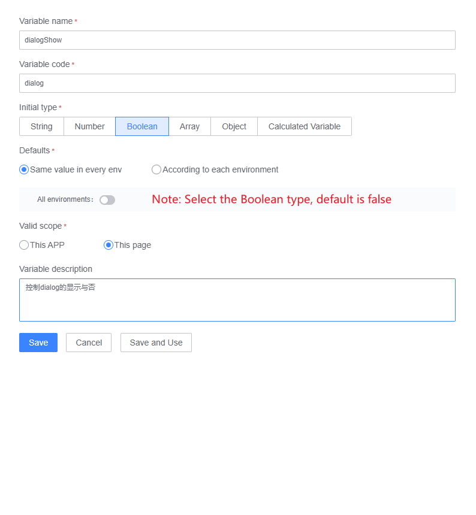
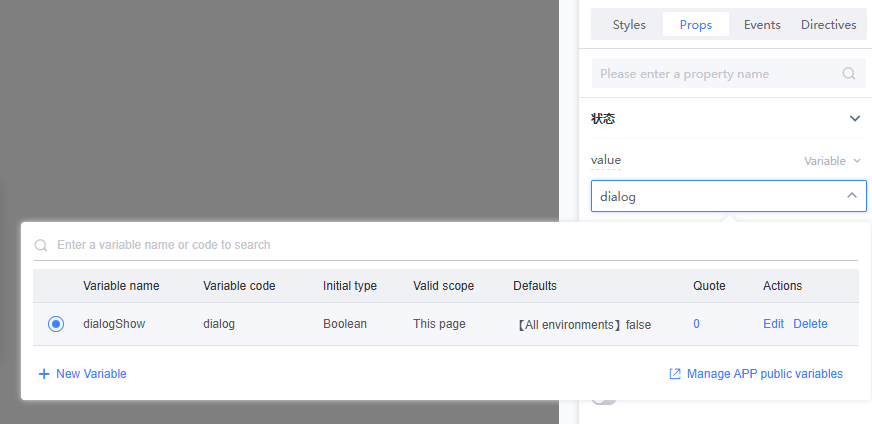
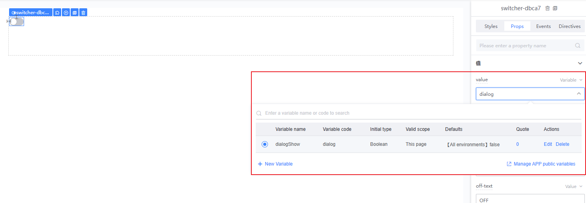
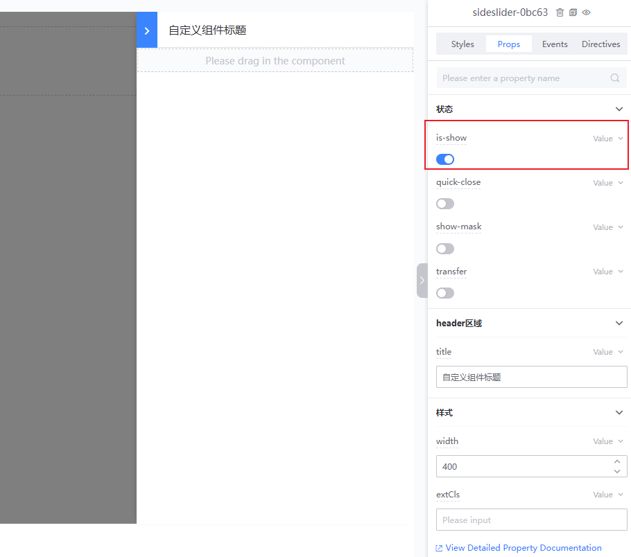

# Guide to Using Interactive Components

## What are Interactive Components?

Unlike regular components such as `button` and `text`, interactive components allow users to control the component's visibility based on certain conditions using variables. These components are strongly bound to specific conditions. For example, a `dialog` component is not permanently displayed but appears only under certain circumstances, such as after a form submission or for displaying announcements. These components are known as **interactive components**.

Currently available interactive components on the platform include `Dialog` and `Sidebar`.

## Using Interactive Components

As with regular components, drag them from the left component library onto the canvas and configure their properties via the right panel. Interactive components have a `Layout` slot in their content area, allowing you to drag other components into this area to customize the content of the interactive component.

> When activated, interactive components will occupy the entire screen and canvas, so only one interactive component can be edited at a time on the canvas.
>
> To switch components, you can toggle the left panel to the component tree and click on a component in the tree to activate the one you want to edit.
>
> The eye icon on the right of the interactive component allows you to toggle the display state of the current interactive component.

## Considerations for Interactive Components

### State Binding

> Interactive components should always be bound to a variable to determine their visibility. Static values will prevent them from interacting properly.
>
> Here, we will explain the state binding for the `Dialog` and `Sidebar` components in detail.

---

The dialog component binds its state through `v-model` (or `value`), controlling whether it is shown. By default, this is set to a static value type. In this state, the interactive component will not function properly in a real environment, so it needs to be bound to a variable or expression.

Select the variable at the top right of the value property and create a new variable in the dropdown.

When adding a new variable, make sure to choose `Boolean` as the initial type and set its default value based on the actual situation (typically `false`, and it should be triggered under certain conditions).

After creating it, select the newly created variable from the dropdown.

Finally, to display the component, simply set the variable to `true`.

To simulate this, create a `switcher` component and bind the same variable. When the `switcher` is turned on, the dialog will appear, and when turned off, it will disappear.

---

The state binding property for the `Sidebar` component is `is-show`, and its configuration method is the same as for the `Dialog`. Please refer to the steps outlined above.

