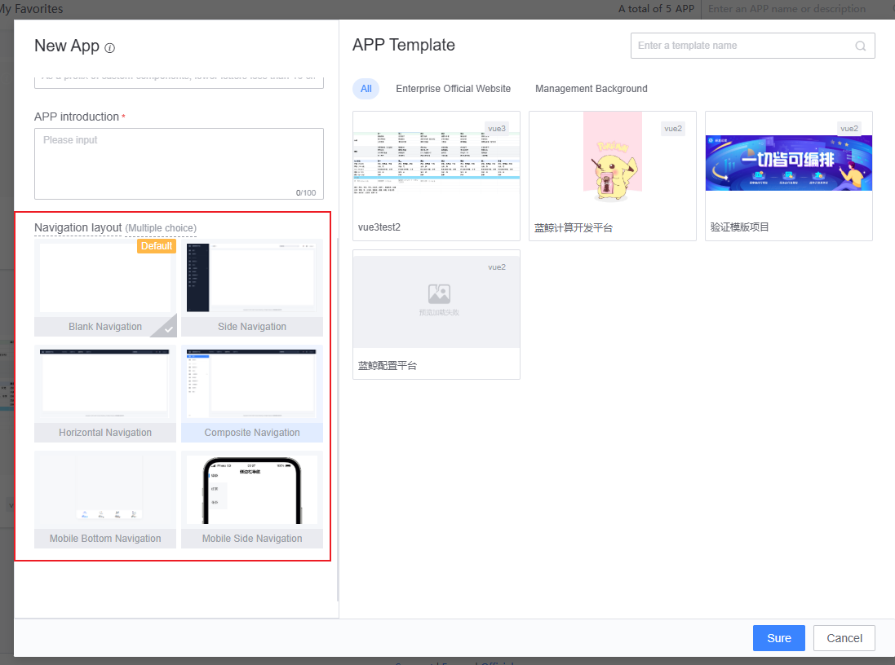
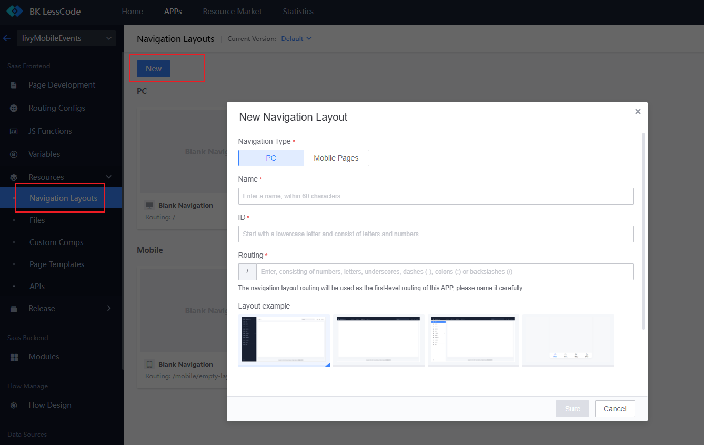
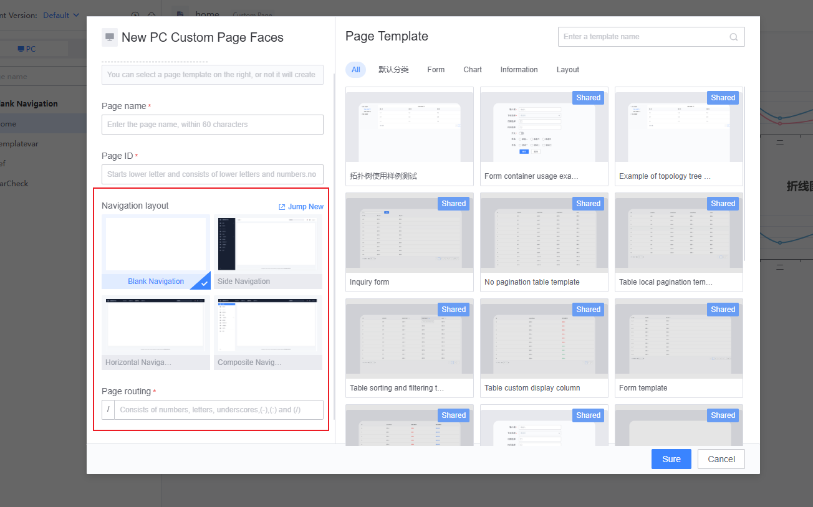
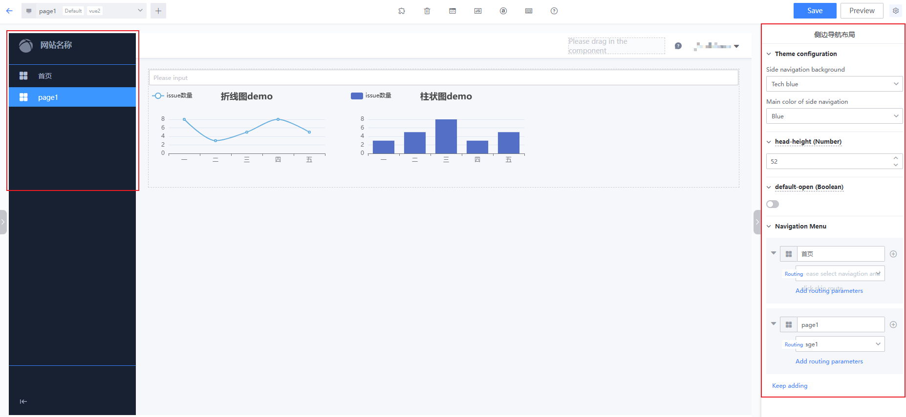
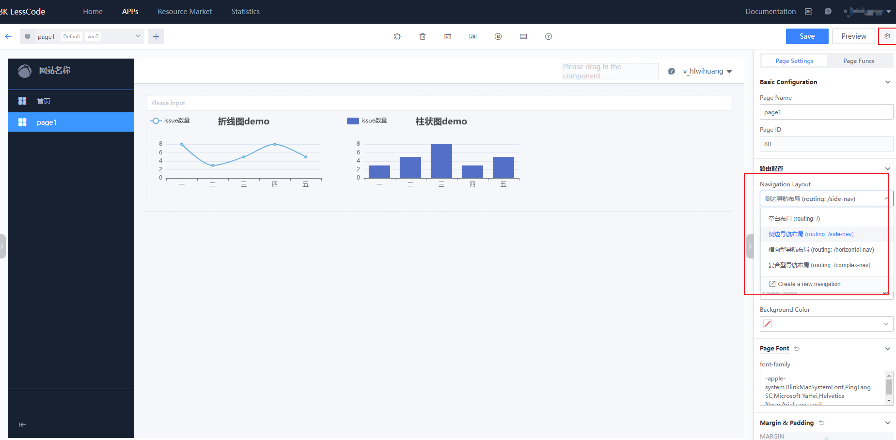

# Navigation Layout Management

Navigation layout is a way to group pages with the same layout (navigation) together, allowing pages to reuse the same layout. Additionally, the layout's route becomes the common parent route for the pages.

## Navigation Layout Categories

The platform currently offers six types of layouts:

- Blank Layout
- Side Navigation Layout
- Horizontal Navigation Layout
- Composite Navigation Layout
- Mobile Bottom Navigation Layout
- Mobile Side Navigation Layout

## Navigation Layout Management

### 1. Add Navigation Layout When Creating a New APP

- The "Blank Layout" is the system default layout, automatically selected and cannot be deselected.
- If no other navigation layout is selected during addition, you can add it in the "Resource Management --> Navigation Layout Management" module after creating the APP.

### 2. Add Navigation Layout in Resource Management --> Navigation Layout Management

### 3. Modify Navigation Layout Configuration in Resource Management --> Navigation Layout Management

In the navigation layout management module, you can see all the navigation layouts added under the current APP. You can also edit and delete navigation layout information and set the default navigation layout for PC and mobile pages.

### 4. Use Navigation Layout on a Page

When creating a new page, you can select the navigation layout for the page type under the APP and enter the page route. The final access route for the page under the layout is **"layout route/page route"**.

### 5. Modify Navigation Layout on a Page

After selecting a navigation layout for a page, you enter the page editing view where the navigation layout content is visible in the canvas. By clicking on the corresponding area, you can modify the relevant configurations. Currently, available modifications include: site name, logo, navigation menu, theme configuration (vue2), etc.

- The example image uses the "Side Navigation Layout" and is setting up the layout navigation. The middle area is the page content editing area.
- If using the blank layout, no navigation layout template content is visible, and the visible area in the canvas is the page content.

You can modify the navigation layout corresponding to the page in the route configuration section of the page configuration.
