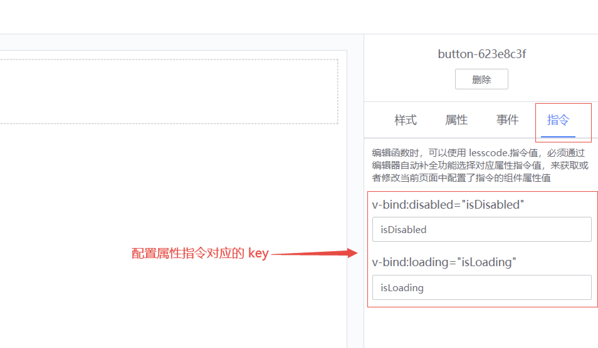

## Function usage guidelines
---
In the BlueKing LessCode: users can write functions by themselves and use the functions in the page. By using functions, you can accomplish the following requirements:
* Write blank functions: Use js syntax to write code, you can initiate ajax requests, obtain interface data, and then perform business processing
* Write remote functions: initiate ajax requests through background forwarding. The forwarded requests can carry more data through configuration.
* Functions cooperate with component events: When component events are triggered, the corresponding functions are executed to complete related services.
* Functions match the page life cycle: Under the page management tab, configure the functions used in the life cycle, and perform relevant business processing in the functions
* Function matching instructions: On the component's instruction configuration page, you can configure the instruction variable name of the attribute, and then use or modify the attribute value in the function
* Function binding component data source: In some properties of the component, initialization data can be set by binding the remote data source
* Call functions in functions and call other components: When writing functions, you can use the function through the editor's auto-completion function, or you can call component library components through js

### Function management entrance
---
#### Function management page path:
Home -> My Applications -> Resource Management -> Function Management
#### Function management page usage:
* Search and select function categories. Function classification is mainly used to classify functions in applications to facilitate subsequent search and management of functions.
* You can sort functions by dragging and dropping to facilitate function management
* You can add, search, modify, delete and copy functions, and manage all functions under the current application

### Function management pop-up window
---
#### How to open the function management pop-up window:
Page -> Canvas Editing -> Function Management Pop-up Window
#### Function management pop-up window functions are as follows:
* The left panel can select, delete, add and copy functions
* The right panel can fill in relevant function content
* There is a full screen button in the upper right corner. Click to write functions in full screen.

### Introduction to function types
---
The BlueKing LessCode currently provides two function types: blank function and remote function to facilitate business development. More function types will be added in the future, so stay tuned
#### Blank function:
* Blank function, the function content is completely written by the user
* The functions edited here are used for property configuration and event binding of the canvas page.
* When used for attributes: the function needs to return a value, and the return value will be assigned to the attribute
* When used for events: the function will be executed when the event is triggered
* You can use lesscode.command value. You must select the corresponding attribute command value through the editor's auto-complete function to obtain or modify the current page.
    Configure the component attribute value of the directive
* You can use lesscode.method name, and you must select the corresponding function through the editor's auto-completion function to call the function in the application
* Examples when used for attributes are as follows:
     return this.$http.get("http://apiHost.com/api/data/getMockData").then((res) => {
         return res.data
     })

#### Remote function:
* Remote function, the system will compose an Ajax request according to the parameters, and forward the request from the background. The user writes the Ajax callback function here.
* If the application is undergoing secondary development, you can configure `lib/serve/conf/token.js` to allow the forwarding request to carry more data
* The functions edited here are used for property configuration and event binding of the canvas page.
* When used for attributes: the function needs to return a value, and the return value will be assigned to the attribute
* When used for events: When the event is triggered, the system will initiate an Ajax request and then execute the callback function written by the user.
* You can use lesscode.command value. You must select the corresponding attribute command value through the editor's auto-complete function to obtain or modify the current page.
     Configure the component attribute value of the directive
* You can use lesscode.method name, and you must select the corresponding function through the editor's auto-completion function to call the function in the application
* Example is as follows: return res.data

### Functions cooperate with component events
---
:::info
After writing the function on the function management page or function management pop-up window, on the application page editing page, click with the mouse to select the corresponding component. In the configuration panel on the right, select the `Event` tab, and then you can configure the corresponding component through the drop-down box. The callback function, please note that the input parameters of the function are consistent with the event parameters of the component. For details, you can view [MagicBox Component Library Documentation](https://magicbox.bk.tencent.com/static_api/v3/components_vue/2.0/example/index.html#/)
:::


### Functions match the page life cycle
---
:::info
After writing the function on the function management page or function management pop-up window, on the application page edit page, select `Page Configuration` at the top to select the callback function through life cycle configuration.
:::


### Function matching instructions
---
:::info
On the component's instruction configuration page, you can configure the instruction variable name of the attribute, and then in the function, you can use or modify the attribute value. After selecting the component, you can edit the properties in the configuration panel on the right, switch to the command tab, and configure the command key for some properties. The system will generate a variable name for the property. Then in the function editing panel, use a string like `lesscode` to trigger the editor's automatic completion function, and then select the corresponding attribute command to obtain or modify the corresponding attribute value in the function
:::

<br>


### Function binding component data source
---
:::info
In some properties of the component, initialization data can be set by binding the remote data source. After selecting the component, you can edit the properties in the configuration panel on the right, find the property of type remote, switch to the remote tab, and then select the function through the drop-down box to bind the remote data source. You can also click the Get Data button to see the effect of the component after getting the data source in real time.
:::


### Call functions within functions and call other components
---
:::info
Call functions within functions and call other components: When writing a function, use a string like `lesscode` to trigger the editor's auto-completion function, and then select the function to use the function in the function. You can also use js to directly use components in the component library, such as pop-up components. For the specific configuration of the components, please see [MagicBox Component Library Documentation](https://magicbox.bk.tencent.com/static_api/v3/components_vue/2.0/example /index.html#/)
:::
```bash
this.$bkInfo({
     title: 'Dialog',
     subTitle: 'Call Dialog',
})

this.$bkMessage({
     message: 'Call Message',
     delay: 0,
     theme: 'error',
     offsetY: 80,
     ellipsisLine: 2
})

this.$bkNotify({
     title: 'Notify',
     message: 'Call Notify',
     limitLine: 3,
     offsetY: 80
})
```
