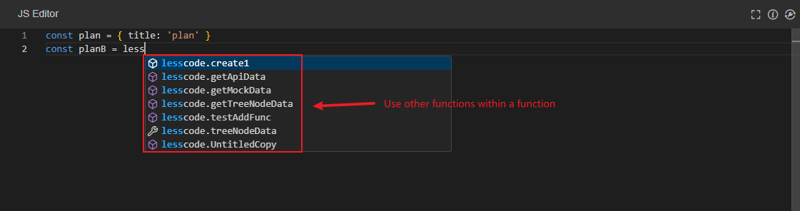
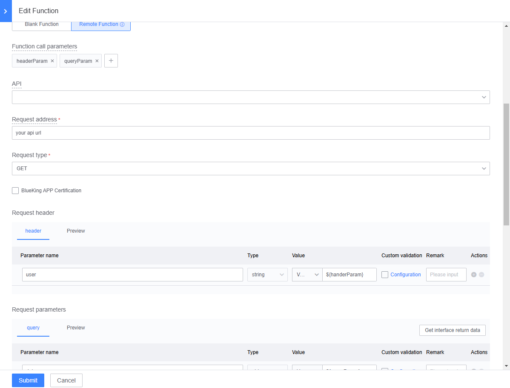

# JS Function Development

In the Blueking LessCode (LessCode), users can write their own functions and use them within pages. By using functions, the following requirements can be met:

- **Writing Blank Functions**: Write code using JavaScript syntax, make AJAX requests, retrieve interface data, and then handle functional logic.
- **Writing Remote Functions**: Make AJAX requests through backend forwarding, with the ability to carry more data through configuration.
- **Functions with Component Events**: Execute corresponding functions when component events are triggered to complete related APP features.
- **Functions with Page Lifecycle**: Configure functions used in the lifecycle on the page function panel to handle relevant functional logic within the functions.
- **Functions with Directives**: In the component's directive configuration page, configure the directive variable name of the attribute, then use or modify the attribute value within the function.
- **Binding Component Data Sources with Functions**: Set initial data by binding remote data sources in some component attributes.
- **Calling Functions and Other Components in Functions**: When writing functions, use the editor's auto-complete feature to utilize functions or call component library components through JavaScript.

## JS Function Development Entry

### JS Function Development Page Path:

APP Development (Select APP) -> JS Function Development

### Using the JS Function Development Page:

- Search and select function categories. Function categories are mainly used to classify functions within an APP for easy searching and management.
- Functions can be sorted by dragging and dropping function categories for better management.
- Add, search, modify, delete, and copy functions to manage all functions under the current APP.

## Function Management Popup

### Opening the Function Management Popup:

APP Page -> Canvas Editing -> Function Management Popup

### Using the Function Management Popup:

- Delete, add, and copy functions.
- Edit related function content.

## Introduction to Function Types

The Blueking LessCode (LessCode) currently provides two types of functions: blank functions and remote functions for APP development. More function types will be added in the future, so stay tuned.

### Blank Functions:

- **Blank Functions**: The function content is fully written by the user and is used for page component attribute configuration and event binding.
- **Functions for Page Component Attributes**: The function must return a value, which will be assigned to the component attribute.
- **Functions for Component or Page Events**: The function will be executed when the event is triggered.
- Use "lesscode.variableIdentifier" to invoke the auto-complete feature. The corresponding variable must be selected through the editor's auto-complete feature to get or modify the variable value.
- Use "lesscode.functionName" to invoke the auto-complete feature. The corresponding function must be selected through the editor's auto-complete feature to call other functions within the APP.
- Example of calling other remote functions: `lesscode['${func:getApiData}']().then((res) => do(res))`
- Example code when the function is used for component attributes:

```javascript
return Promise.all([
    this.$http.get('API endpoint'),
    this.$http.post('API endpoint', { value: 2 })
]).then(([getDataRes, postDataRes]) => {
    return [...getDataRes.data, ...postDataRes.data];
});
```

### Remote Functions:

- **Remote Functions**: The system forms an AJAX request based on parameters. Users write the AJAX callback function here, used for page component attribute configuration and event binding.
- Remote functions are asynchronous and return a promise. Use the `then` callback to execute the next function after the remote function completes asynchronously.
- Example of calling other remote functions: `lesscode['${func:getApiData}']().then((res) => do(res))`
- **Functions for Page Component Attributes**: The function must return a value, which will be assigned to the component attribute.
- **Functions for Component or Page Events**: An AJAX request is made when the event is triggered, executing the callback function.
- Use "lesscode.variableIdentifier" to invoke the auto-complete feature. The corresponding variable must be selected through the editor's auto-complete feature to get or modify the variable value.
- Use "lesscode.functionName" to invoke the auto-complete feature. The corresponding function must be selected through the editor's auto-complete feature to call other functions within the APP.
- Example when API returns data and parameter `res` is used: `return res.data`
- Remote function API requests can select APP data table operation API, Blueking Gateway API, and self-built API. Note that if requesting the `Blueking Gateway API`, you need to `apply for gateway API permissions` and `select Blueking APP authentication`.

## Calling Functions within Functions

When writing functions, use strings like `lesscode` to invoke the editor's auto-complete feature, then select a function to use within the function.



## Using Function Call Parameters in Function Request Headers and Parameters

In function development, request headers and parameters often come from function call parameters. We provide the `${functionParameter}` notation to use function call parameters.


