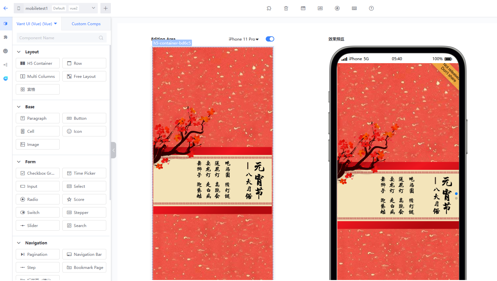
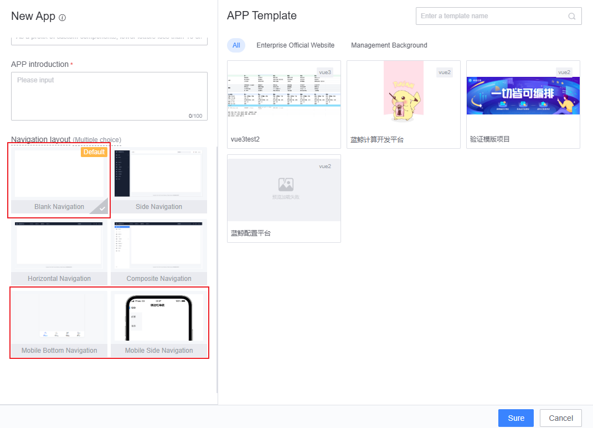
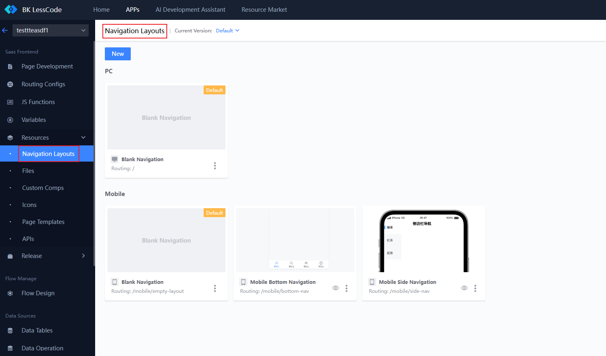
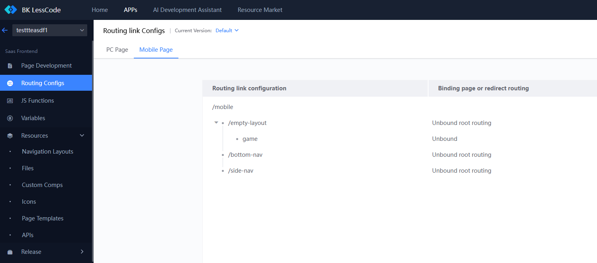
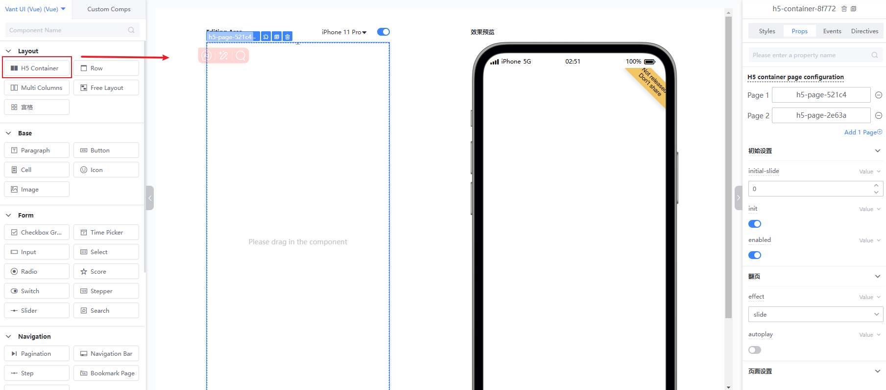
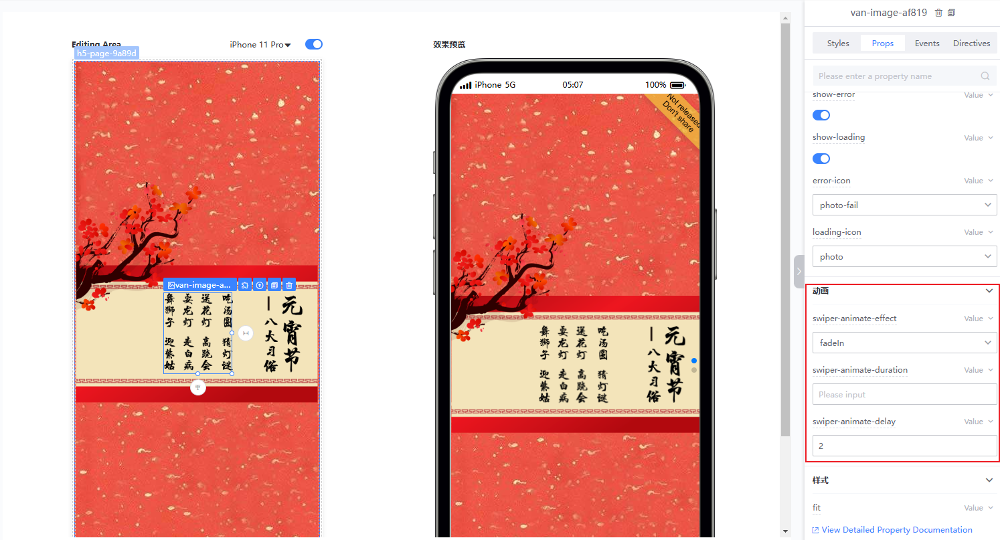
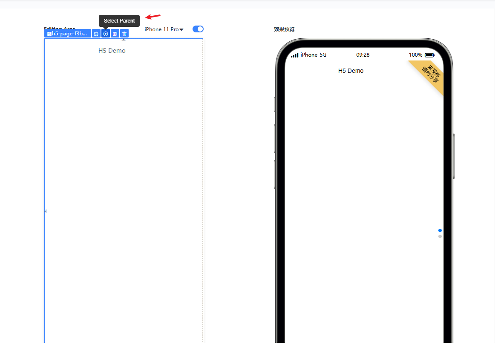
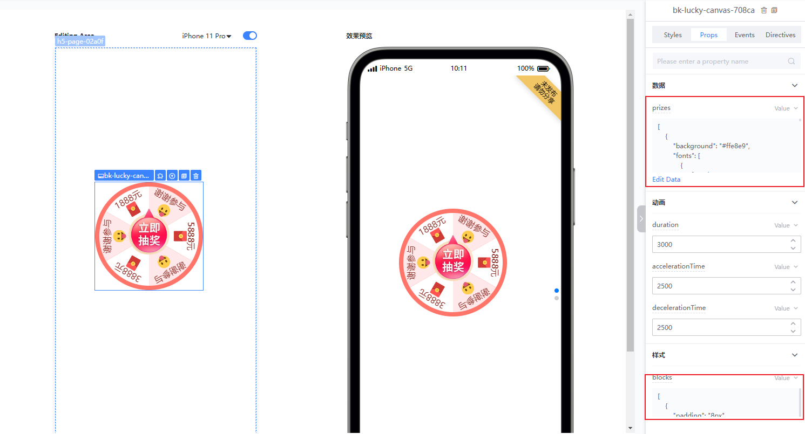

# Mobile Page

The BlueKing LessCode (LessCode) is a visual drag-and-drop integrated development platform that helps developers simplify and speed up the APP development process. This documentation will provide a detailed introduction to the related content of LessCode mobile development, including component libraries, layout management, routing rules, and the use of responsive units.

## Component Library

### Vant UI Component Library

In mobile development, LessCode uses the [Vant UI](https://youzan.github.io/vant/#/en-US/) component library. Vant UI is specifically designed for mobile, offering a rich set of components and features to meet various mobile development needs. Additionally, LessCode encapsulates a series of advanced components, such as the **Lottery** component and the **H5 Container** component, to help users more efficiently build APPs and meet business requirements. LessCode mobile provides capabilities including:

- **Responsive Layout**: Supports automatic adaptation to different screen sizes.
- **Mobile-specific Features**: Provides many features suitable for mobile use, such as gesture operations and real-time mobile rendering simulation.

## Layout Management

### Supported Layout Types

LessCode mobile supports the following layout types:

1. **Blank Layout**: No fixed layout, allowing developers to freely drag and place components.
2. **Sidebar Layout**: Includes a sidebar, suitable for APPs needing side navigation.
3. **Bottom Navigation Layout**: Includes a bottom navigation bar, suitable for APPs with multi-page switching.

### Adding and Managing Layouts

- **Add Layout When Creating a New APP**: When creating a new APP, you can choose the desired layout type.
- **Add Layout in Existing APPs**: In existing APPs, you can add and manage layouts through "Resource Management" => "Navigation Layout Management".

## Routing Management

### Routing Rules

To distinguish between PC and mobile routes, LessCode stipulates that mobile routes should start with `/mobile`. For example:

- PC Route: `/page-1`
- Mobile Route: `/mobile/page-1`

### Viewing Routes

In route management, you can view and manage both PC and mobile routes. Ensure that mobile routes start with `/mobile` for proper distinction and management.

## Responsive Units

### rpx Unit

In mobile development, LessCode supports the use of the `rpx` responsive unit. `rpx` is a responsive pixel unit that automatically scales based on screen width. Specifically:

- The design baseline for `rpx` is 750, meaning 750rpx equals the full screen width.
- It is not recommended to use absolute units like `px` to avoid inconsistent display effects on different devices.

Due to the diverse screen sizes on mobile devices, it is suggested to use `rpx` or relative units like percentages on mobile pages.

## Advanced Component Introduction

To further enhance developer efficiency, LessCode provides a series of advanced components. These components are highly reusable in common business scenarios, enabling developers to quickly build high-quality APPs.

### A Powerful Tool for Rapid H5 Construction: LessCode-H5 Container Component

The LessCode-H5 Container Component is an advanced component specifically designed for quickly building H5 pages. It offers flexible layouts and rich features to meet the needs of various H5 projects.

**Usage Example:**

1. Select the **H5 Container** component from the left component library and drag it onto the canvas.

The H5 container comprises two parts:

- h5-container: The outer container for H5, where overall attributes can be configured.
- h5-page: An instance of an H5 page, with each container containing multiple pages.

In the h5-container, you can configure the overall attributes of the **H5 Container**, including page turn effects, indicator display, auto page turn, etc., and quickly add or delete pages.

h5-page is a child element of the container, with each page serving as an independent H5 page, equivalent to a free layout. Therefore, any element can be dragged into the h5-page, with position and attributes configured to achieve animation effects.

2. Drag components into the H5 Container and configure animations

Each page of the H5 container acts as a free layout, allowing any element to be dragged in and freely positioned. For example, drag a paragraph component in and place it at the top, clicking on the paragraph element reveals three animation-related attributes on the right:

- swiper-animate-effect: Select animation effect.
- swiper-animate-duration: Select animation duration.
- swiper-animate-delay: Select animation delay.

Configure and combine these three attributes to view animation effects in real-time on the preview interface.

Note: Since `h5-page` occupies the full screen, it may not be easy to select its parent `h5-container` when `h5-page` is selected. To re-select and configure related attributes, click the floating window icon to select the parent after selecting `h5-page`, as shown below:

### Lottery Component

The Lottery Component helps quickly create a lottery page and can be used in conjunction with the H5 Container to easily and efficiently create an H5 lottery program.

**Usage Example:**

1. Select the **Lottery** component from the left component library, drag it onto the canvas, and set its size according to requirements.
2. The lottery component comes with default lottery cases and styles. Prizes, lottery background, lottery pointers, and other elements can be customized, supporting web images. Its configuration is `json`, which can be modified according to the sample to change styles.

Additionally, attributes related to animation effects like lottery duration and acceleration time can be quickly configured through the right-side attribute panel.

## Summary

The LessCode mobile development platform provides developers with powerful and flexible tools, making mobile APP development more efficient and convenient. This documentation has covered several key aspects:

1. **Component Library**: LessCode uses the Vant UI component library and offers a range of advanced components, such as H5 containers and lottery components, greatly enhancing development efficiency.
2. **Layout Management**: Supports multiple layout types, including blank layout, sidebar layout, and bottom navigation layout, to meet the needs of different APP scenarios.
3. **Routing Management**: Uses the `/mobile` prefix to distinguish mobile routes, facilitating management and maintenance.
4. **Responsive Units**: Recommends using the `rpx` unit to ensure consistent performance across different screen sizes.
5. **Advanced Components**: Provides detailed usage of the H5 container and lottery components, enabling developers to quickly build complex functional pages.

By leveraging these features and tools, developers can easily create feature-rich and excellent mobile APPs on the LessCode platform. As you gain a deeper understanding and proficiency with the platform, you'll be able to efficiently meet various mobile development needs and create impressive APPs.

We encourage developers to fully explore all the features of the LessCode platform and continuously optimize and improve the development process based on actual project needs. If you encounter any issues or have any suggestions during use, please feel free to contact our support team. We wish you a pleasant development experience on the LessCode platform and look forward to seeing more outstanding mobile APPs!
