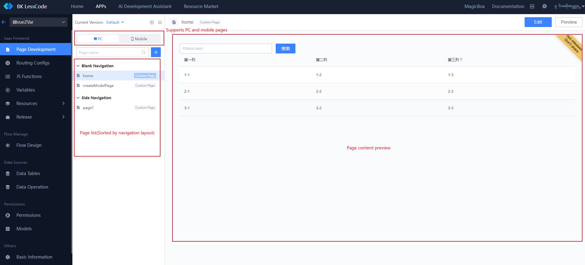
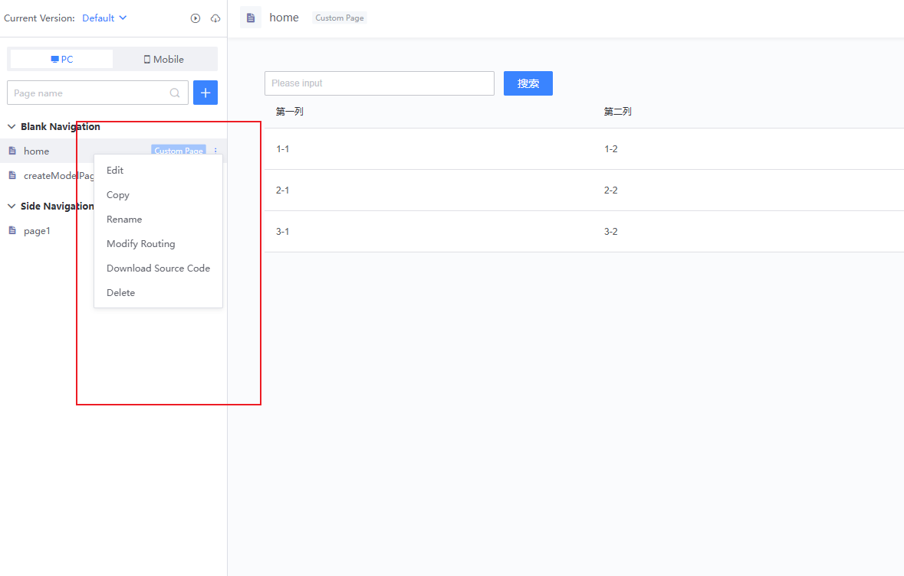

# Page Management

In the page management module, you can perform operations such as adding, deleting, modifying, viewing, previewing, and modifying routes for pages.

## Creating a New Page

- You can choose to create a PC page or a mobile page.
- You can create a blank page or quickly create one based on an existing template.
- You can select the navigation layout to which the page belongs and fill in the corresponding access route.

## Page List

- The page list is displayed classified by the navigation layout to which they belong.
- You can directly preview the currently selected page on the right side.

- You can perform operations such as copying, renaming, and modifying routes for the pages.
