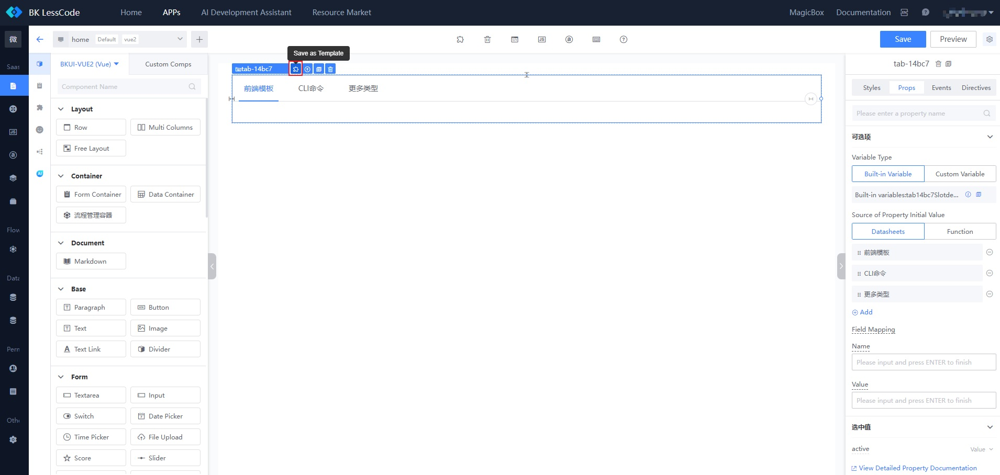
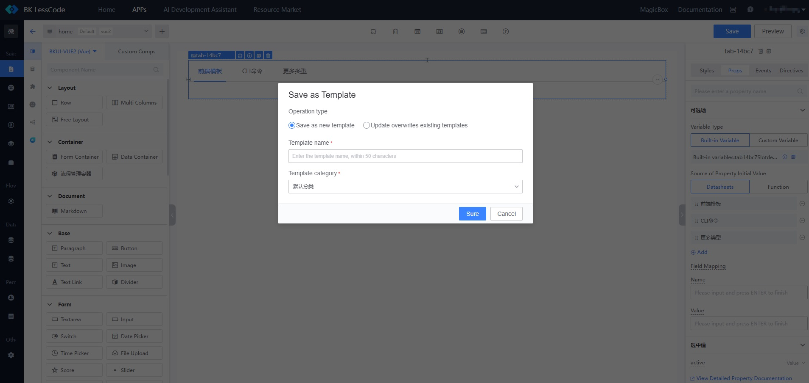
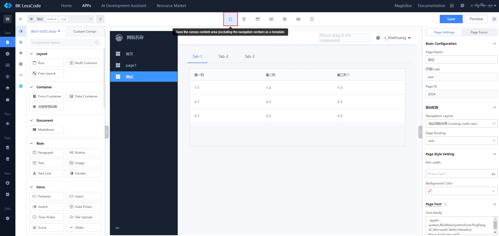
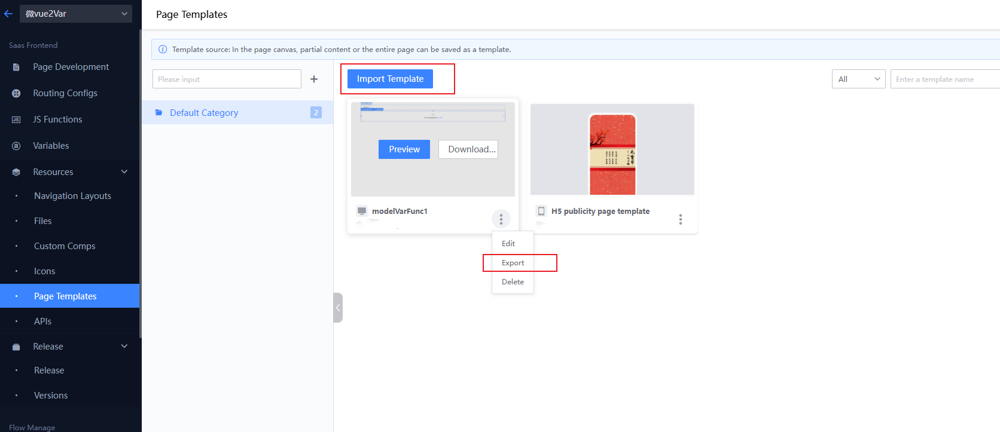
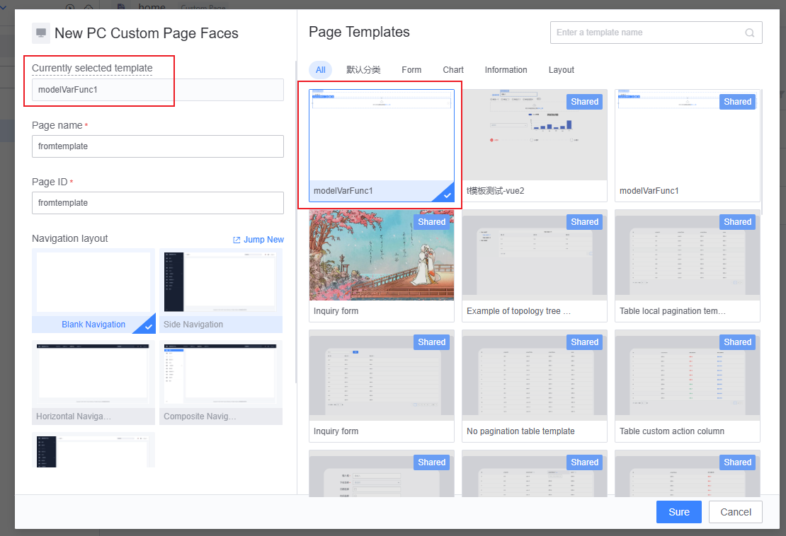
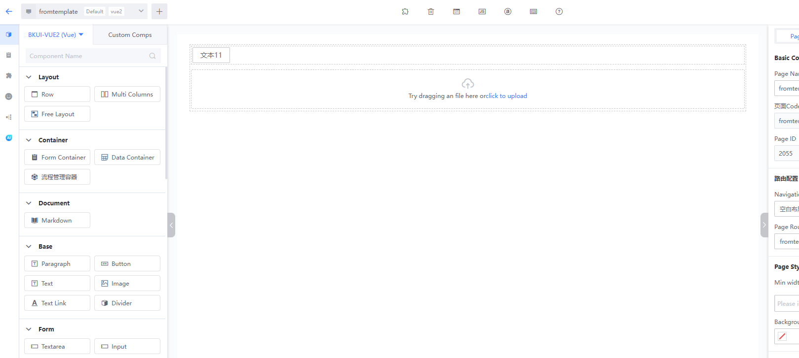
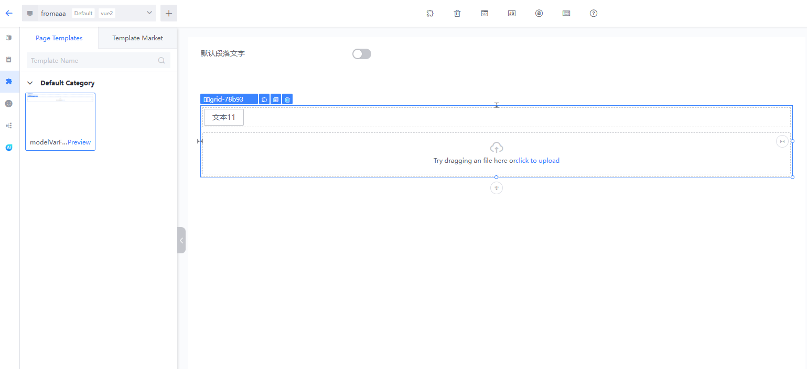
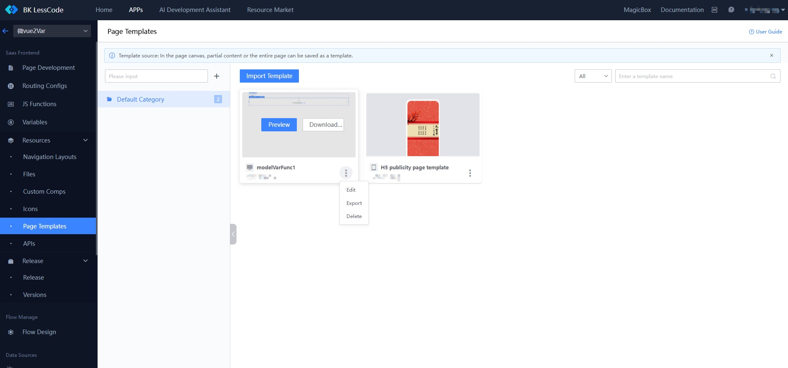

# Page Template Management

Page templates can either be a complete page or any fragment of a page. Users can quickly create pages based on page templates, or achieve convenient and rapid reuse of content through page templates.

## Sources of Page Templates

### 1. Add from the Template Market:

You can add suitable page templates to your APP from the Template Market through the top navigation's Resource Market --> Template Market entry, the template list when creating a page, or the template market in the canvas area.

  

### 2. Save from the Canvas of the Current APP

During the page layout process, you can also save page content as a page template to achieve quick reuse of partial content.

#### 2.1 Select the corresponding module and click "**Save as Template**"

#### 2.2 Fill in the template category to save into

#### 2.3 You can also directly save content from a page in the canvas as a page template (excluding navigation content) and embed it into any form of page layout.

### 3. Import and Export via Template JSON:

You can export a template from one APP as JSON and then import it into another APP to achieve cross-APP template sharing.

## Using Page Templates

### 1. Create a Page Based on a Template When Creating a New Page

When creating a new page, select an existing page template to create a page that is consistent with the page template content.

### 2. Drag and Drop Templates as Part of the Page in the Canvas

When editing a page, drag an existing page template onto the canvas to make the page template part of the current page.

## Page Template Management

In the page template management module, users can perform custom classification management of templates under the APP, as well as edit, delete, and export templates.

