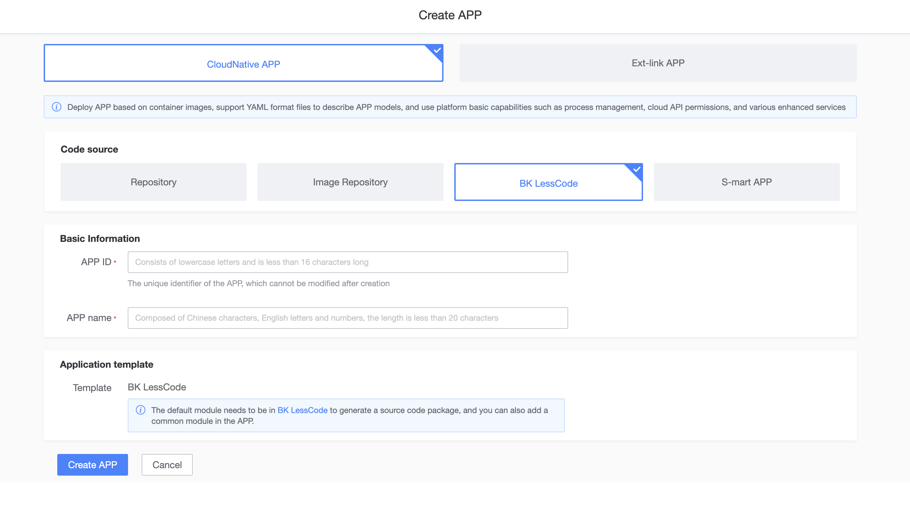
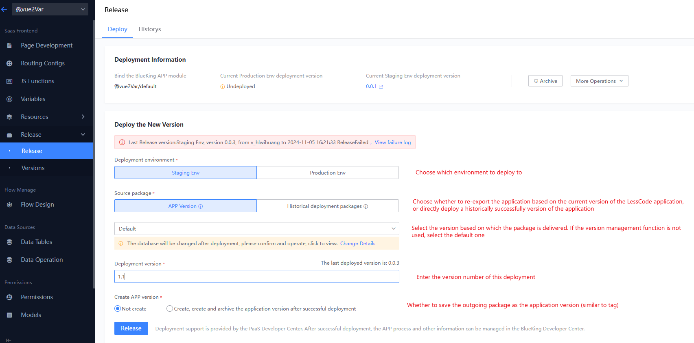
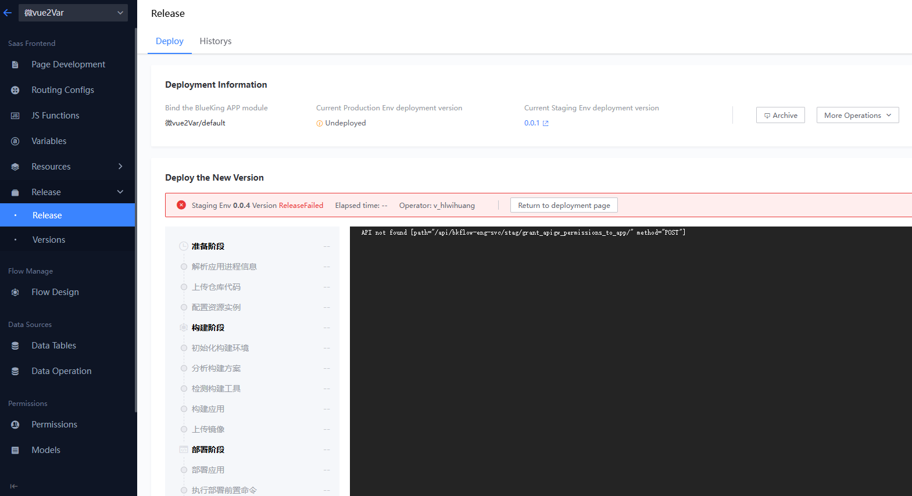
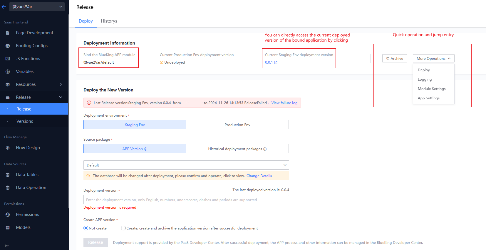

# Release and Deployment

The release and deployment module allows APPs that are dragged and dropped on the BlueKing Operations and Maintenance Development Platform (LessCode) to be quickly deployed to the BlueKing Developer Center.

## APP Association

- When an APP is created on LessCode, a default module with the same name is created in the Blueking Developer Center.
- When an APP is created in the Blueking Developer Center with the code source selected as "BlueKing Operations and Maintenance Development Platform (LessCode)," the APP is also synchronized and created on LessCode.

## Deployment

### 1. Fill in Deployment Information

- Without using the version management feature, you only need to select the deployment environment, fill in the version number, and click deploy each time to deploy the latest content of the current APP on LessCode to the Blueking Developer Center.
- If the source package option is set to select a historical deployment package, you can directly select a previously successfully deployed package to the corresponding environment (e.g., if version 1.1 has been deployed to the pre-release environment for verification, you can select the historical deployment package version 1.1 to deploy to the production environment).

### 2. Display Deployment Logs

### 3. Deployment Status, Access Entry, Jump to Developer Center

