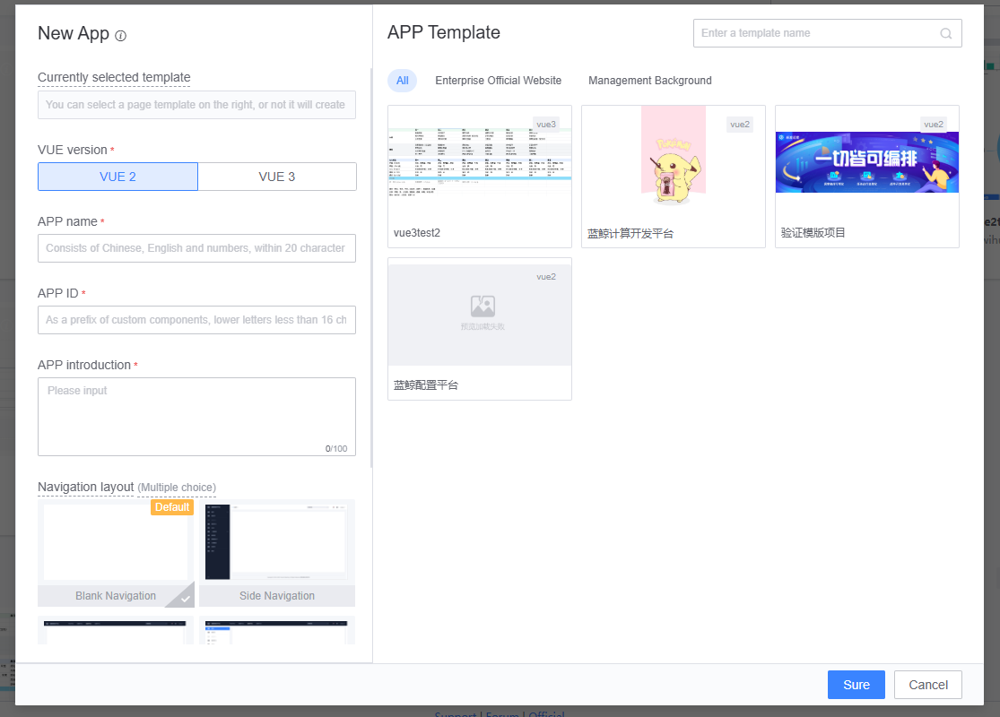
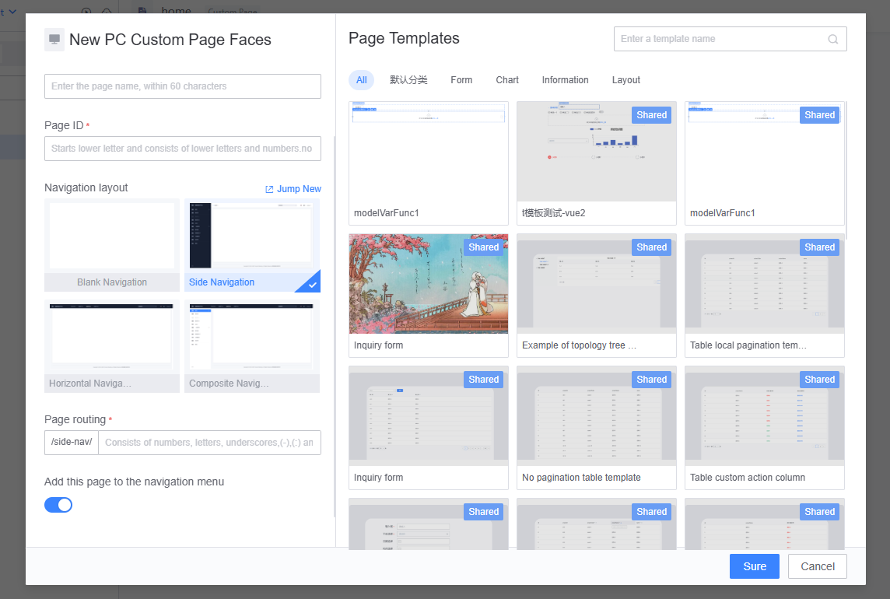
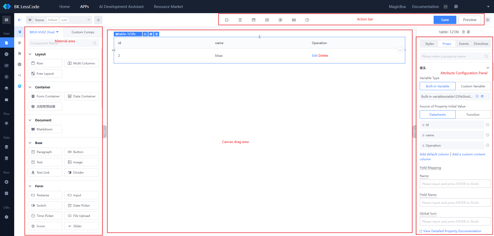
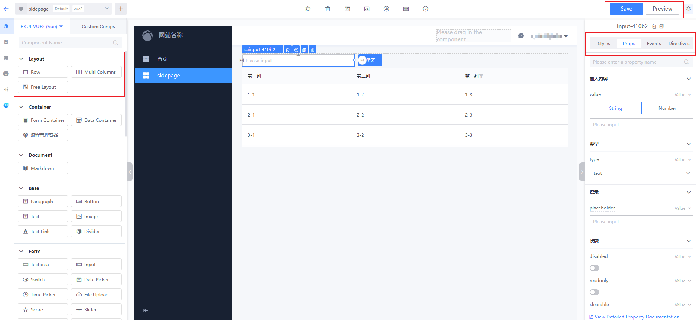
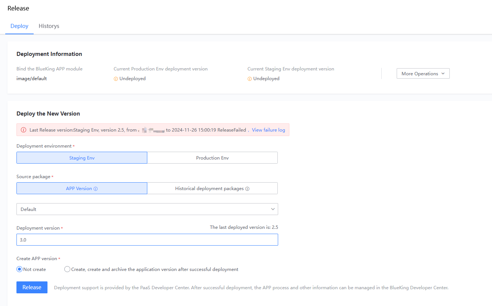
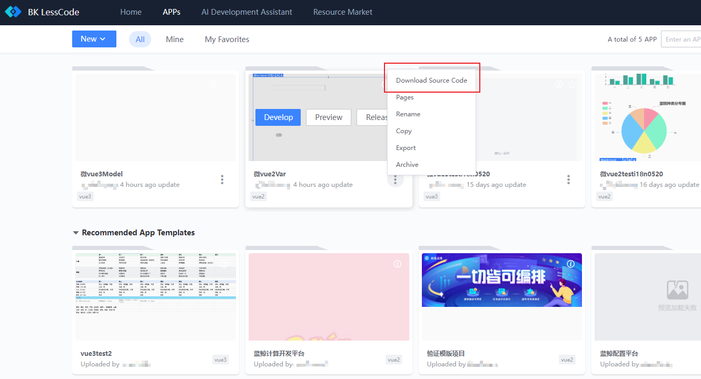
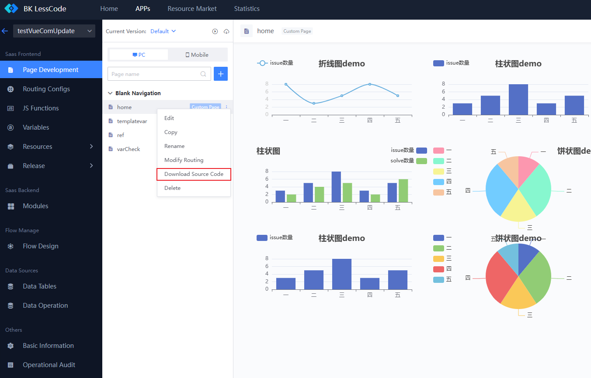

# Quick Start

## 1. Create a New APP

After entering the BlueKing LessCode (LessCode), you can "**Create a New APP**" to start online one-stop development.

Notes:

1. The APP ID will serve as the prefix for the APP's custom component ID, so please name it carefully.
2. You can create a blank APP or quickly create an APP using existing APP modules.
3. You can specify the APP type to be vue2/vue3.
4. When creating an APP, you can choose to initialize a navigation layout instance and create APP pages based on the specified navigation layout instance.
5. The platform will automatically create a demo APP for users using the platform for the first time, named "Username + Demo APP."
6. Upon successful creation, a default module for the same name SaaS APP will be created in the Blueking Developer Center and bound to the LessCode APP. After completing the drag-and-drop operations, you can deploy directly to the bound SaaS APP.

## 2. Create/Edit Pages

Enter the APP's "Page List" to create multiple pages and perform drag-and-drop layout editing.

- You can choose to create PC pages or mobile pages.
- You can create a blank page or quickly create based on an existing template.
- You can select the navigation layout to which the page belongs and fill in the corresponding access route.

- Drag components to the canvas area for configuration.

### 2.1 Component Selection Area

- Basic Components: Includes basic general PC components and element components provided by the BlueKing Vue component library.
- Custom Components: Includes custom components uploaded within the current APP and other publicly available custom components.

### 2.2 Canvas Area

- 1. Drag components or layout containers (row layout, multi-column layout, free layout) into the canvas.
- 2. Edit component properties, styles, events, and directives (if needed, you can set the required functions and variables through the toolbar).
- 3. Preview and save the page.

## 3. Function Management

You can create and manage JS functions needed for APP pages. The platform provides two example functions for reference.

- getMockData: Based on a blank function template, retrieves Mock data from a remote API.
- getApiData: Based on a remote function template, fills in remote API call information, and the function itself only processes the data returned by the remote API.

Functions can be used for component event binding or component data source retrieval.

### Note

- The remote API called in the function can be any API provided by the system, such as an API provided by a BlueKing SaaS you developed or a cloud API provided by BlueKing APIGateway.
- When calling a remote API in a function, you may encounter cross-domain issues and API permission verification issues. Please follow the remote API requirements for calls.

## 4. Custom Component Management

In the page editing component selection area, besides the basic general components provided by BlueKing, you can also upload your own developed scenario components.

Notes:

- You must follow the custom component specifications provided by the platform for component development.
- The "type" attribute in the component configuration (config.json) must be prefixed with the "APP ID," i.e., APP ID-xxx.
- The component upload package must be packaged using the packaging tool provided by the platform before uploading.

## 5. Release and Deployment

When the LessCode APP was created, a corresponding APP module was also created in the Blueking Developer Center. After editing the APP pages, you can directly deploy them to the BlueKing PaaS Platform.

- You can directly select the environment and version to deploy.

## 6. Secondary Development

If you need to perform secondary development on the pages created using drag-and-drop, you can refer to the following methods:

### Method 1: Download the Entire APP Source Code

The platform integrates the source code of all APP pages and page route configurations into the BlueKing Frontend Development Framework (BKUI-CLI). The downloaded source package can be directly deployed in the Blueking Developer Center.

### Method 2: Download Single Page Source Code

If you have an existing APP under development and only need to perform secondary development on a single page, you can download the source code of the single page and integrate it into your existing APP project.

