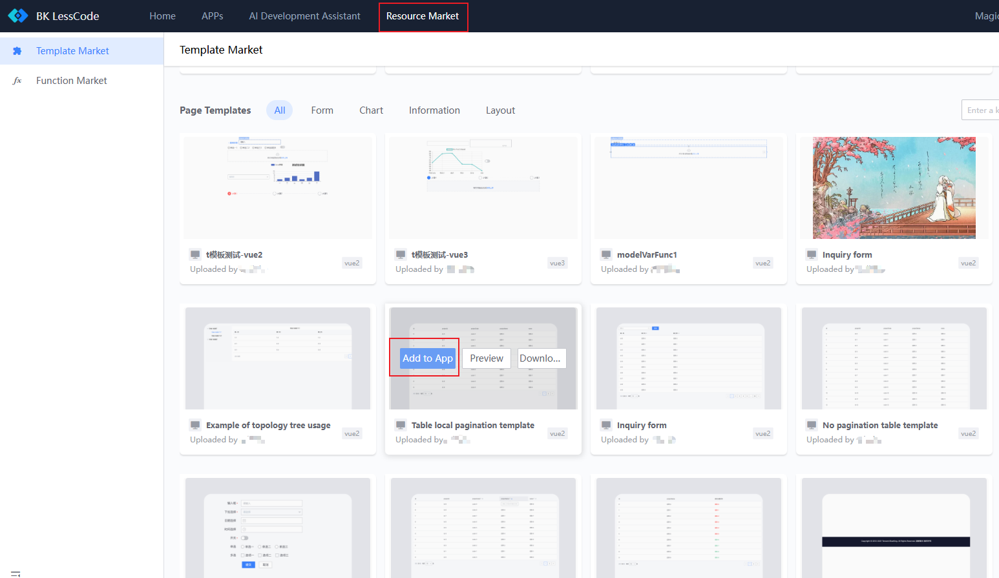
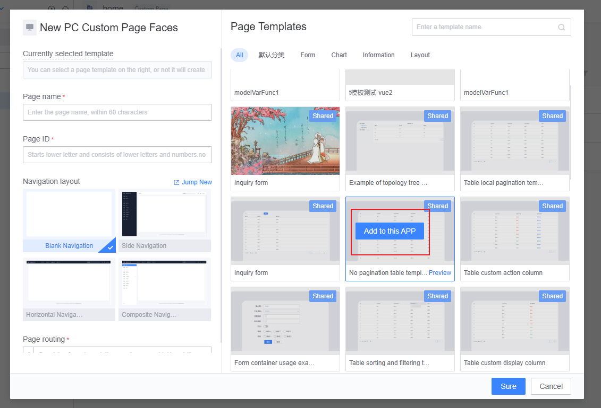
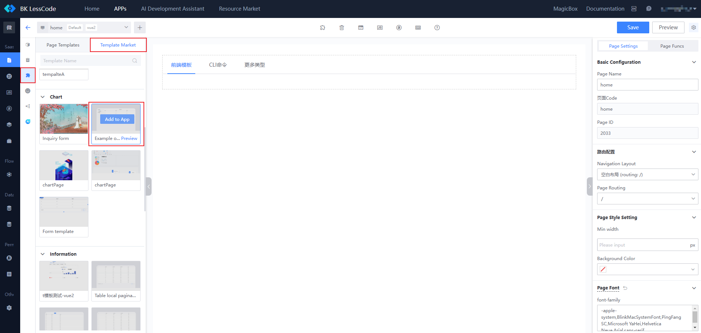

# Guide to Using Page Templates

The BlueKing Operations and Maintenance Development Platform (LessCode) offers two different levels of templates: project-level templates and page templates. Page templates are more granular than project-level templates and can be flexibly applied to various pages.

## Add Templates from the Template Marketplace to Your APP

### 1. Add via Resource Marketplace -> Template Marketplace

Navigate to "**Resource Marketplace -> Template Marketplace**," select the appropriate page template, and then "**Add to APP**."

### 2. Add via the Page Template Area When Creating a Page

When creating a new page, the page template area on the right can be used to quickly add a page template. The templates with a black overlay indicate that they have not been added to the APP. Select the appropriate page template and click "**Add to This APP**."

### 3. Add via the Canvas Template Marketplace

In the canvas template marketplace, you can also quickly add page templates. The templates with a black overlay indicate that they have not been added to the APP. Select the appropriate page template and click "**Add to APP**."

### For more information on using and managing page templates, please refer to the "**Frontend Module Development -> Resource Management -> Page Template Management**" documentation.
