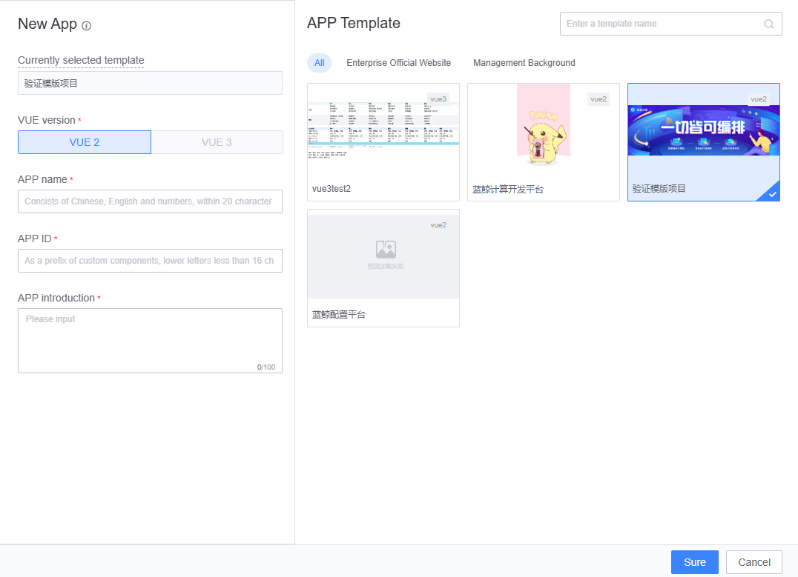

## APP Template Usage Guide

The Blueking LessCode (LessCode) offers APP-level templates such as official website templates, backend management templates, and announcement templates. These templates include complete APP functionalities like functions, variables, and databases. You can directly create a new APP based on these templates without assembling from scratch, and simply modify the corresponding content to quickly complete the APP development.

## How to Use APP Templates

There are two ways to use APP templates:

### Create a New APP Through the APP Template Market

Go to Resource Market -> Template Market, select an appropriate APP template, then click "Create as New APP". Alternatively, you can download the APP template source code and perform secondary development locally.

### Choose to Create from a Template When Creating a New APP

1.Choose to create from a template when creating an APP.

{width="80%"}

2.Once the APP is successfully created, you will see all the pages included in the APP template and modify the page content as needed.
