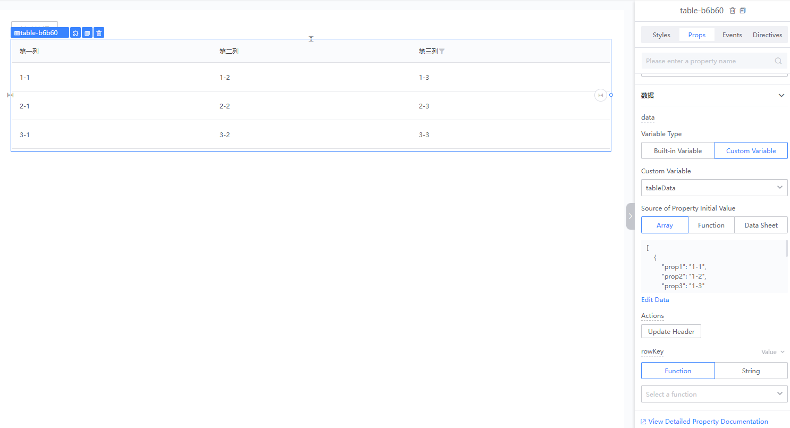
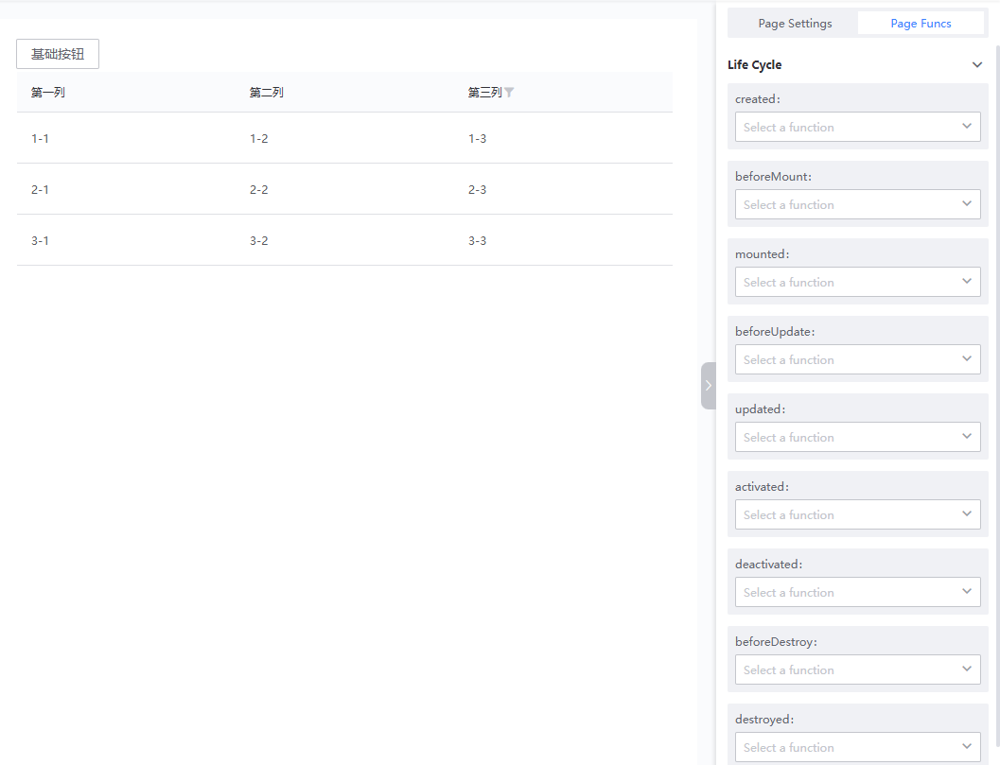
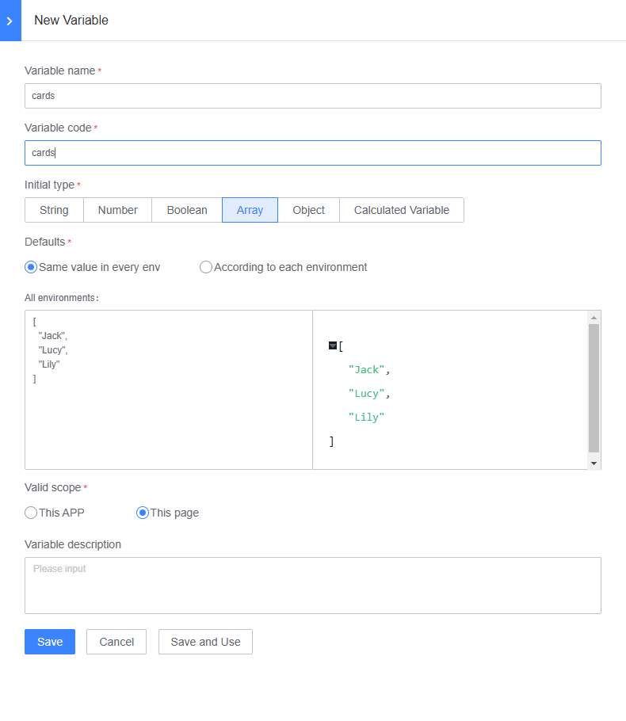
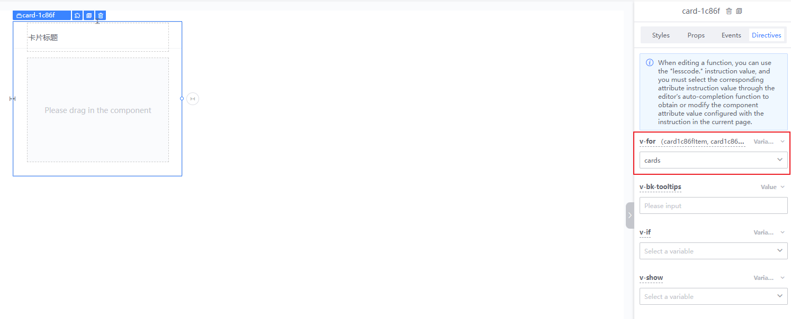
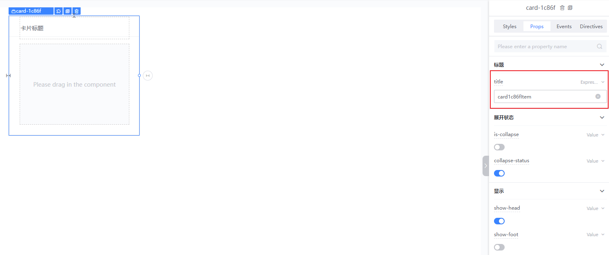
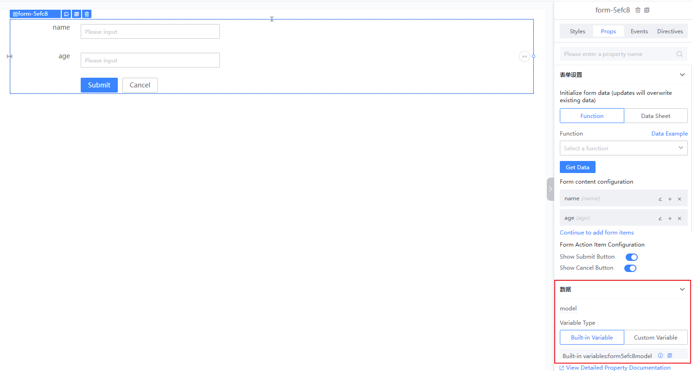
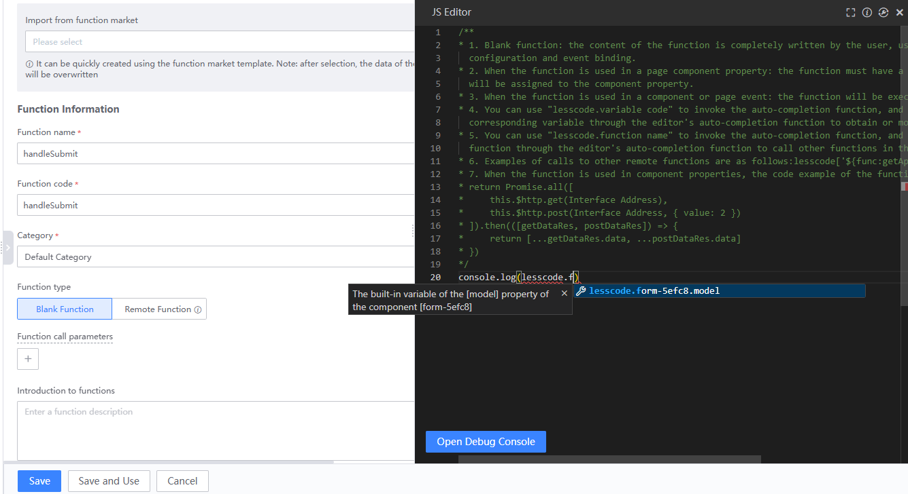
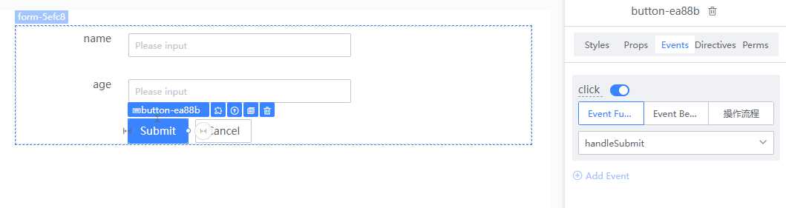

# Using Variables on the Canvas

Vue employs the MVVM pattern, which means data drives the view, and the view can also modify data. Variables can be bound to component properties, event parameters, and directives. We can modify variables to change the corresponding state of components, which will automatically update the component. We can also use the value of variables in functions to obtain the values entered by users in components. Therefore, variables are crucial in complex interactions, serving as the data bridge between functions and components.

## Modifying Variables Directly Affects View Changes

### Using Variables to Render API Data into Table Components

First, set a custom variable `tableData` for the table.

Then, create a new function. Within this function, call an API to fetch the data you want to display and assign the data to the `tableData` variable (you can use the LessCode keyword to trigger the autocomplete feature for variable or function selection).

Next, call the `handleInitData` function in the `beforeMount` lifecycle of the page. This allows the data to be fetched through the API during page initialization and rendered into the table component.

### Using Variables to Render an Array into Multiple Components (v-for)

Add a new variable `cards` and set an initial value.

After selecting the card component, switch to the directive panel and bind the `cards` variable to the `v-for` directive. This will render the card component three times.

If you need to assign values individually to each component based on the v-for directive, you can use the following rules (hover over the v-for directive title to see the variable name, which is `card7c921Item` here):

1. If the input value is an array, number, or object, use [card7c921Item] for expression assignment.
2. If the input value is an array and the array items are objects, use [card7c921Item.object key] for expression assignment.
3. If the input value is a data table, use [card7c921Item.table field name] for expression assignment.

Here we assign data to the title of the card component.

The preview will look like this:

## Entering Data in Page Input Fields Directly Modifies Variable Values

### Form Container Components Can Use Variables to Obtain User Input Values

You can start by creating a form container component and adding two form items (`name`, `age`). In the model section, you can directly use built-in variables or select custom variables.

Create a new function `handleInitData` and print the data filled in the form container within the function. You must use the LessCode keyword to trigger the autocomplete feature to select the corresponding data.

Then bind the `handleInitData` function to the `click` event of the form container's submit button. This allows you to print the data entered by the user upon clicking submit.

