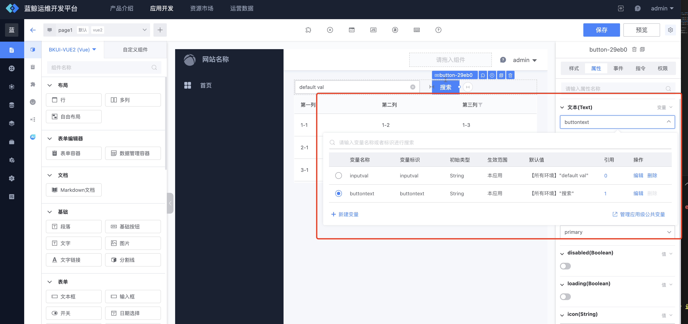
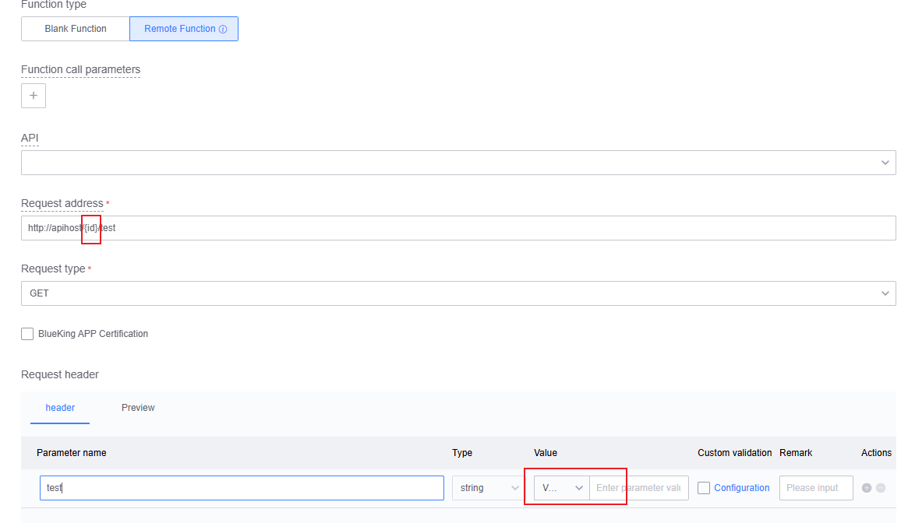
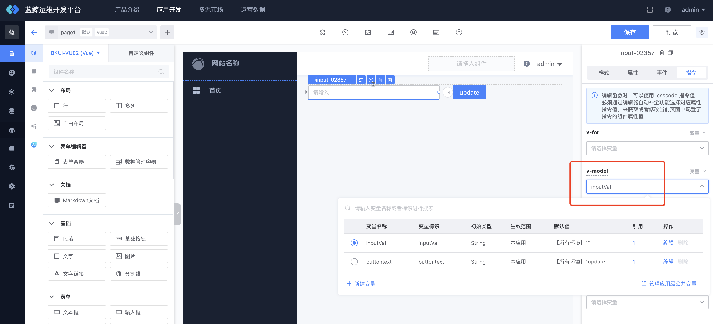
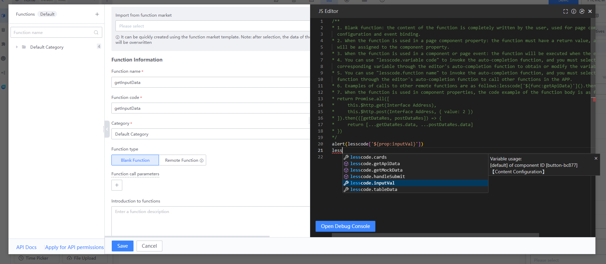

## Variable usage guidelines
---
In the BlueKing LessCode: variables can be created by users and used in the page. By using variables, you can accomplish the following requirements:
* Dynamically assign values to component attributes: Bind variables to attributes, and then you can obtain or modify the value of the variable through function manipulation to affect the attributes of the component.
* Dynamically assign values to component instructions: The current platform provides instructions in the VUE syntax, binding variables to instructions, and controlling the performance of instructions through function manipulation variables. For specific instruction performance, please refer to [VUE Instruction Document] (https:/ /cn.vuejs.org/api/built-in-directives.html)
* Global variables: You can define global variables in the application, and each page shares the value of this variable
* Environment variables: A variable can be configured with values in the production environment and pre-release environment respectively as the initial value of the variable.
* Use variables for function parameters: the Api Url and Api Data of the function can use variables to dynamically obtain values

### Global variable management
---
#### Apply global variables to manage page paths:
Home -> My Applications -> Resource Management -> Variable Management
#### Application global variable usage instructions:
* You can add, delete, modify and check global variables on the application global variable management page
* The reference position of already used variables can be queried and deletion is not allowed.
* The variable identifier of a global variable is globally unique
* If the value of a global variable is modified on the page, the values of the variable used in other pages will also be modified together.

### Page variable management
---
#### Page variable management page path:
Page -> Canvas Editing -> Page Variables
#### Description of page variable management page
* This page shows the details of the variables available on this page (including global variables and page variables of this page)
* Only page variables can be operated. Global variables need to be operated on the global variable management page.
* Already used variables are not allowed to be deleted. Only administrators and variables created by themselves have deletion permissions.
* You can add, delete, modify and check page variables on this page.

### Introduction to variable initial type
---
The BlueKing LessCode currently provides seven variable initialization types for business development. This type is only used as an initialization type, and the variables can be modified later in the function. More variable initialization types will be added in the future, so stay tuned
* Ordinary data types (String, Number, Boolean, Array, Object): that is, JS data types. When binding to properties, filtering will be performed based on the data type.
* Image address: Users can upload a picture, and then the picture can be bound to the attribute that can use the picture in the canvas
* Calculated variables: can be combined based on multiple variables or functions, and finally return a value. This variable can be applied to all attributes and instructions. For specific usage of calculated variables, please refer to [VUE Computed Properties Document](https://cn.vuejs.org/api/options-state.html#computed)

### Variable and attribute binding
---
:::info
On the application page editing page, click the mouse to select the corresponding component. In the configuration panel on the right, select the `Properties` tab, select the property you want to bind the variable to, and then switch to variable in the upper right corner to select the variable. You can also switch to values and expressions. The expression can directly write the variable identifier to use the variable, and write the final JS expression.
:::

### Binding variables and instructions
---
:::info
On the application page editing page, click the mouse to select the corresponding component. In the configuration panel on the right, select the `Instructions` tab, select the instruction to which you want to bind variables, and select the variable. You can also switch to values and expressions. The expression can directly write the variable identifier to use the variable, and write the final JS expression.
:::

### Variable and function binding
---
:::info
The Api Url and Api Data of the function can use variables: as shown in the figure, you can use `{{variable identifier}}` to use variables in parameters
:::

 

### Operating variables in functions
---
:::info
In a function, you can use the `lesscode.variable identifier` keyword to invoke shortcut input. You must select the corresponding variable through the editor's auto-completion function to obtain or modify the variable value. The following example illustrates:
:::

 
#### As shown in the picture above: add an input box component and a basic button component to the page, and bind a variable to the `v-model` directive of the input box component.

 
#### As shown in the picture above: Add a new function. In the function, you can use the `lesscode.variable identification` keyword to invoke quick input. According to the prompts, you can find the variable you want to modify. After selecting the corresponding variable, you can modify the variable. Operated

 
#### As shown in the picture above: When writing the function, we first pop up the value of the input box, and then modify the value of the input box to `Hello Lesscode`

 
#### As shown in the picture above: Finally, in the `click` event of the basic button component, bind the function just written. Then you can check the effect in the preview