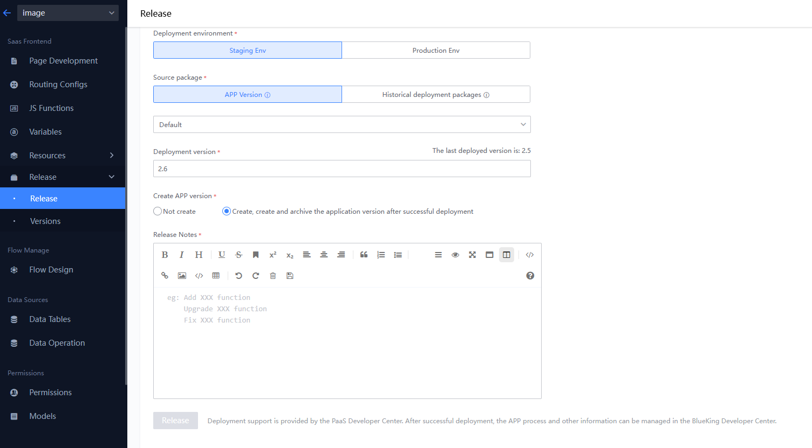
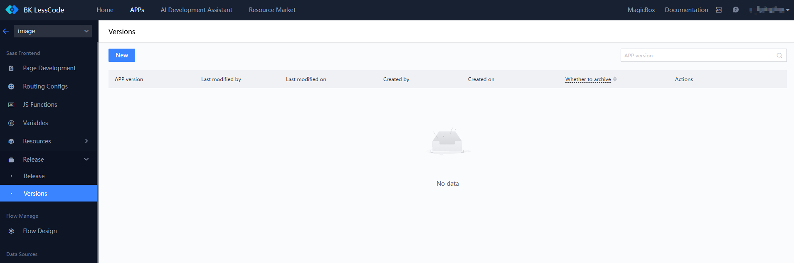
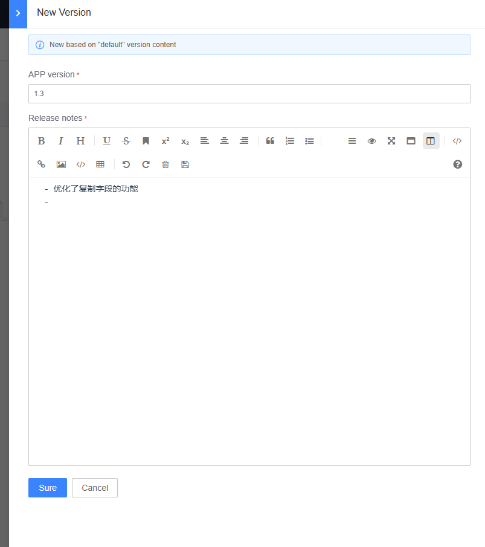
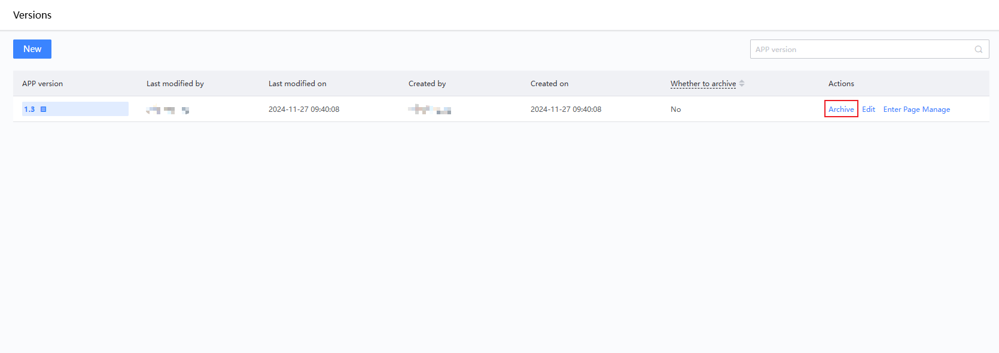
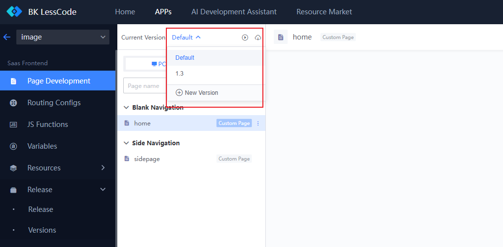
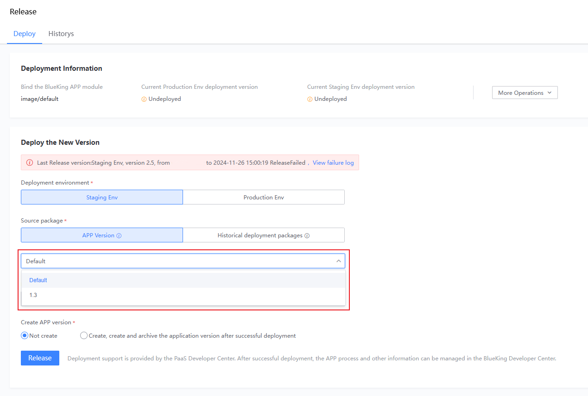

# User Guide for Version Management

Version management allows tagging of the current content of an APP (default version). You can create versions through "Release Deployment" or proactively on the "Version Management" feature page.

## Creating Versions via "Release Deployment"

Navigate to the "Release Management - Release Deployment" page. Enter the "Deployment Version Number" and select "Create and archive APP version upon successful deployment." Fill in the "Version Log" and click "Deploy."

After successful deployment, a version with content matching the "Deployment Version Number" will be created and archived by default. You can view all created versions in the "Version Management" section.

## Creating Versions via "Version Management"

Click the "New" button to open the new version creation function. Fill in the "APP Version" and "Version Log," then click "Confirm."

At this point, the created version is in an "Unarchived" state. You can publish, deploy, or switch to the version for development based on this unarchived version.

## Development and Deployment Based on "Version" Content

In the upper left corner of the page, you can see the entry point for switching the "APP Current Version," indicating that the data of this module is included in version management. As shown, version "1.3" in the list is the one just created in version management.

Switching to the "1.3" version means entering the content of this version, where all operations are effective only within the current version. In other function modules, you'll notice that the APP current version points to "1.3."

After development based on version content is completed, navigate to "Release Deployment" to select the specified version content for release.

