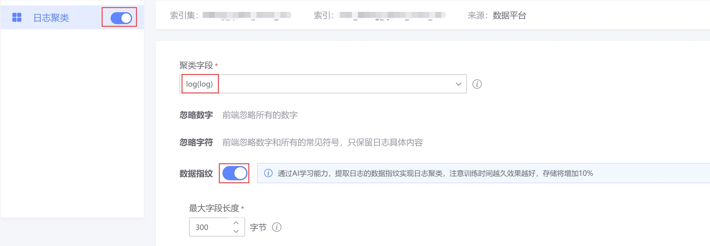
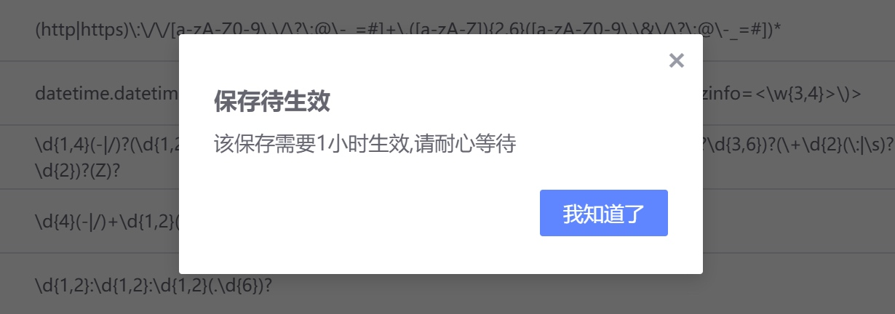

# 开启日志聚类

## 业务痛点

海量日志泛滥，核心日志被淹没，真正需要关注和处理的错误日志被遗漏
传统日志告警依赖已知关键字，覆盖度不足，无法覆盖新类型日志

## 解决方案

蓝鲸日志平台推出的日志聚类功能就是针对海量日志分析的一种高效的解决方案。

日志聚类：是指通过计算日志文本之间的相似度，将相似度高的日志聚合成一类，并提取他们的共同日志模式的方法
通过聚类，可以将大量的日志聚合成少量更具可读性的日志模式，大大提升业务日志分析和应用的效率，附加蓝鲸日志平台联动告警的特性

可以完美覆盖新类告警以及聚类告警。

### 聚类效果概览

下图某业务24小时内产生了18W+错误日志，经过聚类后，实际只有27种类型日志，18W对比27，经过聚类后业务侧的日志分析和应用显然会效率更高

## 聚类接入

简单聚类，无额外的存储资源成本消耗，日志平台对于已接入蓝鲸日志平台的业务默认开启了简单聚类，以便让大家能够快速查看聚类的效果接入蓝鲸日志平台后，默认就是开启的，所以这里不做介绍。

AI聚类(对应日志平台日志聚类的数据指纹)则通过AI算法加持，用于覆盖业务更复杂的聚类需求场景

* AI算法加持,更好的适用于海量日志复杂聚类场景
* 提供过滤规则，便于业务针对特定日志开启聚类
* 提供常见聚类正则，且用户侧可自定义聚类规则
* 提供高级功能特性：告警通知、下钻分组分析、同比分析、聚类敏感度调整等

### AI聚类接入流程

接入聚类需要用户侧做的操作：打开日志聚类开关=>选择聚类字段(默认加载log字段)=>设置过滤规则(可选)=>设置聚类规则(可选)=>调试聚类规则(可选)=>保存提交

①聚类开关设置页面入口

②打开聚类开关

③设置过滤规则和聚类规则(均为可选步骤)

④调试聚类规则(可选步骤)

⑤提交保存

> 注：开启聚类需等待1小时生效，这里的时间主要包含数据接入，预处理，样本准备，冷启动模型训练，模型应用等时间，跟采集项的数据量大小有关，1小时只是一个大概时间，数据量小的话只需等待很短时间即可生效。

待聚类开启流程结束，即可在采集项右侧看到绿色的 数据指纹 标签，表示聚类已正常开启，可以使用聚类的各种功能了。

聚类功能概览

