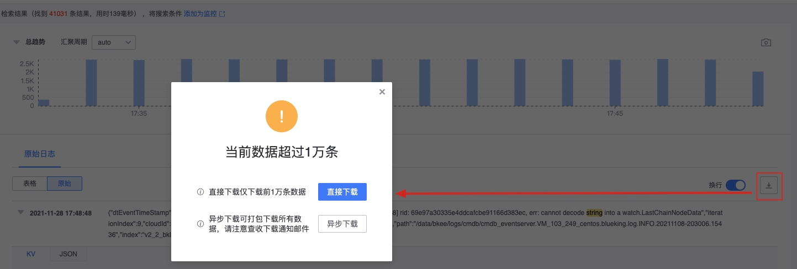

# Log retrieval

Log retrieval is mainly used to quickly locate problems and avoid querying logs on the server side. The advantages are efficient performance and convenient tools.

## working principle

To be able to retrieve logs, you need to have access to the data source and form an **index set** before it can be used for retrieval and monitoring.

## Retrieve


### Check for phrases

Click the search box and the field names of the current log will be listed.


Supports QueryString syntax and regular matching. For specific query syntax, please see [query string detailed explanation](./query_string.md).

```json
Exact matching (supports AND, OR)
author:"John Smith" AND age:20

Field name matching (* represents wildcard character):
status:active
title:(quick brown)

Field name fuzzy matching:
vers\*on:(quick brown)

Wildcard matching:
qu?ck bro*

Regular match:
name:/joh?n(ath[oa]n/

Range matching (numeric type):
count:[1 TO 5]
count:[1 TO 5}
count:[10 TO *]
```

Click the log field and enter the keyword string. The search results are as follows


## Filter conditions

**Add filter conditions** to locate the log content more accurately.

### IP Quick Selection

**IP Quick Selection** controls the scope of log retrieval by correlating the business topology of CMDB.


### Add condition


Notice:

* The values listed are the values in the currently retrieved logs. The default is to list 50 logs. If the required value does not exist in the current log, you need to enter it manually.
* Retrieval from added conditions actually has the same effect as entering the query ES statement
     

#### Operator

`is`
`is one of`
`is not`
`is not one of`
`greater than`
`less than`
`equal to`
`Greater than or equal to`
`less than or equal`
`exists`
`does not exist`
     
      
### Quickly add conditions

* `+` sign adds key is value
* `-` sign adds key is not value


## collect 


## Automatic query


The default is automatic query. After entering the query statement, the search will be automatically performed. However, sometimes it is customary to enter the complete query statement and then click Search to query more clearly. You can turn off automatic query.

## Log format display


The content will be linked to:

* Host IP, monitored IP details
* traceID will be linked to the corresponding call chain


For details on log clustering, see [./log_reduce.md]

## Log export



The default export is 10,000 logs. If you need to export more logs, you can use the asynchronous download function and send the download link via email. The maximum number of logs supported is 1 million.

## Load more logs

Swipe down to continue loading more logs


## Real-time log

**Real-time log scrolling.**


## Contextual viewing

Context logs are generally used to query the keywords you are interested in, and then you need to delve into the context of the log, as shown in the figure below.


## Container webConsole

If the collected logs come from the BCS container, there is a WebConsole that can be opened directly for viewing.


## Field display and sorting

**Field display and order, as well as multi-column sorting function.**

