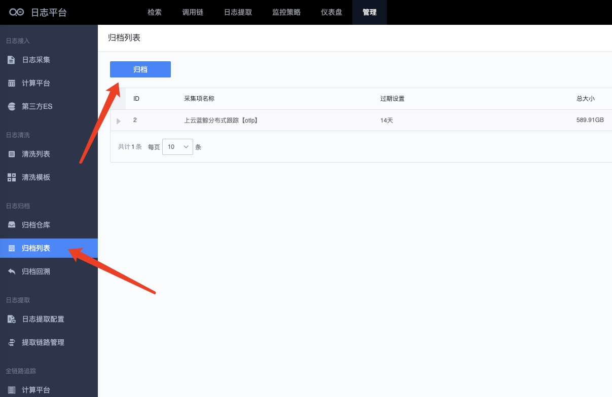

# Log archive

Log archiving is a function that permanently stores logs. When you need to view the logs, you can trace back from the archived logs on demand. After the query is completed, the decompressed archived logs can be destroyed. Although ES supports hot and cold storage, historical logs are not queried frequently and are only queried when needed. For example, they are queried only once every six months during an audit. This will cause huge waste and it is very uneconomical to use ES cold storage. , we should use cheaper storage.

BKLog supports three ways of archiving logs to COS, HDFS, and local storage. Logs can be kept for months, years, or even decades. Therefore, the dilemma of insufficient ES storage for a long time can be solved.

## Steps for usage

The steps to use this function are as follows:

1. Create an archive warehouse: a place to store archive logs
2. Create an archive: archive the log index on demand
3. Backtracking data: Decompress and extract archived data by specifying an index and a specified time range.

## Data life cycle

The storage of ES is divided into hot and cold data, or only hot data. Log archiving is to archive and store the expired logs. Its life cycle is shown in the figure below

## Create archive warehouse

### 1. HDFS warehouse access

The ES cluster needs to install the HDFS plug-in https://www.elastic.co/guide/en/elasticsearch/plugins/current/repository-hdfs.html

How to obtain hdfs

* Dedicated team within the company
* Tencent Cloud HDFS https://cloud.tencent.com/product/chdfs
* Self-built HDFS https://hadoop.apache.org/docs/r1.2.1/hdfs_design.html

Obtain the final HDFS uri address through the above method. For example: `"hdfs://<host>:<port>/"`

If kerberos is configured, the following configuration is required

Configuration method

1. Users need to create a principal for es in the kerberos set up in hdfs, and then export the corresponding keytab file
2. Put the keytab in the directory corresponding to each node of es.
3. Then you need to fill in the principal corresponding to the keytab when configuring the snapshot warehouse.

### 2. COS warehouse access

> cos can only be used with Tencent Cloud ES or ES clusters with the Tencent Cloud COS plug-in installed.

cos warehouse configuration

> appid Tencent Cloud COS bucket name-the number after it
> bucket is the letter in front of -

### 3. Shared directory

Some local devices can mount network disks or other devices.

## Create archive

Enter the archive list page and click Archive

Configuration archive

Complete archiving

## Archive traceback

### Create a traceback to retrieve archived data

Enter the traceback page and click traceback

Configure traceback

*Archived items: Archived collection items

* Time range: refers to the time range that needs to be traced back. For example, if you query the logs from 2021-10-01 to 1021-10-31, all the data during this period will be decompressed.

* Expiration time: The logs decompressed from the archive will be written to ES query. If they need to be retained for 2 days, the decompressed logs will be automatically deleted after 2 days of decompression and storage.

*Result Notifier: After the archiving review is completed, an email will be sent to notify the completion

The schematic diagram is as follows

