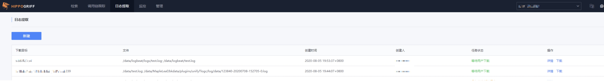

## Log extraction

Create a new download task in the "Log Extraction" menu page.

Enter the content according to the prompts. Please read the prompts carefully during the input process:

- The directory supports wildcards. If it ends with "/", the subdirectory will be viewed. Otherwise, all files in the directory will be directly queried.
- A single server can download up to 100 files at a time. Considering efficiency issues, it is recommended to select the smallest range of content to be downloaded.

After submitting the task, you can view the task status in the task list and download the file:

- Operations and maintenance students can view all download lists, and other authorized users can view personal download history
- The download task expires in 24 hours, please download it in time