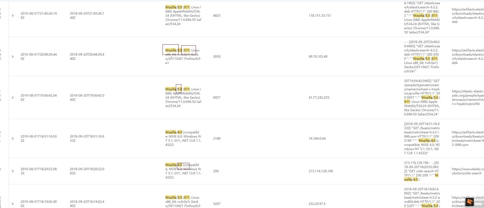

# Retrieve syntax guide

In log retrieval, the standard Elasticsearch QueryString is used, which basically supports all syntaxes. The following is a basic syntax introduction.

## QueryString Introduction

The query backend will parse the text information passed in by QueryString. The grammatical principle of parsing is to perform segmentation judgment based on specific operators, and conduct independent analysis on each segment after segmentation, and then perform query analysis.
As shown in the picture:

Query statement (Mozilla) OR (Chrome)

The query statement will be divided into two parts, Mozilla and Chrome, based on the operation, and each part will be analyzed independently by the query background.

> **Note:** "Space" will not be used as an operator, such as query (KHTML, like Gecko) OR (200 8823), KHTML, like Gecko will be completely passed to the background for search and analysis. It is possible to search for fields with only Gecko or only 200, because the specific fields are word segmented and configured in ES. If you want to search 200 and 8823 independently, you can query through the statement 200 AND 8823.

## QueryString syntax

### Basic syntax

As mentioned above, the content of QueryString will be parsed into words or operators. Words can be words - such as MozillaORChrome, or they can be phrases surrounded by double quotes `"Mozilla\/5.0" AND "KHTML,like Gecko"`.

### Query the specified field

By default, QueryString will parse the query content into all fields (_all), and you can fix the query for specific fields through field settings.

Example: The query agent contains Mozilla.

`agent:Mozilla`

Example: The query agent contains Mozilla or X11 or 4.0.

`agent: Mozilla OR X11 OR 4.0`

Example: Query the specific phrase in agent (enclosed in double quotes).

`agent: "KHTML,like Gecko"`

Example: Query geo. The content whose wildcard character contains CN.

`geo.\*:CN`

Example: Query geo.src is not empty

`_exists_: geo.src`

### Wildcard

Wildcards are supported ? and * .

? Replaces a single character.

\* Replaces zero or more characters.

This is similar to regular expressions.

For example, query `agent: M?zi*a`.

> Note: Wildcard queries consume a lot of memory. The presence of multiple wildcards in a phrase or word will result in a large number of words being included in the search scope.

For example: `agent: *zi*a`.

The results contained in the agent can be queried, but all phrases in the agent field will be retrieved, which consumes a lot of time and background memory.

Considering necessary query scenarios, log retrieval does not disable this function. When using wildcards, you need to consider the specific query statement in detail.

### Regular expression

Regular expression pattern nesting can be used in Query String. When using it, the query content needs to be wrapped in two forward slashes ("/").

For example: `agent: /[L-N].*z*l{2}a/`

### Fuzzy query

You can use a tilde to perform fuzzy queries at the end.

`agent: Mozill~`

Fuzzy queries can be performed on phrases.

`agent:"KHTML Gecko"~2`

### Range query

Range queries are used for time, numeric, and string type fields.

The main operators of range query are [] and {}, where [] is a closed query and {} is a non-closed query.

Example: Query the data in the range of Bytes field from 8023 to 9057, including 8023 and 9057.

`bytes: [8823 TO 9057]`

Example: The query time field is an interval of time type.

`timestamp:[2019-08-01T19:56:00 TO 2019-08-01T22:00:00]`

Example: Query the data in the Bytes field from 8023 to 9057, excluding 9057.

`bytes: [8823 TO 9057}`

## Bool operator

Review a basic query

`agent: Mozilla X11 4.0 5.0`

In this query, all phrases are optional, which means you will get the following results:

If you want to have more control over query operations, you can use Bool operators such as:

`agent: Mozilla X11 +4.0 -5.0`

For the understanding of this query,

Mozilla X11 is optional, if one of the main requirements is met, the record will be found,

4.0 is required,

5.0 cannot exist,

The following results are obtained:

The above query can be understood as:

`agent: ((Mozilla AND 4.0) OR (X11 AND 4.0) OR 4.0) AND NOT 5.0`

In comparison, using the Bool operator can easily obtain the desired results.

## Conditional grouping

`agent: ((Mozilla AND 4.0) OR (X11 AND 4.0) OR 4.0) AND NOT 5.0`

The above query is an example of grouping, and conditional grouping can also be performed on different fields.

`bytes: "2189" AND agent: ((Mozilla AND 4.0) OR (X11 AND 4.0) OR 4.0) AND NOT 5.0`

## Escape of special characters

If you want the query content to include log retrieval operators, you need to escape them in the Query String using backslashes. The characters that need to be escaped are as follows:

`+ - = && || >< ! ( ) { } [ ] ^ " ~ * ? : \ /`

If you forget to escape, the query will report an error.

If you want to query the agent, it is Mozilla/5.0 (X11; Linux x86_64; rv:6.0a1) Gecko/20110421 Firefox/6.0a1.

By escaping,

`agent:Mozilla\/5.0 \(X11; Linux x86_64; rv\:6.0a1\) Gecko\/20110421 Firefox\/6.0a1`

After escaping, it will be converted into participle mode for query.