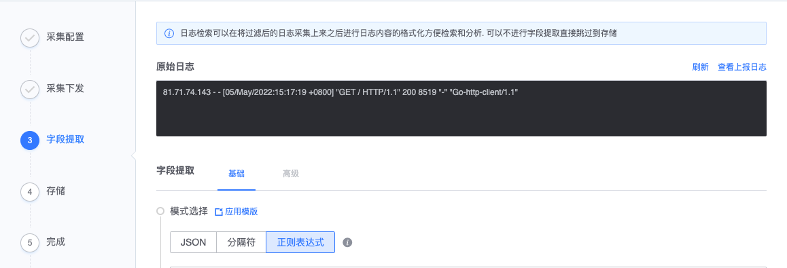
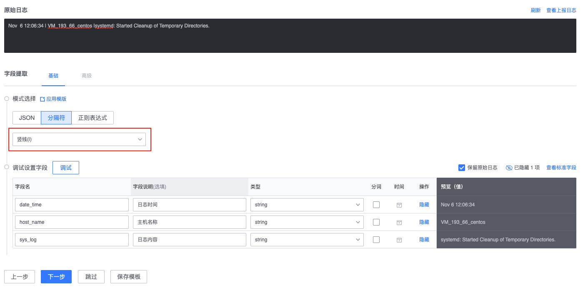

# Collect access

Log collection is to collect logs to the server through real-time streaming through the log service's own link, and the agent-side filtering and server-side field extraction functions can also be run during the collection process, which can quickly format the logs. need.

## Preliminary steps

Log collection principle


## function list

* New collection
* Collect running status
* Log field extraction
* Data sampling

## Features

### Create new collection

**Function location**: Navigation → Management → Data Access → Collection Access → New

**Steps**:

* (1) Collection configuration
* (2) Collection and distribution
* (3) Field extraction & storage
* (4) Complete

### Collection configuration


* Log type: At first, only line log files are supported, and Windows and Linux systems are supported.
* Data classification: See terminology explanation for details [Data classification](../../concepts/glossary.md)
* Collection target: It can be collected based on static IP or using dynamic module method. Dynamic collection will be automatically added and deleted as the host of the CMDB module changes.


* Log path:
     * The log is an absolute path
     * Can support wildcard mode, see [Common Wildcard Characters](../addenda/wildcard.md) for details
     * Can support CMDB variable mode, see [CMDB variable usage](../addenda/cmdb_var.md) for details
     * Can support multiple log files
* Log content filtering: first support the include method

### Collection and delivery

> Note: The asynchronous execution is still continuing after leaving the current collection, but the storage setting has not been completed, so the storage of the third step has not been completed after 24 hours, and the collection task will be forcibly deactivated.


### Field extraction

Optional item, applicable to scenarios where logs need to be formatted and logs need to be aggregated and dimensionally monitored.

Field extraction provides three extraction methods: JSON, delimiter, and regular expression.



#### Regular extraction

Format description:

Regular extraction uses Go's regular syntax: there are two forms, one is a normal extraction group, and the other is a named extraction group. Named extraction group syntax is used here.

* Normal: (Expression)
* Naming: (?P<name>Expression)

like:

```bash
(?P<request_ip>\d+\.\d+\.\d+\.\d+)
```

It means: name the `\d+\.\d+\.\d+\.\d+` content matched by the regular expression as `request_ip`.

[Online regular expression debugging page](https://www.debuggex.com/)

#### JSON mode

The collected and reported logs are in standard JSON format, and only the first-level keys are extracted.


#### Separator

Determine the required field content through delimiters. Currently supported: vertical bar, comma, backtick, space, and semicolon.




### Storage

The index name where the collected data is stored will be used in the index set.

