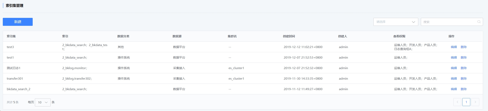
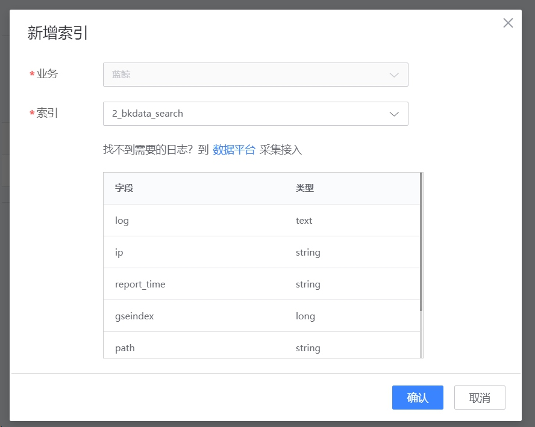

# Index set management

Index set management provides administrators with the functions of adding, deleting, checking, and modifying index sets.

Logs stored in ES must first create an index set before they can be queried. The object of the query is the index set.

**Interpretation of index set list fields**

Index set: The name of the user-defined index set, supports Chinese and English.

Index: The index saved in ES.

Data classification: log type label.

Data source: data platform, collection access, third-party ES.

> Data platform: refers to the log coming from the data platform ES;
> Collection access: refers to logs collected from internal log retrieval;
> Third-party ES: refers to the third-party ES cluster that accesses users independently.

Cluster name: The name of the user-independent third-party ES cluster

## Create a new index set

When the accessed logs are collected during log retrieval, the corresponding index set will be automatically created.

Other situations require administrators to manually create index sets.

## Edit index set

Editing an index set can modify the index set name, data classification, add or delete indexes, and modify authorization, but the data source type cannot be modified.

