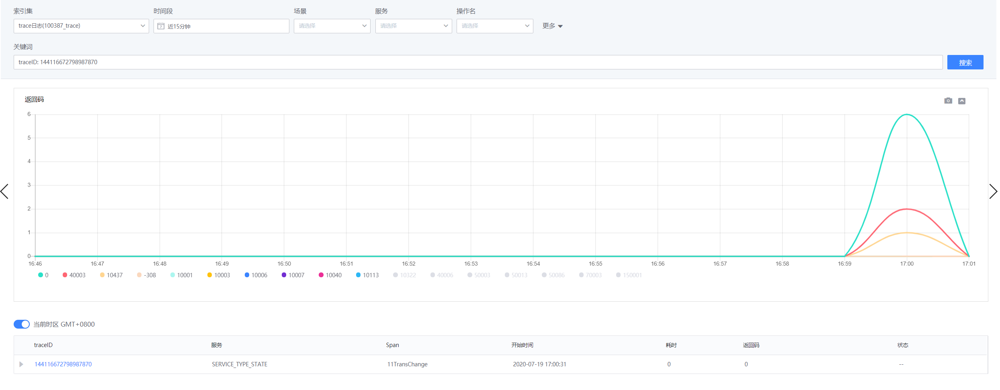

## Statistics preview

When searching the homepage, you can easily use time, time consumption, scene, service, operation name and other query conditions to filter and find the information that the user wants to obtain. The platform performs statistical analysis on the results using time-consuming graphs, return codes and other dimensions.
When only time and scene are the query conditions, the search results are aggregated and counted in the trace dimension; otherwise, the results are counted and displayed in the span dimension. The two methods are combined to accurately express the query intention. Currently, the system defaults to aggregation statistics based on scenarios/service categories (relevant fields need to be stored in the database when accessing or cleaning, see the access guide document for details). It will be optimized to aggregate statistics based on user-defined fields when accessing to meet the needs of multiple users. diverse needs.
Aggregate by return code:

Aggregation according to service scenarios:

At the same time, users can also enter specific information in the search box, including specific traceid, spanid or specific error logs, etc. to query.

## Trace details query

After obtaining the response trace through retrieval, click traceID to query the trace details.
Trace details are displayed in two dimensions: calling relationship and time consumption.

in:
- The call relationship graph shows the call relationship between each node (span):
     - Green nodes are normal nodes with return values, and red nodes are abnormal nodes.
     - The node with a subscript indicates that its relationship with the parent node is a synchronous execution relationship, otherwise it is an asynchronous execution node.
- The waterfall chart displays the execution time of the node. At the same time, the waterfall chart adds a "only display synchronization request" switch, which is used to more accurately understand the critical path information when the call relationship is complex.

## Node details display

After clicking on a specific node, the specific content of the node will be displayed in detail, including upstream and downstream IP, call time, time consumption and other information can be displayed in detail:

