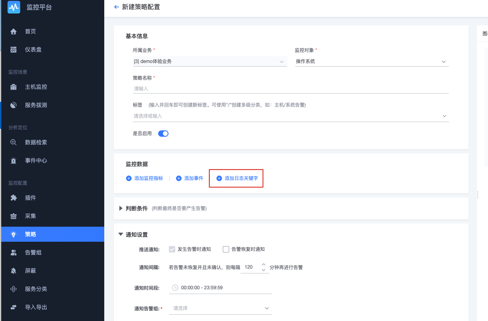

# How to monitor log keywords

Log keyword monitoring is a very common monitoring requirement. There are two entrances to log keyword monitoring.

## Entrance 1: Log retrieval

After retrieving BKLog, those who want to monitor and add can directly jump to the monitoring platform to add log keywords strategically.

## Entrance 2: Add directly on the monitoring platform

Step 1: Create a new strategy and select log keywords.

Step 2: Select the index set and pay attention to the choice of data classification.

Step 3: Enter the adding interface of the first method to supplement the corresponding policy content.