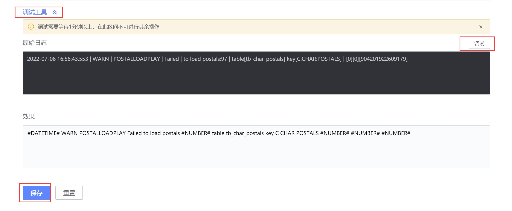
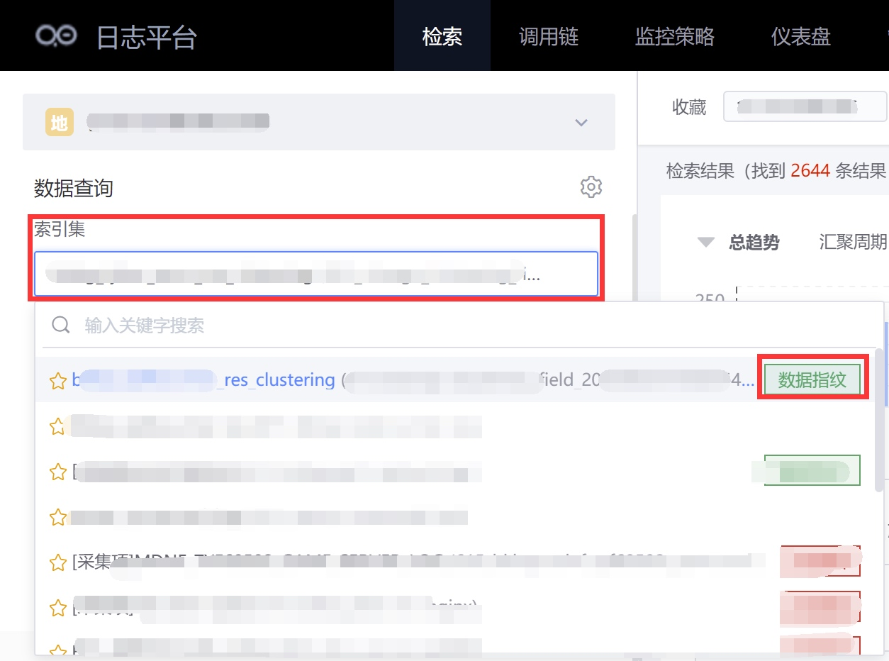
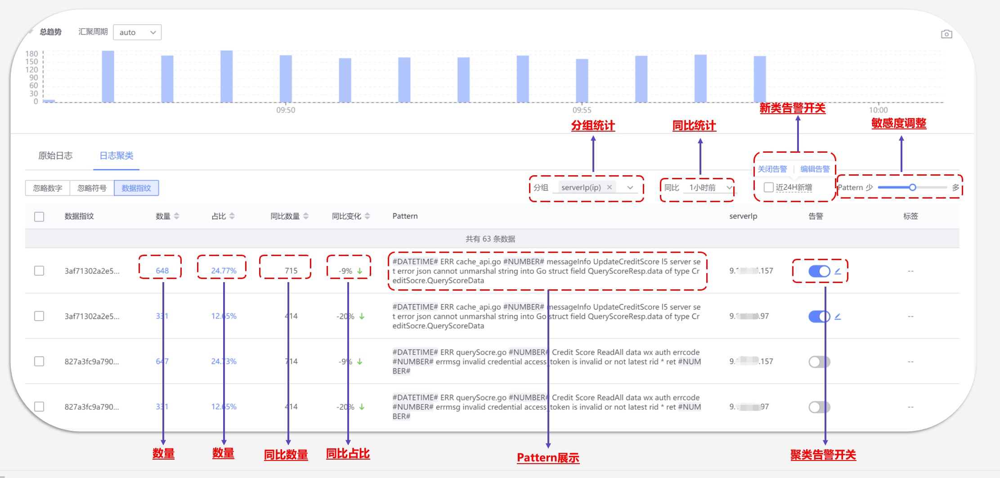

# Enable log clustering

## Business pain points

Massive logs overflow, core logs are submerged, and error logs that really need attention and processing are missed.
Traditional log alarms rely on known keywords and have insufficient coverage to cover new types of logs.

## solution

The log clustering function launched by BlueKing BKLog is an efficient solution for massive log analysis.

Log clustering: refers to a method of aggregating highly similar logs into one category by calculating the similarity between log texts, and extracting their common log patterns.
Through clustering, a large number of logs can be aggregated into a small number of more readable log patterns, greatly improving the efficiency of business log analysis and application, and adding the feature of BlueKing BKLog linkage alarms.

It can perfectly cover new types of alarms and clustered alarms.

### Overview of clustering effects

As shown below, a certain business generated 18W+ error logs within 24 hours. After clustering, there are actually only 27 types of logs. Compared with 18W, 27, log analysis and application on the business side will obviously be more efficient after clustering.

## Clustering access

Simple clustering, no additional storage resource cost consumption, BKLog turns on simple clustering by default for businesses that have been connected to BlueKing BKLog, so that everyone can quickly check the effect of clustering. After connecting to BlueKing BKLog, it is turned on by default. , so no introduction is given here.

AI clustering (corresponding to the data fingerprint of BKLog log clustering) is supported by AI algorithms to cover more complex clustering demand scenarios of the business.

* AI algorithm blessing, better suitable for complex clustering scenarios of massive logs
* Provide filtering rules to facilitate businesses to enable clustering for specific logs
* Provides common clustering rules, and the user can customize the clustering rules
* Provide advanced features: alarm notification, drill-down group analysis, year-on-year analysis, clustering sensitivity adjustment, etc.

### AI clustering access process

Operations required on the user side to access clustering: Turn on the log clustering switch => Select the clustering field (the log field is loaded by default) => Set filtering rules (optional) => Set clustering rules (optional) => Debugging Clustering rules (optional) => save submission

①Clustering switch setting page entrance

②Turn on the clustering switch

③Set filtering rules and clustering rules (both optional steps)

④Debug clustering rules (optional step)

⑤Submit and save

> Note: You need to wait 1 hour for clustering to take effect. The time here mainly includes data access, preprocessing, sample preparation, cold start model training, model application, etc. It is related to the amount of data collected. One hour is just one hour. Approximate time, if the amount of data is small, you only need to wait a short time for it to take effect.

After the clustering opening process is completed, you can see the green Data Fingerprint label on the right side of the collection item, indicating that clustering has been opened normally and you can use various functions of clustering.

Clustering functionality overview

