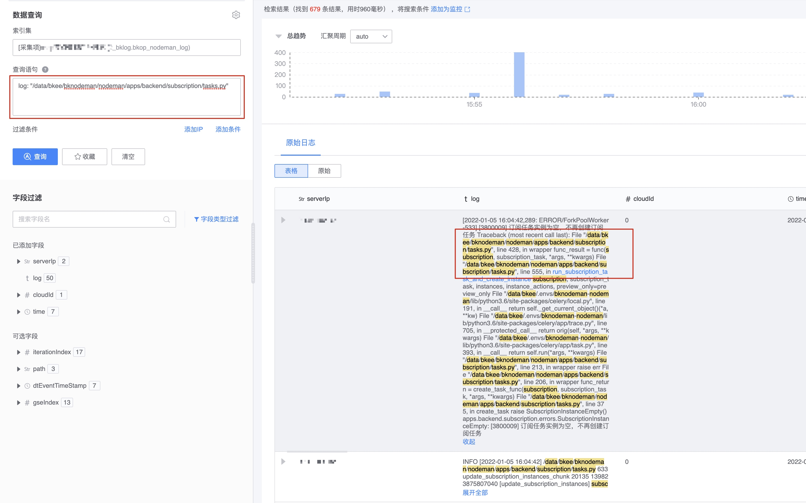

# Retrieve syntax guide

In log retrieval, the standard Elasticsearch Query String is used, which basically supports all syntaxes. The following is a basic syntax introduction.

## Query String Introduction

The query statement uses ES Query String syntax. When querying, you can query according to certain rules. For example, if the query log field contains the log keyword 2189988 of user, you can use the query statement log: "2189988 of user", where Log indicates that there is a field called log in the log. The colon is the query syntax, and the characters in double quotes are the keywords to be queried.


For simple searches, you can directly use the above query. However, for complex queries that contain special symbols, you cannot query normally by directly entering keywords. In order to better understand the query statement, please refer to the following introduction. .

```
Log retrieval uses the elasticsearch default word segmenter (Standard Analyzer), which splits words according to spaces and lowercase processing. For special symbols, such as + - = && || >< ! ( ) { } [ ] ^ " ~ * ? : Special symbols such as \ / (see details below) will not be matched and searched.
```

### Query String Syntax


```
Note: Since the name of most log fields is log, the log field is used as an example here.
```

When searching, if the search field is not specified, _all field will be searched by default, which contains the values ​​of all fields. At this time, the scope of ES scanning will be very large and the query efficiency will not be high. Therefore, it is recommended to search based on specific fields. Search to improve retrieval speed.

### Distinguish between word participles and strings

* Word segmentation: It is a feature of ES and a threshold that needs to be learned.
* String: It can support regular expressions, but it is strictly a regular syntax, so you need to pay attention to it.

Note: Different field types support different query syntaxes.

## Participle

Word segmentation is a method of dividing log text into words to facilitate faster retrieval. The tokenizer accepts a string as input, splits the string into independent words or tokens (possibly discarding some characters such as punctuation marks), and then outputs a token stream.

Original log

`blueking@foo-bar.com|[abc] &`

Field after word segmentation

```
blueking
foo
bar.com
abc
```

Among them, the special symbols `@ | ] [ &` are ignored, that is, they will not be matched when searching.

For example, the original log is as follows

```
"ERROR [2022-01-05 15:04:43] /data/bkee/bknodeman/nodeman/apps/backend/subscription/tasks.py 430 wrapper 18302 140333498185536 [3800009] The subscription task instance is empty and no more subscription tasks will be created. Traceback (most recent call last): File \"/data/bkee/bknodeman/nodeman/apps/backend/subscription/tasks.py\", line 428, in wrapper func_result = func(subscription, subscription_task, *args, ** kwargs) File \"/data/bkee/bknodeman/nodeman/apps/backend/subscription/tasks.py\", line 555, in run_subscription_task_and_create_instance subscription, subscription_task, instances, instance_actions, preview_only=preview_only File \"/data/bkee/ .envs/bknodeman-nodeman/lib/python3.6/site-packages/celery/local.py\", line 191, in __call__ return self._get_current_object()(*a, **kw) File \"/data/ bkee/.envs/bknodeman-nodeman/lib/python3.6/site-packages/celery/app/trace.py\", line 705, in __protected_call__ return orig(self, *args, **kwargs) File \"/ data/bkee/.envs/bknodeman-nodeman/lib/python3.6/site-packages/celery/app/task.py\", line 393, in __call__ return self.run(*args, **kwargs) File \ "/data/bkee/bknodeman/nodeman/apps/backend/subscription/tasks.py\", line 213, in wrapper raise err File \"/data/bkee/bknodeman/nodeman/apps/backend/subscription/tasks.py \", line 206, in wrapper func_return = create_task_func(subscription, subscription_task, *args, **kwargs) File \"/data/bkee/bknodeman/nodeman/apps/backend/subscription/tasks.py\", line 375, in create_task raise SubscriptionInstanceEmpty() apps.backend.subscription.errors.SubscriptionInstanceEmpty: [3800009] The subscription task instance is empty, no more subscription tasks will be created"
```

The words after standard segmentation are as follows. These words are searchable keywords. Words that are not here cannot be searched.

```
error, 2022, 01, 05, 15, 04, 43, data, bkee, bknodeman, nodeman, apps, backend, subscription, tasks.py, 430, wrapper, 18302, 140333498185536, 3800009, subscription, subscription, task, task, Actual, example, is, empty, not, again, create, build, subscribe, read, task, task, traceback, most, recent, call, last, file, data, bkee, bknodeman, nodeman, apps, backend, subscription, tasks.py, line, 428, in, wrapper, func_result, func, subscription, subscription_task, args, kwargs, file, data, bkee, bknodeman, nodeman, apps, backend, subscription, tasks.py, line, 555, in, run_subscription_task_and_create_instance, subscription, subscription_task, instances, instance_actions, preview_only, preview_only, file, data, bkee, envs, bknodeman, nodeman, lib, python3.6, site, packages, celery, local.py, line, 191, in, __call__, return, self, _get_current_object, a, kw, file, data, bkee, envs, bknodeman, nodeman, lib, python3.6, site, packages, celery, app, trace.py, line, 705, in, __protected_call__, return, orig, self, args, kwargs, file, data, bkee, envs, bknodeman, nodeman, lib, python3.6, site, packages, celery, app, task.py, line, 393, in, __call__, return, self. run, args, kwargs, file, data, bkee, bknodeman, nodeman, apps, backend, subscription, tasks.py, line, 213, in, wrapper, raise, err, file, data, bkee, bknodeman, nodeman, apps, backend, subscription, tasks.py, line, 206, in, wrapper, func_return, create_task_func, subscription, subscription_task, args, kwargs, file, data, bkee, bknodeman, nodeman, apps, backend, subscription, tasks.py, line, 375, in, create_task, raise, subscriptioninstanceempty, apps.backend.subscription.errors.subscriptioninstanceempty, 3800009, subscription, subscription, task, task, instance, is, empty, not, again, create, create, subscription, subscribe, Task
```

You can see that `+ - = && || >< ! ( ) { } [ ] ^ " ~ * ? : \ /` Special characters will not be segmented and are directly ignored by the standard segmenter and are not special. Characters dot `(.)` and underline `( _ )` will be treated as part of the word.

search term

```
log: "/data/bkee/bknodeman/nodeman/apps/backend/subscription/tasks.py"
```

search results



Special cases of participles, such as

```
Original log
I'm blueking 'log'.
after standard participle
i'm
blueking
log

#If you have an ES environment, you can query and analyze through the ES interface. The last point has been removed. This is the default behavior of standard.

GET _analyze
{
"analyzer": "standard",
"text":"I'm blueking 'log'."
}
```

### How to determine whether it is segmented

When the type is **text**, it means that the field has been segmented and needs to be retrieved according to **word segmentation rules**

**Text**, indicating that the field has been word segmented and can support search by word. If special symbols are encountered, it cannot be matched.


Click the mouse on the word. If the word can be highlighted, it means that the word can be used for keyword search.


### Rule 1: Keyword query

**Field name: Keywords to be segmented**

`log: ERROR ` #Search for logs whose log field contains ERROR

### Rule 2: Exact query - with double quotes

**Field name: "Exact match of complete string"**

`log: "ERROR MSG"` #Search for logs whose log field contains "ERROR MSG"

### Rule 3: Boolean query AND, OR

```
Field name: (Keyword 1 OR Keyword 2) #The default is OR, () can be omitted
Field name: (Keyword 1 Keyword 2) #The default is OR
Field name: (keyword 1 AND keyword 2) #Keyword 1 and keyword 2 exist simultaneously
Field name: (Keyword 1 AND Keyword 2 AND NOT Keyword 3) #Keyword 1 and Keyword 2 exist at the same time, but Keyword 3 is not included
```

`log: (ERROR OR INFO)` #Equivalent to log: ERROR OR log: INFO
`log: (ERROR INFO)` #Equivalent to log: ERROR OR log: INFO
`log: (ERROR AND INFO)` #Equivalent to log: ERROR AND log: INFO
`log: (ERROR AND INFO AND NOT panic)` #Equivalent to `log: ERROR AND log: INFO NOT log: panic`

> Note: AND can be written as &&, OR can also be written as ||, NOT can be written as !, `log: (ERROR && INFO && !panic)`

### Rule 4: Boolean query keyword exists +, does not exist -

`Field name: Keyword 1 Keyword 2 + Keyword 3 - Keyword 4` #Search for `Keyword 1` OR `Keyword 2` One of them exists, and `Keyword 3` also exists at the same time, but `Keyword 4` does not exist

Equivalent to: `((Keyword 1 AND Keyword 3) OR (Keyword 2 AND Keyword 3) OR Keyword 3) AND NOT Keyword 4`

### Rule 5: Fields have spaces

If you encounter fields with spaces, you need to escape them.

`first\ name: Alice`

### Rule 6: Nested fields

To search for nested fields, you can use * matching. For example, if msg.title, msg.content or msg.date contains ERROR or INFO, you can write as follows

`msg.\*: (ERROR OR INFO)`

### Rule 7: Field exists

  Query the logs where a certain field exists

`_exists_: cloudId`

### Rule 8: Wildcards

Wildcard characters include ? and *

```
? match a character
* Matches 0 or more characters
```

> Note: Wildcards will consume a lot of ES memory and the execution efficiency is not high. If * is placed at the beginning, the query efficiency will be seriously reduced. Please use it with caution.

### Rule 9: fuzzy query

Fuzzy query is a fuzzy query that determines whether it matches based on the edit distance (Levenshtein Distance) between the search term and the search field. An edit distance is a one-character modification to a word. This modification may be

* Modify a character, such as box to fox
* Delete a character, such as black to lack
* Insert a character, such as sic to sick
* Swap the positions of two adjacent characters, such as act to cat

When performing a fuzzy search, ES will generate a series of deformations within a specific edit distance, and then return accurate matches of these deformations. By default, when the length of the search term is between 0..2, it must match accurately; when the length is between 3..5, the maximum edit distance is 1; when the length is greater than 5, the maximum edit distance allowed is 2 .

If it is a fuzzy search, you can use the ~ symbol for matching, and use the Damerau-Levenshtein distance to find all terms with at most two changes, one of which is the insertion, deletion, or substitution of a single character, or the transformation of two adjacent characters.

As follows

```
log: bl* AND log

bl log search
blu log search
blue log search
bluek log search
blueki log search
bluekin log search
blueking log search

blue~2 matches the word characters between bl, blu, blue, bluek, blueki, starting from ~ (excluding the position of ~), subtracting 2 characters forward, that is, matching bl, blu, blue, and adding them successively 2 characters (counting from the ~ position), that is, bluek, blueki matches
log: blue~2 AND log

The matching result is

bl log search
blu log search
blue log search
bluek log search
blueki log search

log: blue~4 AND log has the same effect as log: blue~2 AND log because it matches up to 2 characters.

In the same way, blue~ matches blu, blue, and bluek. Counting from ~, words of 1 character before and after are matched, which is equivalent to log: blue~1 AND log. When the length is between 3..5, the edit distance is The maximum is 1

log: blue~ AND log
blu log search
blue log search
bluek log search

When the length is greater than 5, the maximum edit distance allowed is 2, log: bluekin~ AND log is equivalent to log: bluekin~2 AND log

log: bluekin~ AND log
bluek log search
blueki log search
bluekin log search
blueking log search


When the length is greater than 5, the maximum edit distance allowed is 2

log: bluekin~3 AND log
bluek log search
blueki log search
bluekin log search
blueking log search
```

### Rule 10: Proximity Search

Proximity queries allow search terms to appear in a different order and position than the logs.

For example, the original log is blueking log search

If our search statement is log: "log blueking", the log will not be searched at this time, but using the proximity search method, although the order is different, it can be searched through matching.

You can search for log query syntax

`log: "log blueking"~2`
`log: "search blueking"~3`

The query syntax of the log cannot be searched

`log: "log blueking"~1`
`log: "search blueking"~2`

### Rule 11: Regular matching

Regular expression pattern nesting can be used in Query String. When using it, the query content needs to be wrapped in two forward slashes ("/").

For example, to match the string Mozilla in the log field, you can write like this

`log: /[L-N].*z*l{2}a/ `

For more syntax of regular matching, please refer to the later part of this article.

### Rule 12: Range query

Range queries are used for fields of type **Time**, **Number**, and **String**. The main operators of range queries are [] and {}, where [] is a closed query and {} is a non-closed query.

Query data with code between 200 and 600

`code: [ 200 TO 600 ]`

Query data with code greater than or equal to 200

`code: [ 200 TO * ] `

Query data with code less than or equal to 600

`code: [ * TO 600 ] `

Query time range

`timestamp: [2021-08-01T19:56:00 TO 2021-08-01T22:00:00]`

Query the data in the range of Bytes field from 8023 to 9057, excluding 9057

`bytes: [8823 TO 9057}`

For an unbounded range on one side, you can use the following syntax

```
code: > 200
code: >= 200
code: < 500
code: <= 500
```

### Rule 13: Conditional grouping

Use `()` to group query statements, and the outermost parentheses are matched first.

`((Keyword 1 AND Keyword 3) OR (Keyword 2 AND Keyword 3) OR Keyword 3) AND NOT Keyword 4`

### Rule 14: Special symbols

Special symbols, such as `+ - = && || >< ! ( ) { } [ ] ^ " ~ * ? : \ / `, whose uses are as follows, cannot be used as query statements because the default word breaker will not treat them Participles, please refer to participles for details.

```
+ indicates AND operation
| represents OR operation
- means negative
" is used to enclose a phrase
* Placed after the token to indicate prefix matching
() indicates priority
~N is placed after the token to indicate the maximum edit distance fuzziness of the fuzzy query.
~N is placed after phrase to indicate the slop value of the fuzzy matching phrase.
[ ] Range query, including start and end
{} Range query, excluding start and end
// Regular matching
```


## String search [String]


String, indicating that the field has not been segmented, and special symbols can be queried, such as

Search using double quotes

`path: "/data/bkee/logs/nginx/paas_api_access.log"`

Escape special symbols

`path: \/data\/bkee\/logs\/nginx\/paas_api_access.log`

Escape and add * to match

`path: \/data\/bkee\/logs\/nginx\/paas_api_access*`

Use regular search to match [l-n]

`path: /\/data\/bkee\/logs\/nginx\/paas_api_access.[a-z]og/`

#### Unable to search logs

If you add * inside the double quotes, it will not match, because the double quotes represent exact matching text.

`path: "/data/bkee/logs/nginx/paas_api_access*"`

Without using double quotes or escaping, the search syntax is not conformed and the search cannot be performed.

`path: /data/bkee/logs/nginx/paas_api_access.log`


### Regular expression syntax

Regular expression queries are supported by `regexp` and `query_string` queries. The Lucene regular expression engine is not compatible with Perl, but supports a smaller range of operators.

#### Anchored

Most regular expression engines allow you to match any part of a string. If you want the regular expression pattern to start at the beginning of the string or end at the end of the string, then you must anchor it specifically, using `^` to indicate the beginning or `$` to indicate the end.

`Lucene`'s modes are always anchored. The provided pattern must match the entire string. For the string "abcde":

```
ab.* # match
abcd # does not match
```

#### Allowed characters

Any Unicode character can be used in a pattern, but some characters are reserved and must be escaped. Standard reserved characters are:

`. ? + * | { } [ ] ( ) " \`

If optional features are enabled (see below), these characters are also preserved:

`# @ & < > ~`

Any reserved character can be escaped using backslash `\*`, including a literal backslash character: `\`

Additionally, any character (except double quotes) will be interpreted literally when enclosed in double quotes:

`john"@smith.com"`

#### Match any character

The character `.` can be used to represent any character. For the string "abcde":

```
ab... # match
a.c.e # match
```

#### Match one or more

The plus sign `+` can be used to repeat a small previous model one or more times. For the string "aaabbb":

```
a+b+ # match
aa+bb+ # match
a+.+ # match
aa+bbb+ # match
```

#### Match zero or more

The asterisk `*` can be used to match a small previous model zero or more times. For the string "aaabbb":

```
a*b* # match
a*b*c* # match
.*bbb.* # match
aaa*bbb* # match
```

#### Match zero or one

The question mark `?` makes the previous model optional. It matches zero or one time. For the string "aaabbb":
```
aaa?bbb? # match
aaaa?bbbb? # match
.....?.? # Match
aa?bb? # does not match
```

#### Minimum maximum number of matches

Braces `{}` can be used to specify the minimum and maximum (optional) number of times the previous previous model can be repeated. Allowed forms are:

```
{5} # Repeat the match 5 times.
{2,5} # Repeat matching at least 2 times and at most 5 times.
{2,} # Repeat the match at least 2 times.
```

For example, the string "aaabbb":

```
a{3}b{3} # match
a{2,4}b{2,4} # match
a{2,}b{2,} # match
.{3}.{3} # Match
a{4}b{4} # does not match
a{4,6}b{4,6} # does not match
a{4,}b{4,} # does not match
```

#### Grouping

Brackets `()` can be used to form submodels. The quantity operators listed above operate on the shortest previous model, which can be a group. For the string "ababab":

```
(ab)+ # match
ab(ab)+ # match
(..)+ # match
(...)+ # does not match
(ab)* # match
abab(ab)? # match
ab(ab)? # No match
(ab){3} # match
(ab){1,2} # does not match
```

#### Alternate

The pipe symbol `|` acts as the `OR` operator. The match will succeed if the pattern on the left or right side matches. Alternate applies to the longest pattern (the longest pattern), not the shortest. For the string "aabb":

```
aabb|bbaa # match
aacc|bb # does not match
aa(cc|bb) # match
a+|b+ # does not match
a+b+|b+a+ # match
a+(b|c)+ # match
```

#### Character class

A range of potential characters can be expressed as a character class by enclosing them in square brackets `[]` . Leading `^` excludes character classes. Allowed forms are:

```
[abc] # 'a' or 'b' or 'c'
[a-c] # 'a' or 'b' or 'c'
[-abc] # '-' or 'a' or 'b' or 'c'
[abc\-] # '-' or 'a' or 'b' or 'c'
[^abc] # any character except 'a' or 'b' or 'c'
[^a-c] # any character except 'a' or 'b' or 'c'
[^-abc] # any character except '-' or 'a' or 'b' or 'c'
[^abc\-] # any character except '-' or 'a' or 'b' or 'c'
```

Note that the dash "-" represents a range of characters unless it is the first character or is escaped with a backslash.

For example the string "abcd":

```
ab[cd]+ # match

[a-d]+ # Match

[^a-d]+ # does not match
```

For more information, please refer to [2]


Query syntax: https://www.elastic.co/guide/en/elasticsearch/reference/current/query-dsl-query-string-query.html#_field_names

Regular syntax: https://www.elastic.co/guide/en/elasticsearch/reference/current/regexp-syntax.html