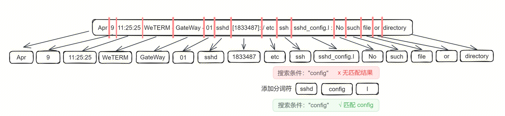
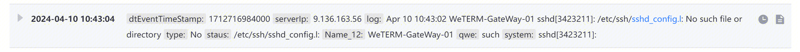
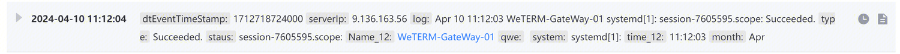
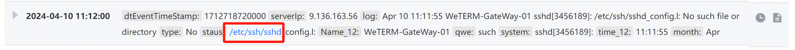

### Introduction
The default syntax in Lucene for tokenization is based on natural language, following English grammar conventions. However, in many log scenarios, the natural language tokenization may not meet the expected log segmentation. For example, patterns like 172,10 or log_level may be considered as a single word in English grammar and not segmented.

The custom tokenizer provides the ability to configure custom tokenization rules to address various segmentation requirements.

### Definitions and Explanations
#### Case Sensitivity
This option supports case-sensitive queries, ensuring that the matching results are more accurate. Example: When case sensitivity is enabled, the query will be case-sensitive. Searching for "ERROR" will only match "ERROR" and not "error". When case sensitivity is disabled, the query will be case-insensitive. Searching for "ERROR" can match both "error" and "ERROR".

#### Tokenization
The tokenizer divides the log content into multiple fragments, called "tokens", based on predefined rules. This process is called "tokenization". This setting affects the results of log search and queries. For example, when the log example is tokenized based on the default rules, the word "sshd_config.I" is not segmented. Therefore, it cannot be searched directly using "config". By adding "_" and ".", the log is further segmented and successfully matched.

#### Raw Logs
The platform provides the capability to retain the original logs, which is the default "log" field. This field will contain the full content of the reported logs. If you don't want to retain the original logs, you need to configure the output of the log cleaning fields.

### Function Explanation
You can edit the tokenization settings under "Management - Log Collection - Cleaning". The log platform provides two modes: default and custom. In the default mode, tokenization is performed based on natural language. In the custom mode, users can define the desired tokenization delimiters.

If you choose to retain the original logs (log field), you can set the tokenization and case sensitivity for the original logs. 

If you choose not to retain the original logs, you need to configure the individual fields after cleaning. 

For fields with the "string" type, you can enable tokenization by checking the "Tokenize" option. After checking, you can switch the tokenization delimiter. By default, it retrieves the tokenization delimiters from other fields on the current page and supports independent configuration for different fields. The default tokenization delimiters are:" @&()='",;:<>[]{}/ \n\t\r\ ", and you can modify the tokenization configuration as needed. After tokenization, you can search based on the segmented tokens. 

If you need to differentiate between uppercase and lowercase during log searches within a field, you can check the "Case Sensitive" option. With this option enabled, the search will strictly differentiate between uppercase and lowercase.

### Effect Display
When using the default tokenization, the tokenization effect for the "log" field is as follows:

Different fields can have different independent settings. For example, we set the tokenization delimiter for the "name_12" field as ":" and for the "status" field as []:._. You can observe that the tokenization effect for "name_12" and "status" differs from the original. 

Tokenization effect for the "name_12" field: "WeTERM-GateWay-01" is treated as a whole word, so searching for "WeTERM" alone will not yield any results.

Tokenization effect for the "status" field: It is segmented into three separate words: "/etc/ssh/sshd config I". Searching for "sshd_config.I" or "ssh" alone will not yield any results. 
