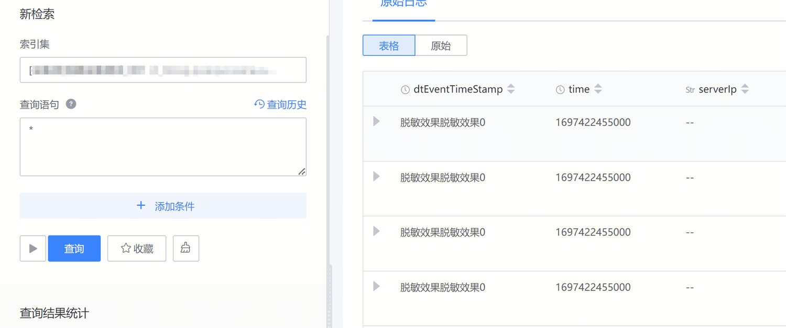
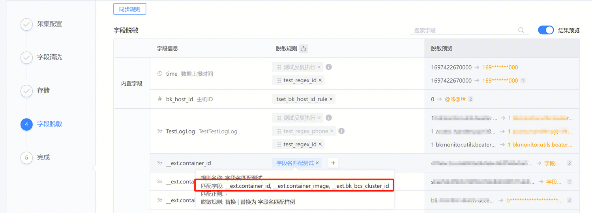
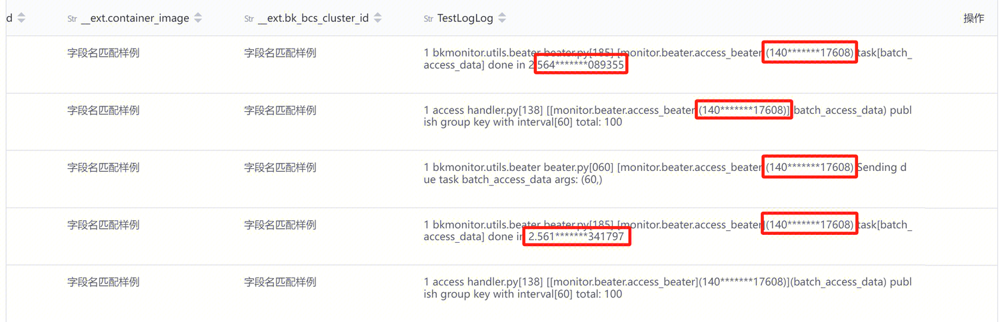
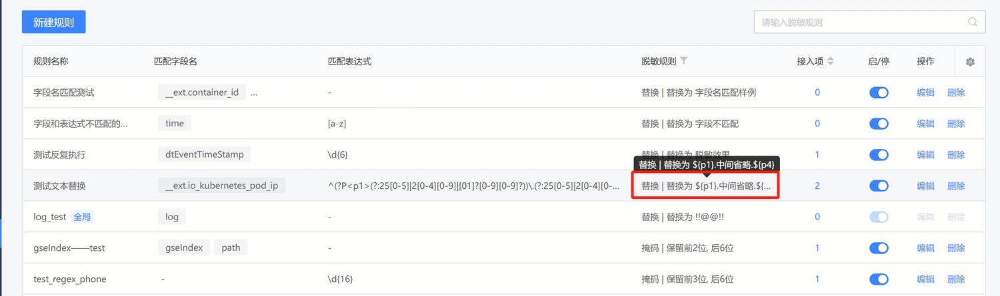
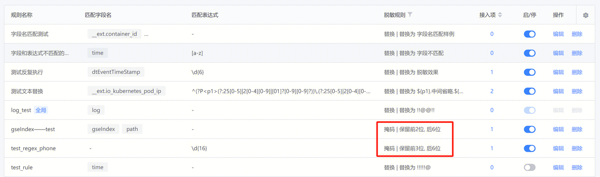
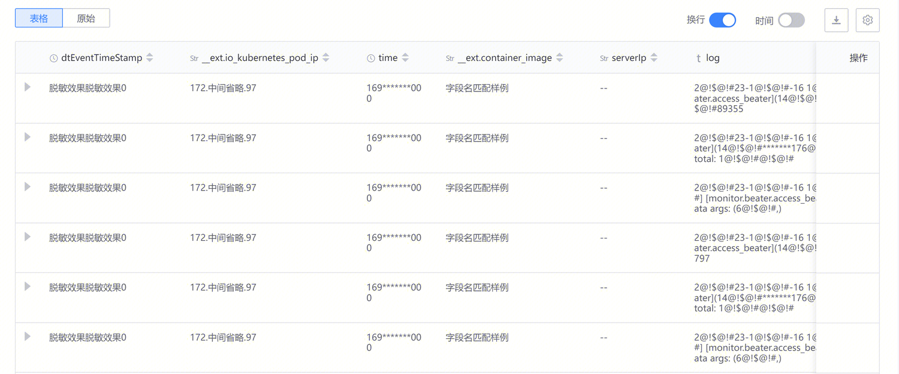
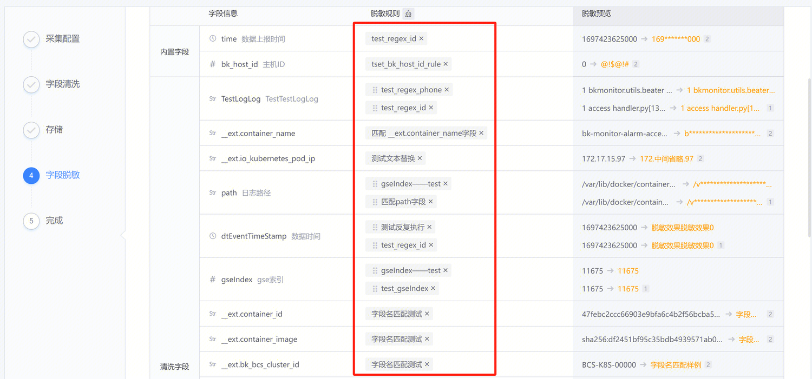

Log platforms provide the capability to anonymize logs for users. Users can match the corresponding log content based on cleaning fields and regular expressions to meet the anonymization requirements in different scenarios.

### Configuration Modes
#### Regular Expression + Field Name
This mode provides precise matching using regular expressions and field names (Keys) to solve the issue of excessive regex matching for repetitive formatted content. 

**Example**

time (13-digit number): 1697422130000 

dtEventTimeStamp (13-digit number): 1697422130004 

Expectation: Mask the middle digits of fixed numbers without affecting other parts 

Effect: Accurate matching, this rule does not apply to the time field

**Final Effect**

#### Field Name Only
This capability is designed for logs with standardized content, clear field meanings, and no repetition. It allows for quick anonymization based on field names without the need to edit regex. Multiple field names can be configured simultaneously, such as phone number (phone, iphone, Tel, etc.).

**Example**
Expectation: Mask homogeneous content in configurable fields 

Effect: Fast anonymization, outputting the target result (the example shown is for a single log, but it can be applied to multi-log scenarios)

**Final Effect**

#### Regular Expression Only
Using the regex matching capability, this mode provides anonymization based on regex rules. It is suitable for logs with large-scale characteristic keywords, such as extremely long numbers or IDs generated in a fixed format.

**Example**

Expectation: Match and mask 13-digit numbers in the log 

Effect: Mask the first 3 and last 3 digits of the 13-digit numbers

**Final Effect**

#### Anonymization Operator
The anonymization operator is used to process the anonymization results. Currently, it supports two forms: replacement and masking. Replacement: Replace the matched content with the target content, supporting partial replacement in regex format.

Masking: Mask a portion of the matched content to eliminate its identifiable features. 

**Final Effect**

Supports querying and exporting anonymized data. After anonymization, the corresponding matched content will be displayed in the configured anonymized result style.

### Result Display
One configuration to meet various anonymization requirements. 

Platform-side: All page contents (syntax recommendations, dashboards, monitoring platforms, etc.) are anonymized. 

Download: Meets the needs of users to download or share anonymized data. 

International: Different users can see different results on the same platform through permission group isolation.

### Key Features
#### Hierarchical Management
The log platform provides hierarchical anonymization rule management based on anonymization scenarios. It meets the requirements of different management needs for anonymization. It provides two levels of management: global and business, to meet the needs of both corporate-wide and business-specific rule management scenarios.

#### Auto-Matching
Provides one-click matching of anonymization rules, automatically applies the corresponding rules to the target content, and provides rule recommendations based on the content. Eliminates complex configuration work and reduces configuration complexity. 

#### Real-time Preview
The configuration process is visualized, allowing real-time preview of anonymization results, avoiding repetitive debugging.