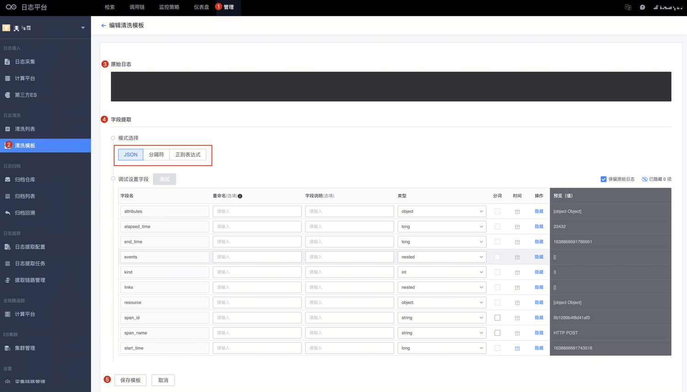
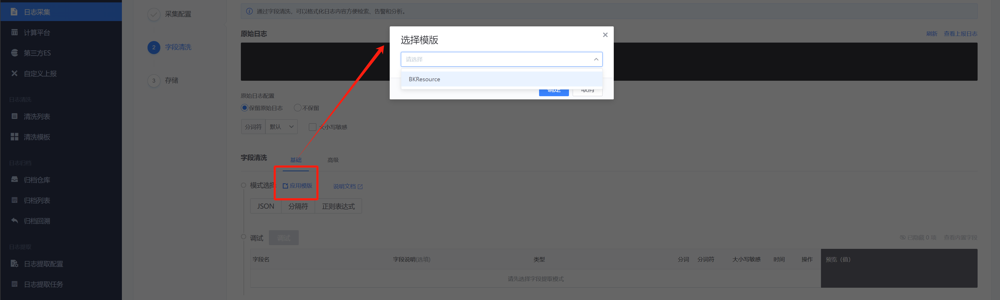

### Parsing Template
Cleaning template feature: Provides shared Parsing templates for multiple collection items to use.

### Configuring Parsing Templates
Enter the example of the original log, select the parsing mode, and click on "Debug" to test. The settings after debugging can be saved as a template. 

### How to Use Parsing Templates
In the log collection and Parsing section, click on "Apply Template" to select the saved template.
