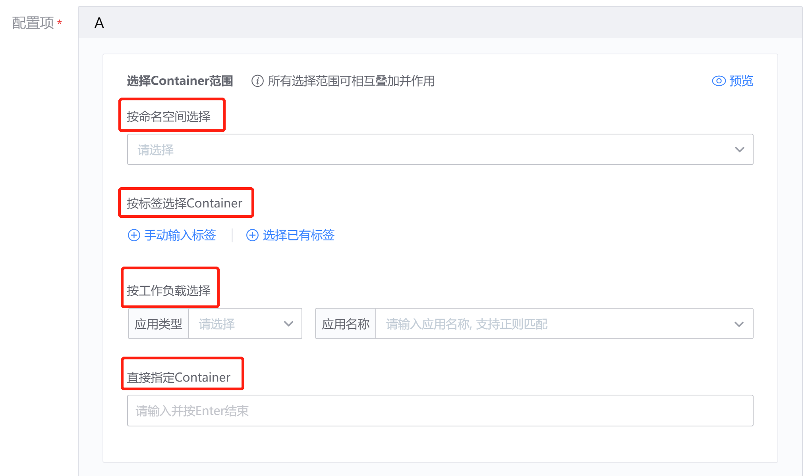
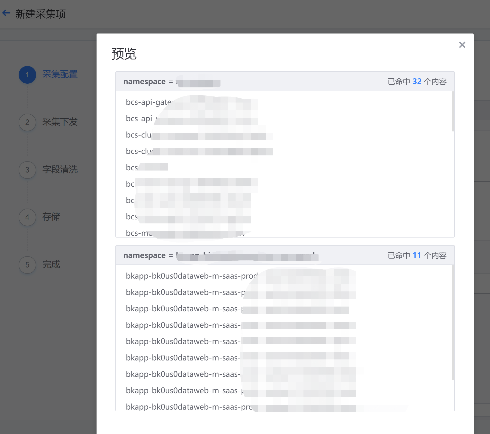

# Container log collection access

In order to meet the needs of cloud migration scenarios, BKLog supports the collection of container logs. Select "Container Environment" in the environment selection option, which supports three modes: Container, Node, and standard output.

**Navigation path**: Operation steps: Environment selection - Data classification - Cluster selection - Log type [supports line logs and segment logs] - Configuration items - Link configuration

Depending on the selected container environment, there are certain differences in configuration items:

Containers and standard output support directly specifying Containers by namespace, label, workload, etc. Multiple configurations will superimpose on each other. Click Preview to check the effective scope of this configuration; Node currently only supports selection by label.

**Preview**

Multiple configurations will take effect at the same time, and the final selected range is the intersection of all configuration item ranges. Click Preview on the right to view the effective scope of the configuration.

**Log path**

* The log is an absolute path and log rotation
* Can support wildcard mode, see common wildcards for details
* Can support multiple log files

**Log content filtering**

* Support string filtering: select include to retain logs that hit the string, and logs that do not hit the string will be discarded.
* Support delimiter filtering: you can select the system preset delimiter ‘ | ’ ‘ , ’ ‘ ; ’ ‘ ‘space’ for filtering

**Additional log tag**

You can manually attach log labels, or check "Automatically add labels in Pod" to generate labels.

**Log link**

Transfer logs and storage nearby, see link management for details