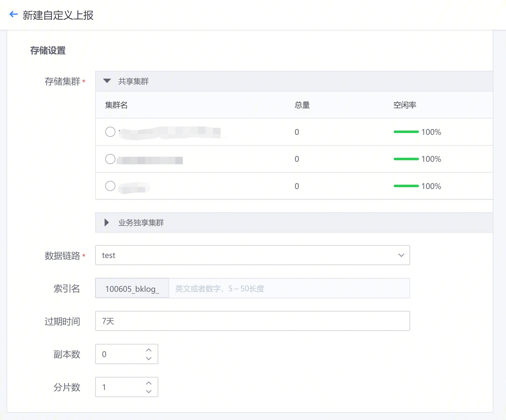

## Custom reporting

Access BKLog through customized reporting. Customized reporting data can be reported through a collector or a specified protocol such as otlp. Customized reporting has certain usage requirements and needs to be accessed according to the requirements.

Custom reporting supports three data types: container log reporting, otlp Trace reporting, and otlp log reporting ** (API frequency limit 5w/s)**. For reporting requirements, please view the help document on the right side of the page.

**Access Process**

*Basic information: configuration data name, data type, English name, data classification, description

* Storage settings:

   * Storage cluster: Supports the selection of shared clusters; if there is a business exclusive cluster, you can select an exclusive cluster for setting

   * Data link: Select an existing data link for log reporting

   * Complete the configuration after entering the log expiration time, number of copies, and number of shards

