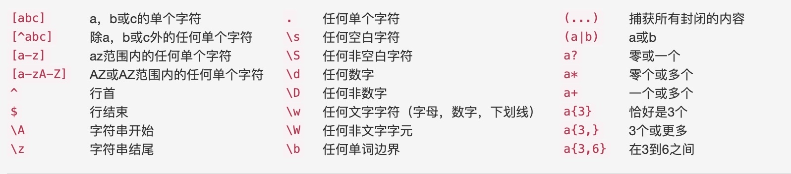

# Regular extraction reference

[Online regular debugging address](https://www.debuggex.com/)

## Nginx log regular extraction reference

Original log:

```bash
10.0.1.10 - - [30/Nov/2019:20:57:54 +0800] "POST /api/v3/auth/verify HTTP/1.0" "200" 1184 "https://cmdbee-dev.bktencent.com /" "Mozilla/5.0 (Macintosh; Intel Mac OS
```

```bash
(?P<request_ip>\d+\.\d+\.\d+\.\d+) - - \[(?P<datetime>[\s\S]+)\][\s"]+(?P <request>[A-Z]+) (?P<url>[\S]*) (?P<protocol>[\S]+)["] ["](?P<code>\d+)["] (?P<sendbytes>\d+) ["](?P<refferer>[\S]*)["] ["](?P<useragent>[\S\s]+)["]
```

Effect:


Regular reference syntax example:

```bash
([^\s]*) # Match $http_host
(\d+\.\d+\.\d+\.\d+) # Match $server_addr,$remote_addr
(\"\d+\.\d+\.\d+\.\d+\,\s\d+\.\d+\.\d+\.\d+\"|\"\d+\.\d+\.\d+ \.\d+\") #match "$http_x_forwarded_for"
(\[[^\[\]]+\]) #match[$time_local]
(\"(?:[^"]|\")+|-\") # Match "$request", "$http_referer", "$http_user_agent"
(\d{3}) # Match $status
(\d+|-) # Match $body_bytes_sent
(\d*\.\d*|\-) # Match $request_time,$upstream_response_time'
^ # Match the beginning of each line of data
$ # Match the ending of each row of data
```

## json regular extraction

Original log:

```json
2020-01-20T09:02:22,723 INFO [qtp1677319673-193] org.apache.druid.java.util.emitter.core.LoggingEmitter - {"feed":"metrics","timestamp":"2020-01-20T09 :02:22.723Z","service":"druid/broker","host":"druid-public-broker-01:8082","version":"0.16.0-incubating","metric":" sqlQuery/time","value":558,"dataSource":"[]","id":"0454b907-f313-430a-b509-5b1ee065d020","nativeQueryIds":"[]","remoteAddress":" 10.1.1.1","success":"true"}
```

Get the field timestamp service host version metric value in json.

```json
.*timestamp":"(?P<datetime>[^"]+).*service":"(?P<service>[^"]+).*host":"(?P<host>[^ "]+).*version":"(?P<version>[^"]+).*metric":"(?P<metric_name>[^"]+).*value":(?P<metric_value >\d+)
```

## Regular small syntax

