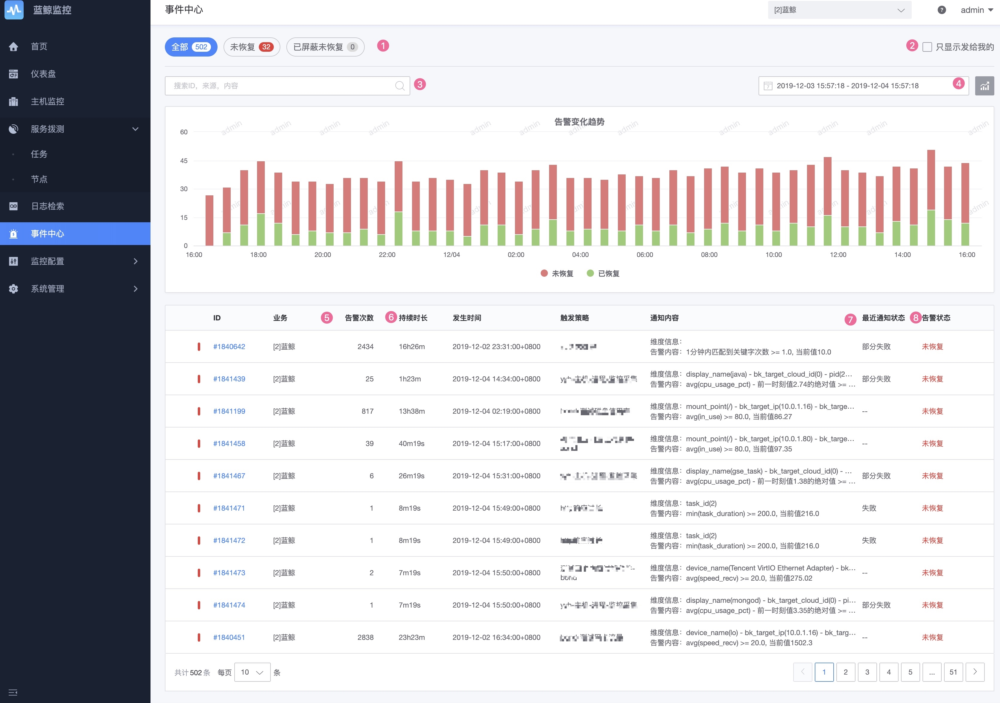

# 事件中心

事件中心记录的是所有的告警事件，及告警通知情况。可以在事件中心进行基本的问题定位和分析。

## 前置步骤

**工作原理**

**了解概念**：

* **异常点**：时序数据通过算法检测判断有异常的点
* **告警事件**：多个异常点为同一类为事件，一般具有持续性
* **告警通知**：多个告警事件通过收敛规则，风暴抑制等手段汇总成告警通知

> 更多查看[术语解释](../../concepts/glossary.md)

## 主功能一览

* 告警事件趋势
* 持续事件，事件状态，通知状态
* 事件详情及事件趋势图
* 告警确认
* 快捷屏蔽
* 处理建议
* 流转记录

## 功能说明

### 事件查看

告警事件提供多种查询方法，帮助快速的定位到事件。

**通知状态**：

* 成功：全部成功
* 部分失败：通知有部分失败
* 失败：通知全部失败
* 通知人为空：配置了告警组但是通知人为空的情况

**告警状态**：

* 未恢复：事件一直在持续未恢复，需要重点关注
* 未恢复(已确认)：事件一直在持续未恢复，有人已经进行了**告警确认**
* 未恢复(已屏蔽)：事件一直在持续未恢复，有人已经进行了**快捷屏蔽**
* 未恢复(已抑制)：是监控的内部逻辑
* 已恢复：事件不再持续，算是历史情况，可以不再重点关注
* 已关闭：当策略删除的情况下，事件直接接入到关闭状态

### 事件详情

* 【1】查看关联的告警策略，查看的是快照，有可能当前的策略已经被修改或者被删除
* 【2】告警处理
    * **快捷屏蔽**：快捷的屏蔽该事件，后续再出现类似的事件在屏蔽时间内也不再进行通知
    * **告警确认**：该告警事件快速确认，该事件恢复前不再进行通知。恢复后再出现相同的事件时还是会再进行通知
* 【3】通知状态详情：可以查看到每次通知的情况
* 【4】视图信息：展示出现首次异常时间到结束时间点的数据状态。日志，事件类的展示方式不一样
* 【5】处理建议：简单的记录事件的处理解决方案，和指标进行关联
* 【6】流转记录：详细的事件流转过程，主要用于单一事件追踪定位

### 问题定位

当通知没有收到的情况可以查看“通知状态详情”。

告警通知被收敛了的细节可以查看流转记录。

